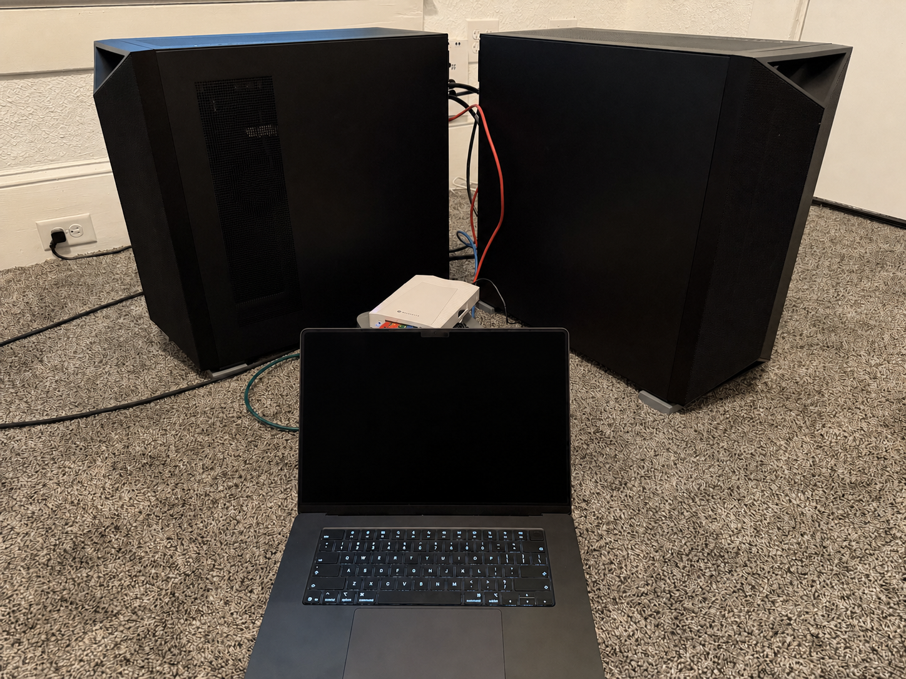

# NVIDIA DGX Station benchmarks

Reproducible local LLM inference results from NVIDIA DGX Station systems with
one NVIDIA GB300 selected per station for inference. Multi-node experiments
use generic `node0` and `node1` roles. These are GB300 systems, not DGX
Spark/GB10.



*The two-station direct-connect test setup.*

## DGX Station guide

Start with the [DGX Station GB300 field guide](dgx-station-guide/) for measured
system specifications, photos, two-node networking, container setup,
performance tuning, runtime quirks, benchmarking practice, and safe recovery.

## Experiments

| Experiment | Checkpoint / precision | Headline result |
| --- | --- | --- |
| [Qwen3.8-27B](qwen3.8-27b/) | BF16 plus unofficial Huginn FP8 and NVFP4A16 targets; BF16 KV/Mamba state | DFlash2: 265.8 tok/s C1; MTP: 6,348.8 C128. Quant AR C128: FP8 5,494.4 (+8.7% vs BF16), NVFP4A16 3,607.4 (−28.6%) |
| [Qwen2.5-72B LoRA FSDP training](qwen72b-lora-fsdp/) | BF16 LoRA SFT; FSDP2 over 2× GB300; packed UltraChat 10K at 2,048 tokens | 4,453.19 tokens/s; 29.433 s/optimizer step; global batch 131,072 tokens |
| [RF-DETR Large training](rfdetr-training/) | BF16 fine-tuning on the 1.17M-image MLPerf OpenImages subset; 2× GB300 DDP | Optimized global-batch-128 epoch: 220.45 images/s and 1:46:52 end to end (2.44× faster than control) |
| [DeepSeek-V4-Flash-0731](deepseek-v4-flash-0731/) | 304B/13B-active native mixed FP4-expert/FP8-dense checkpoint | DSpark: 345.8 output tok/s at C1; C128 raw, capacity-limited: 6,511.1 aggregate output tok/s |
| [Ornith-1.5-397B](ornith-1.5-397b/) | Official ModelOpt NVFP4 W4A4 checkpoint; 1× TP1 and 2× PP2/TP2+EP | 1× C1: 129.8 output tok/s; 2× PP2 stable, capacity-limited C128: 3,799.6 aggregate tok/s |
| [GLM-5.2](glm-5.2/) | Official NVIDIA NVFP4 checkpoint; 2× TP2+EP (1× does not fit) | C1: 68.0 output tok/s; shared-prefix C128: 2,012.4 aggregate tok/s |
| [Hy3-FP8](hy3/) | Official FP8 checkpoint; 2× PP2 and TP2+EP (1× does not fit) | MTP2 C1: 141.9 output tok/s; MTP1 C64: 2,563.7; no-spec C128: 3,078.5 aggregate tok/s |
| [MiniMax H3 video](minimax-h3-video/) | Official BF16 FL2VA checkpoint; resident 1× GB300, no offload | Official 5 s: 116.86 s mean; official 15 s: 719.29 s; experimental patched 30 s: 2,454.44 s |
| [MiniMax M3](minimax-m3/) | Official NVIDIA NVFP4 (1×) plus official MiniMax MXFP8 (2× PP2) | NVFP4: 152.6 C1, 1,595.8 C16; MXFP8 PP2: 998.3 C32; 128K prefill: 35,683 tok/s; WikiText-2 PPL: 5.7120 / 5.4323 |
| [Dual-station networking](gb300-networking/) | ConnectX-8 400GbE RoCE with GB300 Data Direct | 392.1 Gb/s one-way raw GPUDirect; 389.8 Gb/s tuned NCCL all-reduce bus bandwidth |

Each experiment folder contains:

- A complete README with benchmark conditions, tables, quality results, and caveats
- Embedded publication-ready graphs
- Machine-readable CSV data and experiment-specific quality/audit JSON
- An agent-ready `recipes/` directory with pinned setup and reproduction commands

## Test system

| Component | Configuration |
| --- | --- |
| Hosts | One DGX Station, plus an identical peer where noted |
| Inference GPU | 1× NVIDIA GB300, 256,703 MiB reported HBM, 1,300 W power limit |
| CPU | NVIDIA Grace, 72 Arm Neoverse-V2 cores |
| System memory | 744 GiB |
| NVIDIA driver | 595.84 |

The display GPU was excluded from inference. Results are direct measurements
from the tested systems, not vendor projections.

## Shared methodology

The throughput measurements use [`llm-inference-bench`](https://github.com/local-inference-lab/llm-inference-bench) v0.4.29 at commit `0b4185b5b435e948b199c9077a00b084864aa963`. Qwen and DeepSeek use its finite-request layer:

- 8,192 input tokens and 1,024 generated tokens
- Temperature 0, EOS ignored for a fixed amount of decode work
- Concurrency 1, 2, 4, 8, 16, 32, 64, and 128
- `5 × concurrency` measured requests after `concurrency` warm-up requests
- Aggregate output throughput = measured output tokens / benchmark wall time

Quality was tested separately with EOS respected, experiment-specific natural or mixed prompts, canonical WikiText-2 perplexity, and automated repetition audits. See each experiment README before comparing numbers; prompt construction, cache precision, and model architecture differ.

MiniMax H3 uses a separate fixed-seed video-and-audio methodology: one full
50-step warmup followed by three measured 1344×768, 124-frame requests. Its
folder also measures native 10- and 15-second samples plus one explicitly
unsupported patched 30-second attempt. It reports end-to-end latency, stage
timing, peak HBM, media integrity, and manual non-degeneracy review; its results
are not comparable to LLM token rates.

Ornith, GLM-5.2, and Hy3 instead use the benchmark's fixed-duration
sustained-decode layer: offered concurrency is maintained during a 30-second
measurement window, with separately labeled 60-second stability cells where
present. Boundary requests may remain in flight when the window closes.
Sustained-window throughput is not directly interchangeable with the finite
`5 × concurrency` results above; each experiment README identifies its layer
and retains completion and scheduler-residency fields.

## Contents

```text
.
├── qwen3.8-27b/
│   ├── README.md
│   ├── charts/
│   ├── data/
│   └── recipes/
├── dgx-station-guide/
│   ├── README.md
│   └── photos/
├── deepseek-v4-flash-0731/
│   ├── README.md
│   ├── charts/
│   ├── data/
│   └── recipes/
├── ornith-1.5-397b/
│   ├── README.md
│   ├── charts/
│   ├── data/
│   └── recipes/
├── glm-5.2/
│   ├── README.md
│   ├── charts/
│   ├── data/
│   └── recipes/
├── hy3/
│   ├── README.md
│   ├── charts/
│   ├── data/
│   └── recipes/
├── minimax-h3-video/
│   ├── README.md
│   ├── charts/
│   ├── data/
│   └── recipes/
├── minimax-m3/
│   ├── README.md
│   ├── charts/
│   ├── data/
│   └── recipes/
└── gb300-networking/
    ├── README.md
    ├── charts/
    ├── data/
    └── recipes/
```

Measured August 2026.
