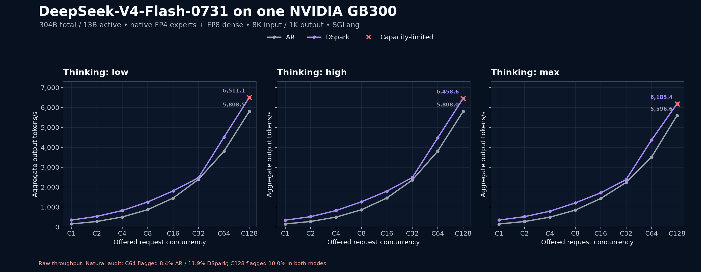
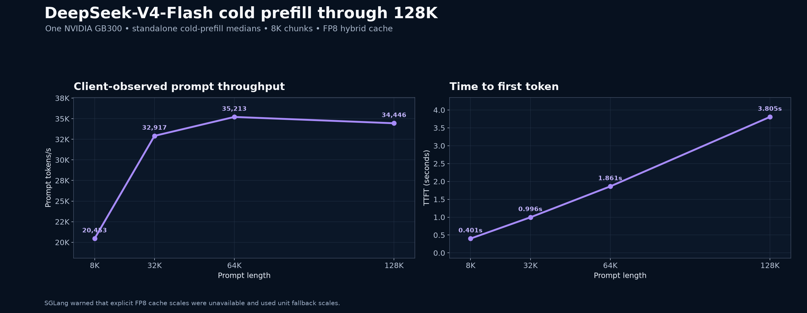
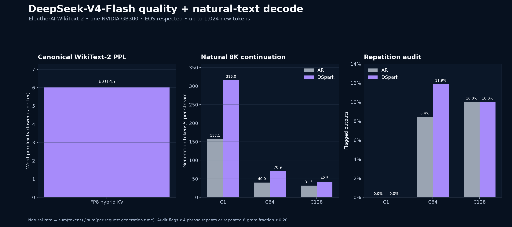

# DeepSeek-V4-Flash-0731 on one NVIDIA GB300

DeepSeek-V4-Flash-0731 was benchmarked on a DGX Station with one server-class NVIDIA GB300. This is the 304B-parameter, 13B-active checkpoint with native mixed FP4 experts and FP8 dense layers.

To recreate the environment and every benchmark cell, follow the [agent-ready reproducibility recipe](recipes/). It includes the pinned checkpoint/runtime, exact AR and DSpark launch flags, C1–C128 commands, quality checks, and the DeepSeek DFlash exclusion test.

## Headline results

- DSpark delivered **345.8 output tok/s at C1**, 2.29× the 151.2 tok/s autoregressive low-thinking baseline.
- Peak measured server throughput was **6,511.1 aggregate output tok/s at C128** with DSpark and low thinking. This is raw throughput subject to the output-quality warning below.
- Cold prefill reached **20,453 prompt tok/s at 8K** and **34,446 prompt tok/s at 128K**.
- Canonical WikiText-2 word perplexity was **6.0145** with the required FP8 hybrid cache.
- Natural C1 outputs were clean. At C64, the repetition audit flagged 8.4% of AR and 11.9% of DSpark outputs; both C128 modes flagged 10.0%. High-concurrency throughput is therefore reported as raw throughput with a quality warning.

## Fixed-length decode throughput

Aggregate output tokens/second. `C` is request concurrency. All runs use 8,192 input tokens, 1,024 forced output tokens, temperature 0, and the model's FP8 hybrid KV cache.

*Aggregate output throughput for every published C1–C128 fixed-length cell. Red × marks harness-classified capacity-limited runs; the high-concurrency output-quality warning still applies.*

### Thinking: low

| Mode | C1 | C2 | C4 | C8 | C16 | C32 | C64 | C128 |
| --- | ---: | ---: | ---: | ---: | ---: | ---: | ---: | ---: |
| Autoregressive | 151.2 | 273.8 | 500.6 | 867.6 | 1,448.2 | 2,393.0 | 3,797.8 | 5,808.5 |
| DSpark | **345.8** | **529.7** | **823.8** | **1,253.8** | **1,809.6** | **2,474.2** | **4,507.0** | **6,511.1†** |

### Thinking: high

| Mode | C1 | C2 | C4 | C8 | C16 | C32 | C64 | C128 |
| --- | ---: | ---: | ---: | ---: | ---: | ---: | ---: | ---: |
| Autoregressive | 150.1 | 273.8 | 494.4 | 863.1 | 1,454.8 | 2,358.7 | 3,810.7 | 5,808.0 |
| DSpark | **340.1** | **516.3** | **823.7** | **1,263.7** | **1,799.9** | **2,482.9** | **4,477.1** | **6,458.6†** |

### Thinking: max

| Mode | C1 | C2 | C4 | C8 | C16 | C32 | C64 | C128 |
| --- | ---: | ---: | ---: | ---: | ---: | ---: | ---: | ---: |
| Autoregressive | 150.1 | 272.1 | 491.5 | 845.1 | 1,429.6 | 2,237.0 | 3,510.1 | 5,596.6 |
| DSpark | **345.8** | **516.1** | **791.6** | **1,207.6** | **1,714.7** | **2,382.8** | **4,371.9** | **6,185.4†** |

The fixed workload supports direct performance comparisons but does not score answer quality. C64/C128 are finite five-wave drains of 320/640 measured requests and can include end-of-run scheduling effects. `†` means `llm-inference-bench` classified the run as capacity-limited; all requests still completed without errors, and resolved concurrency is retained in the CSV.

## Cold prefill through 128K

Single-request client-observed prompt throughput and time to first token (TTFT), using 8K chunks and FP8 cache:

| Context | Prompt tok/s | TTFT |
| --- | ---: | ---: |
| 8K | 20,453 | 0.401s |
| 32K | 32,917 | 0.996s |
| 64K | **35,213** | 1.861s |
| 128K | 34,446 | 3.805s |

SGLang warned that explicit FP8 cache scaling factors were unavailable and used unit fallback scales. The specialized DeepSeek hybrid cache in SGLang v0.5.16 requires uint8/FP8 storage; a BF16-cache comparison could not be run and was not silently substituted.

## WikiText-2 quality and natural decode

Canonical EleutherAI `lm-evaluation-harness` WikiText document-level task, WikiText-2-raw-v1, 2,048-token rolling windows, API batch 8, 62 documents:

| Cache | Word PPL ↓ | Byte PPL ↓ | Bits/byte ↓ |
| --- | ---: | ---: | ---: |
| FP8 KV | **6.0145** | **1.3987** | **0.4841** |

Natural decode used an approximately 8K WikiText prompt, up to 1,024 new tokens, temperature 0, and respected EOS:

| Mode | C1 tok/s per stream | C64 | C128 | C1 avg TTFT | C64 | C128 |
| --- | ---: | ---: | ---: | ---: | ---: | ---: |
| Autoregressive | 157.1 | 40.0 | 31.5 | 0.219s | 0.677s | 8.744s |
| DSpark | **316.0** | **70.9** | **42.5** | 0.224s | 0.722s | 6.698s |

The natural C64/C128 tok/s fields are `sum(tokens) / sum(per-request generation time)`, so they are per-stream rather than total server throughput. Use the fixed-length tables for aggregate throughput.

### Repetition audit warning

The audit flags an output if it has at least four consecutive phrase repeats or a repeated 8-gram fraction of at least 0.20.

| Mode | C1 flagged | C64 flagged | C128 flagged |
| --- | ---: | ---: | ---: |
| Autoregressive | 0/5 | **27/320 (8.4%)** | **64/640 (10.0%)** |
| DSpark | 0/5 | **38/320 (11.9%)** | **64/640 (10.0%)** |

Loops usually appeared in the reasoning preamble. A follow-up 64-request autoregressive run with radix caching disabled still flagged 3/64 outputs (4.7%), so prefix-cache reuse did not eliminate the behavior. Treat the high-concurrency matrix as raw benchmark throughput, not production-safe throughput without application-level output controls.

## Why there is no DFlash number

No DeepSeek DFlash result is reported because no valid public checkpoint/runtime combination was available for this exact target:

- The public RedHat DFlash draft targets an earlier preview and requires five full 16,384-wide multi-stream auxiliary states.
- Current public vLLM supplied five collapsed 4,096-wide states for DeepSeek-V4-Flash-0731; the first request correctly failed the 81,920-vs-20,480 feature check.
- SGLang v0.5.16 does not accept DFlash for this model.

Padding or repeating the auxiliary states would have produced an invalid benchmark, so only working, target-verified modes are included.

## Software and checkpoints

- DeepSeek-V4-Flash-0731 target revision: `7872f01…`
- SGLang: v0.5.16
- `llm-inference-bench`: v0.4.29, commit `0b4185b5…`
- `lm-evaluation-harness`: v0.4.13.dev0, commit `8a07e111…`

## Data files

- [`data/throughput.csv`](data/throughput.csv) — all 48 fixed-length decode runs and detailed latency/speculation fields
- [`data/prefill.csv`](data/prefill.csv) — prefill through 128K
- [`data/wikitext2-perplexity.csv`](data/wikitext2-perplexity.csv)
- [`data/wikitext2-natural-decode.csv`](data/wikitext2-natural-decode.csv)
- [`data/wikitext2-natural-c128-source.json`](data/wikitext2-natural-c128-source.json) — sanitized run-level C128 provenance, including original artifact hashes and output identities
- [`data/wikitext2-quality-audit.json`](data/wikitext2-quality-audit.json) — per-output repetition statistics and no-radix diagnostic

Return to the [repository overview](../).
