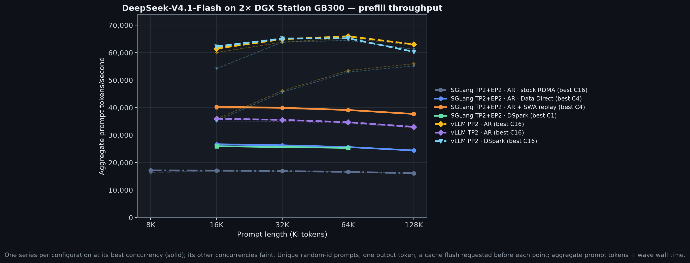
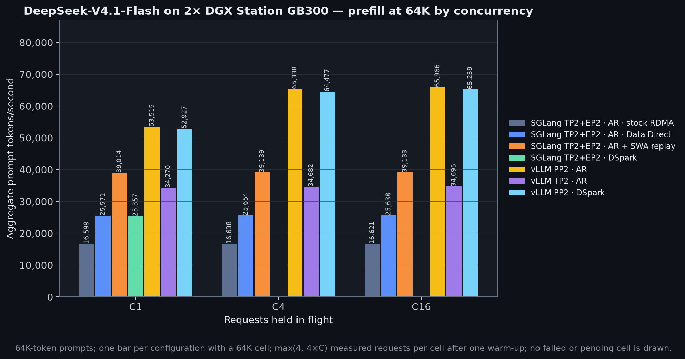
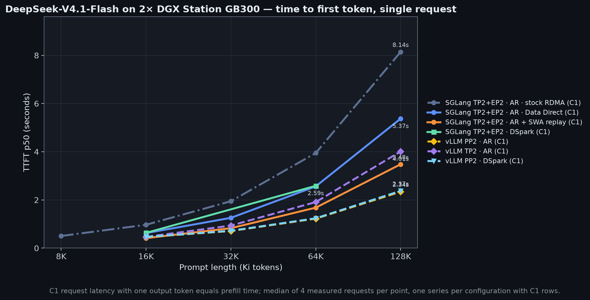
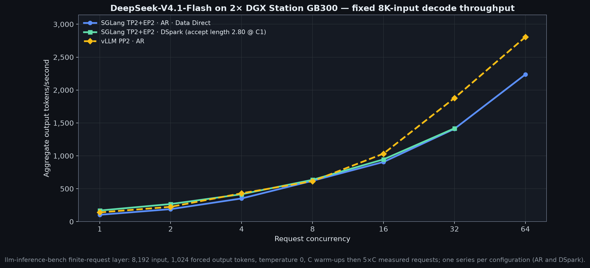
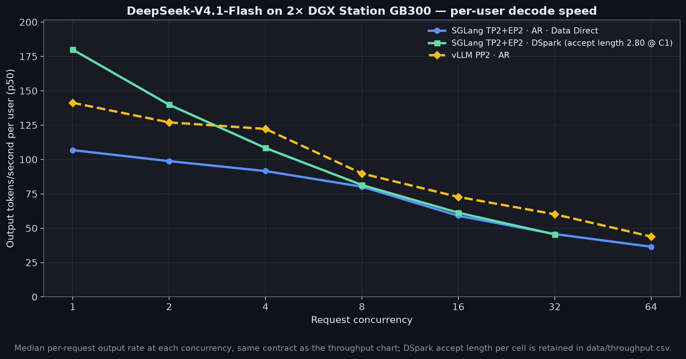
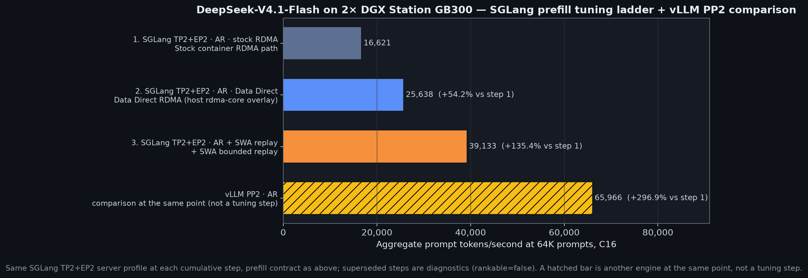
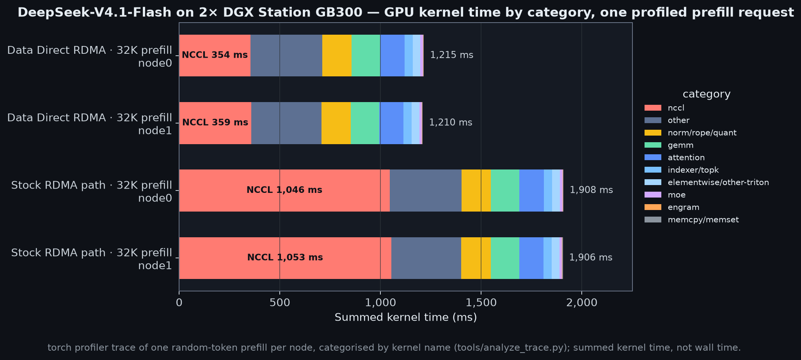
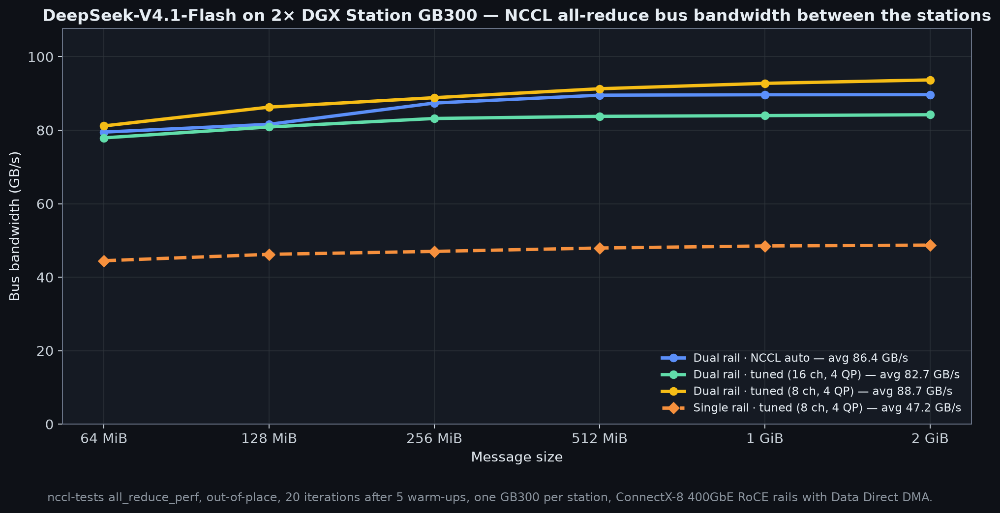

# DeepSeek-V4.1-Flash on 2× NVIDIA GB300 DGX Stations

The official [`deepseek-ai/DeepSeek-V4.1-Flash`](https://huggingface.co/deepseek-ai/DeepSeek-V4.1-Flash) checkpoint at revision `dba1be0a40aa45a94ad051997016db3960a90277` (48 native FP8-dense / FP4-expert shards, 510,286,023,000 bytes, more than one GB300 holds), served across two DGX Stations over dual 400GbE RoCE rails by SGLang (TP2+EP2) and vLLM (TP1 × PP2 and TP2), autoregressive and with DSpark speculative decoding.

**[Open/download the MP4](assets/fly-vllm-2xdgx.mp4)**

<video controls preload="metadata" src="assets/fly-vllm-2xdgx.mp4"></video>

*Social clip for the headline result: vLLM PP2, one 128K request, 55,992 prompt tok/s.*

## Best results

- **55,992 prompt tok/s** for a single 128K request (65,966 aggregate at 64K with 16 in flight) — vLLM TP1 × PP2 over Data Direct RDMA, two local source patches.
- **252.9 output tok/s per user** at C1 — vLLM TP1 × PP2 with DSpark speculative decoding through a local five-file overlay.
- **3,401.6 aggregate output tok/s** at C64 — vLLM TP2 with DSpark.
- **39,133 prompt tok/s** aggregate at 64K / C16 (37,674 for a single 128K request) — SGLang TP2+EP2 with SWA bounded replay, Data Direct RDMA.
- **93.7 GB/s** NCCL all-reduce bus bandwidth at 2 GiB — dual 400GbE RoCE rails, tuned 8-channel ring.

How each number was produced, and every comparison behind it: [notes/](notes/) (measurements) and [recipes/](recipes/) (how to reproduce).

## Best numbers

| Configuration | Prefill 128K · C1 | Prefill 64K · C16 | Decode C1 · per user | Decode C64 · aggregate |
| --- | ---: | ---: | ---: | ---: |
| SGLang AR · stock RDMA† | 16,098 | 16,621 | — | — |
| SGLang AR · Data Direct | 24,394 | 25,638 | 106.8 | 2,236.7 |
| SGLang AR + SWA replay | 37,674 | 39,133 | — | — |
| SGLang DSpark† | — | — | 180.0 | 2,392.3 |
| vLLM PP2 · AR | **55,992** | **65,966** | 141.3 | 2,805.9 |
| vLLM TP2 · AR | 32,672 | 34,695 | 102.3 | 1,964.5 |
| vLLM TP2 · DSpark | — | — | 201.0 | **3,401.6** |
| vLLM PP2 · DSpark | 55,187 | 65,259 | **252.9** | 3,257.9 |

*Prompt tok/s for one 128K request and aggregate at 64K with 16 requests in flight; output tok/s per user at C1 and aggregate at C64. Bold is the best accepted value in the column, † a diagnostic lane that is drawn but never ranked, — a point outside the lane's measured grid. Every measured configuration is its own series on every chart; accepted lanes rank, and the replay-off SGLang lane is the numerically exact reference. One station was not attempted. Full per-lane grids with TTFT, ITL, and accept lengths: [notes/](notes/).*

## Prefill throughput

*Aggregate prompt tok/s versus prompt length, one series per configuration (solid at its best concurrency, faint at the others); the vLLM PP2 lanes lead at every length, and SWA replay is not bit-identical to the exact replay-off series.*

## Prefill by concurrency

*64K prompts with 1, 4, and 16 requests in flight: the two-stage vLLM pipeline needs more than one request to fill, while the SGLang lanes and vLLM TP2 are flat across C1–C16.*

| Configuration | 64K · C1 | 64K · C4 | 64K · C16 | 128K · C1 | 128K · C4 | 128K · C16 |
| --- | ---: | ---: | ---: | ---: | ---: | ---: |
| SGLang AR · stock RDMA† | 16,599 | 16,638 | 16,621 | 16,098 | 16,112 | 16,108 |
| SGLang AR · Data Direct | 25,571 | 25,654 | 25,638 | 24,394 | 24,417 | 24,419 |
| SGLang AR + SWA replay | 39,014 | 39,139 | 39,133 | 37,674 | 37,711 | 37,693 |
| SGLang DSpark† | 25,357 | — | — | — | — | — |
| vLLM PP2 · AR | **53,515** | **65,338** | **65,966** | **55,992** | **62,750** | **63,048** |
| vLLM TP2 · AR | 34,270 | 34,682 | 34,695 | 32,672 | 32,992 | 33,010 |
| vLLM PP2 · DSpark | 52,927 | 64,477 | 65,259 | 55,187 | 61,282 | 60,340 |

*Aggregate prompt tok/s; bold is the best accepted value per column, † a diagnostic lane, — outside the lane's grid. The 16K and 32K columns and every TTFT are in [notes/](notes/).*

## Time to first token

*TTFT p50 for one request in flight, which with one output token is the prefill time. SGLang with SWA replay is fastest for a lone 16K request; vLLM PP2 is fastest from 32K up.*

## Decode throughput

*Aggregate output tok/s versus concurrency (8,192-token input, 1,024 forced output tokens, temperature 0, `C` warm-ups then `5 × C` measured requests): vLLM PP2 DSpark leads at C1 and from C4 to C32, vLLM TP2 DSpark at C2 and C64.*

| Configuration | C1 | C4 | C16 | C32 | C64 |
| --- | ---: | ---: | ---: | ---: | ---: |
| SGLang AR · Data Direct | 104.2 | 352.4 | 906.8 | 1,410.3 | 2,236.7 |
| SGLang DSpark | 169.2 | 416.6 | 946.2 | 1,418.3 | 2,392.3 |
| vLLM PP2 · AR | 140.6 | 431.1 | 1,033.4 | 1,878.0 | 2,805.9 |
| vLLM TP2 · AR | 101.9 | 343.5 | 803.7 | 1,272.0 | 1,964.5 |
| vLLM TP2 · DSpark | 201.7 | 525.3 | 1,275.5 | 2,116.8 | **3,401.6** |
| vLLM PP2 · DSpark | **248.5** | **612.6** | **1,677.7** | **2,346.4** | 3,257.9 |

## Per-user decode speed

*Median per-request output tok/s at each concurrency, same contract; the DSpark accept length per cell is kept in [data/throughput.csv](data/throughput.csv).*

| Configuration | C1 | C4 | C16 | C32 | C64 |
| --- | ---: | ---: | ---: | ---: | ---: |
| SGLang AR · Data Direct | 106.8 | 91.6 | 59.0 | 45.7 | 36.5 |
| SGLang DSpark | 180.0 | 108.4 | 61.3 | 45.5 | 40.4 |
| vLLM PP2 · AR | 141.3 | 122.2 | 72.8 | 60.2 | 43.9 |
| vLLM TP2 · AR | 102.3 | 87.5 | 53.2 | 41.5 | 31.6 |
| vLLM TP2 · DSpark | 201.0 | 134.9 | 82.0 | 68.6 | **55.3** |
| vLLM PP2 · DSpark | **252.9** | **156.6** | **108.9** | **76.2** | 52.6 |

## SGLang prefill tuning ladder

*The same SGLang TP2+EP2 server at 64K prompts, C16 after each cumulative tuning step; the hatched vLLM PP2 bar is another engine at the same point, not a tuning step.*

## Where the GPU time goes

*Summed GPU kernel time by category for one profiled 32K prefill on each node; the Data Direct path roughly halves the NCCL share, leaving the hyper-connection mixing-statistics Triton kernel as the largest single item.*

## NCCL all-reduce bus bandwidth

*Host-side nccl-tests `all_reduce_perf` between the two stations, 64 MiB–2 GiB; dual rail with the tuned 8-channel ring/simple setting is fastest, and 16 channels and NCCL auto are both slower.*

Details: [notes/](notes/) · [data/](data/) · [recipes/](recipes/)

Return to the [repository overview](../).
