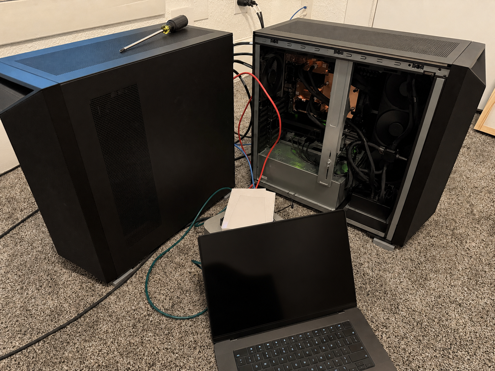
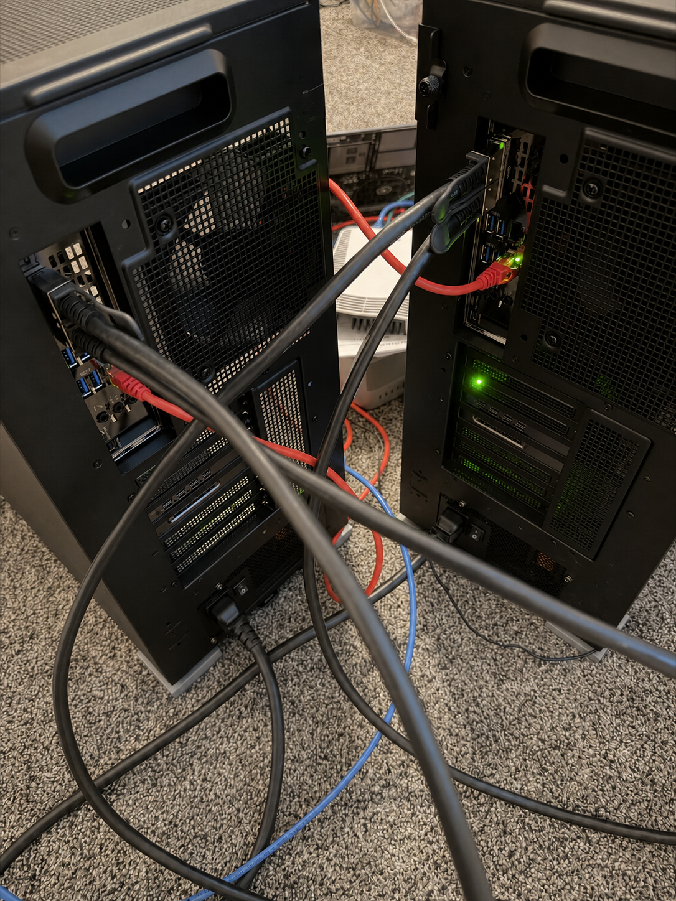
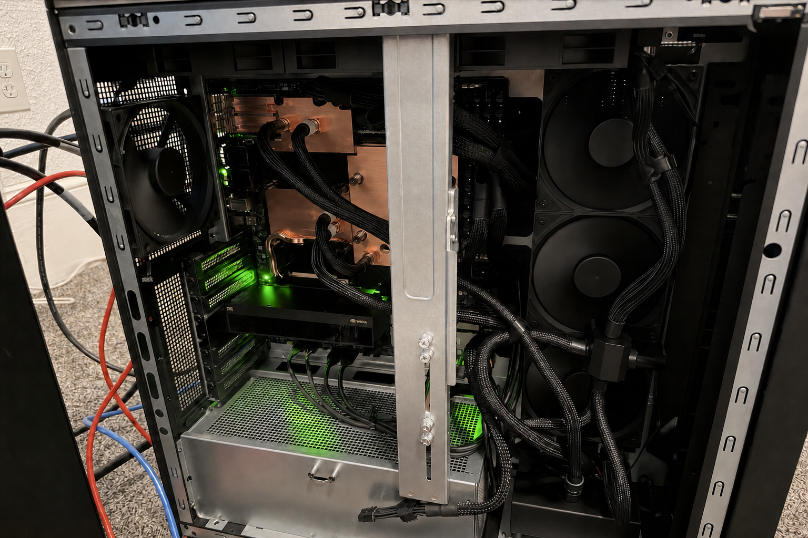

# DGX Station GB300 field guide

This is a practical guide to running local and two-node LLM inference on the
NVIDIA GB300 DGX Station. It summarizes the hardware observed by the benchmark
recipes in this repository, the setup decisions that materially changed
performance, and the failure modes worth checking before a long run.

The examples use generic names: `node0` is the API/benchmark host and `node1`
is its peer. Substitute your own DNS names, interfaces, HCAs, GPU UUIDs, and
addresses. Do not copy identifiers from somebody else's raw logs.



*Two DGX Stations, one with its side panel removed. Screens and unique asset
labels were privacy-redacted; [original photo set](https://x.com/mrcatid/status/2090190345732518370).*

> **GB300 recovery safety:** Run NVIDIA inventory commands only while the
> driver is known healthy. If the host has logged an Xid that left the device
> unavailable, an ATS/PMA removal failure, `RmInitAdapter` failure, or an NVIDIA
> kernel oops, issue no further NVIDIA ioctls. Do not reset the GPU, reload
> NVIDIA modules, or unbind/rescan PCI devices; stop GPU work and coordinate a
> controlled host reboot with the operator.

## Measured system profile

These are runtime-visible values from the systems used for this repository,
not rounded marketing capacities. Exact production revisions can differ, so
capture the same inventory on your own station.

| Component | Measured configuration |
| --- | --- |
| Main accelerator | 1× NVIDIA GB300, 256,703 MiB reported HBM |
| GPU power limit | 1,300 W |
| Host processor | NVIDIA Grace, 72 Arm Neoverse-V2 cores |
| System memory | 744 GiB visible to Linux |
| Display adapter | Separate NVIDIA RTX PRO 2000 Blackwell, excluded from inference |
| High-speed NIC | NVIDIA ConnectX-8, 2× 400GbE ports |
| Tested driver | NVIDIA 595.84 |
| Tested kernel | Ubuntu NVIDIA 64K-page kernel, `6.17.0-1029-nvidia-64k` |
| Container architecture | Linux/ARM64 with NVIDIA Container Toolkit/CDI |

The GB300 exposes 269,172,604,928 bytes, or 250.687 GiB, to the runtime. Use
that number for fit calculations. A checkpoint whose indexed weight files are
larger does not fit merely because its advertised precision sounds small.

## Physical layout and connectivity



The station includes a separate display GPU and two high-speed ConnectX-8
ports. That has a few practical consequences:

- Select the GB300 by UUID or model name. GPU index ordering is not a durable
  API, especially when a display adapter is also present.
- Keep management traffic and default routing on the ordinary LAN. Give each
  direct high-speed rail its own small, route-free subnet.
- If you evaluate both 400GbE rails, keep them separate rather than bonding
  them so NCCL can see each path independently.
- Confirm link state, MTU, HCA-to-interface mapping, RDMA devices, and packet
  loss before model loading. A server can be reachable over management
  Ethernet while a benchmark rail is down or falling back to sockets.

A simple two-node addressing scheme is:

| Rail | `node0` | `node1` |
| --- | --- | --- |
| Rail 0 | First usable address in private `/30` A | Second usable address in private `/30` A |
| Rail 1 | First usable address in private `/30` B | Second usable address in private `/30` B |

Choose subnets that do not overlap your environment. Set MTU 9000 end to end
and do not add a default route on either benchmark rail.

The repository's performance results used one active 400GbE rail. The
second-port layout above is a deployment pattern, not a measured dual-rail
result.

The full tested setup and validation commands are in the
[dual-station networking recipe](../gb300-networking/recipes/).

## Start with an inventory, not assumptions

Run this on each node and save the output beside the result:

```bash
nvidia-smi --query-gpu=index,uuid,name,memory.total,power.limit --format=csv
lscpu
free -h
uname -a
docker info
ibdev2netdev
rdma link show
ip -details -br link
```

Then validate the intended rail and topology:

```bash
: "${RAIL_IFACE:?Set RAIL_IFACE to the intended high-speed interface}"
: "${RAIL_PEER_IP:?Set RAIL_PEER_IP to its peer address}"
ip -details link show dev "$RAIL_IFACE"
ping -c 3 -M do -s 8972 "$RAIL_PEER_IP"
rdma_topo check
```

Do not begin a distributed load if the checkpoint revisions, container image,
model paths, interface names, or MTUs differ between nodes.

## Container pattern that worked

The display GPU makes explicit device selection important. The benchmark
recipes discover the GB300 UUID and pass only that device through CDI:

```bash
gb300_uuid="$(
  nvidia-smi --query-gpu=uuid,name --format=csv,noheader |
    awk -F ', ' '$2 ~ /GB300/ {print $1; exit}'
)"
: "${gb300_uuid:?No GB300 UUID found}"
: "${RDMA_DEVICE:?Set RDMA_DEVICE to the matching /dev/infiniband/uverbs device}"
[[ -c "$RDMA_DEVICE" ]] || { echo "RDMA device not found: $RDMA_DEVICE" >&2; exit 1; }

docker run --rm \
  --device "nvidia.com/gpu=$gb300_uuid" \
  --device "$RDMA_DEVICE" \
  --ipc host \
  --network host \
  --ulimit memlock=-1 \
  --ulimit stack=67108864 \
  --cap-add IPC_LOCK \
  --cap-add SYS_NICE \
  IMAGE ...
```

Pin container images by digest and record the resolved image ID. On Grace,
verify that every image and native dependency supports ARM64 before downloading
hundreds of gigabytes of weights.

### Treat GB300 as its own target

DGX Station GB300 is not DGX Spark/GB10, and Spark-oriented launch assumptions
or fallback kernels should not define the expected ceiling. Confirm that the
runtime detects the GB300 target, compiles for the installed server Blackwell
GPU, and selects the intended attention, GEMM, MoE, and quantization kernels.
The kernel names in the startup log are part of the result: a checkpoint can
silently take a generic or weight-only path that performs very differently
from the native path implied by its label.

Keep compilation and autotuning caches on fast local storage, but record
whether a result is cold or warm. Reusing a compile cache is a setup-time
optimization; it must not be confused with prefix caching inside the measured
request workload.

## Two-node communication settings

For a direct RoCE rail, make the intended path explicit on both ranks:

```bash
: "${RAIL_IFACE:?Set RAIL_IFACE to the intended high-speed interface}"
: "${RAIL_HCA:?Set RAIL_HCA to its matching HCA}"
export GLOO_SOCKET_IFNAME="$RAIL_IFACE"
export NCCL_SOCKET_IFNAME="$RAIL_IFACE"
export NCCL_IB_HCA="$RAIL_HCA"
export NCCL_IB_DISABLE=0
export NCCL_NET_GDR_LEVEL=SYS
export NCCL_DMABUF_ENABLE=1
```

Set the interface and HCA from your own inventory. Do not blindly copy a PCI
path or device name.

On this platform, Data Direct was the difference between an ordinary
host-memory path and nearly line-rate GPU traffic:

| Path | Measured result |
| --- | ---: |
| Host-memory RDMA write, one way | 228.8 Gb/s |
| GPUDirect Data Direct RDMA write, one way | 392.1 Gb/s |
| Tuned two-node NCCL all-reduce, 2 GiB | 389.8 Gb/s bus bandwidth |

The best 2-GiB NCCL test used Ring, Simple protocol, eight channels, four QPs
per connection, and striped data across QPs. Treat that as an A/B candidate,
not a universal serving default: large all-reduce bandwidth and decode latency
are different objectives. Start with NCCL's automatic choice, then measure.

## Model-serving lessons

### Parallelism is model-specific

There is no single winner between pipeline parallelism and tensor/expert
parallelism across these models:

- Ornith-1.5-397B favored PP2 across the tested two-node decode and long-prefill
  workloads.
- GLM-5.2 required TP2 plus expert parallelism; its PP2 split had a severe
  stage-memory imbalance and failed during startup.
- Hy3 PP2 required FlashInfer distributed autotuning to be disabled, while
  TP2 required expert parallelism so MoE weights were not replicated.

Measure both viable layouts. Report the full topology and backend rather than
presenting the result as generic “2× scaling.”

### Pipeline stages may not tune the same kernels

FlashInfer 0.6.16's distributed autotuner assumes every rank enters the same
collectives in the same order. Heterogeneous PP stages can violate that
assumption and deadlock during startup. For the affected Hy3/vLLM combination,
`--no-enable-flashinfer-autotune` avoided the collective mismatch while keeping
FlashInfer kernels enabled.

This flag is a targeted compatibility setting, not a claim that autotuning is
generally harmful. Preserve both rank logs so a long compile can be
distinguished from a true collective mismatch.

### MoE expert placement controls both fit and speed

A model that fits across two GPUs can still OOM if tensor parallelism replicates
its experts. For TP deployments, verify that the runtime actually enabled
expert parallelism and inspect per-rank model-loading memory before warmup.

### Prefill needs its own sweep

Decode-tuned batching is not automatically best for 128K prefill. The Qwen
experiments swept prefill chunk ceilings, KV precision, and CUDA-graph/eager
behavior separately. A 16K chunk ceiling with eager prefill was the strongest
tested official-target configuration; the unofficial FP8 target used a
different runtime and reached its own optimum.

Always report:

- tokenizer target and API-observed prompt tokens;
- time to first token as well as prompt tok/s;
- chunk/batched-token ceiling;
- number of cold samples;
- whether any prefix tokens were cached.

### Prefix caching changes capacity math

An admission estimate that assumes independent 8K prompts can reject a valid
shared-prefix benchmark. Override such a guard only when the workload truly
shares an identical prefix and server evidence proves that all requested
streams became resident with no queue. Record prefix-hit rate, KV use, running
requests, and queue depth. Never turn an override into a claim about unshared
KV capacity.

### KV precision belongs in every result label

Speed runs here commonly use FP8 E4M3 KV cache. Canonical WikiText-2 perplexity
runs use explicit BF16 KV (and BF16 recurrent/Mamba state where applicable).
Do not put their numbers in the same row without labeling the difference.

### Quantization names do not identify the executed kernel

Inspect startup logs. In these experiments:

- one FP8 Qwen target used a Cutlass scaled-FP8 linear kernel;
- the checkpoint named NVFP4A16 used a Marlin weight-only W4A16 path, not
  native W4A4 FP4 tensor-core execution;
- NVIDIA ModelOpt NVFP4 checkpoints used different runtime paths again.

Checkpoint branding, storage size, activation precision, KV precision, and
the selected kernel are separate facts.

### Keep CPU offload out of GPU-native comparisons

If weights exceed the runtime-visible HBM, record a one-node no-fit result.
CPU or disk offload can be useful operationally, but it measures a different
system whose performance is dominated by host memory and interconnect traffic.

## Benchmarking practices that prevented bad headlines

- Separate finite-request drains from fixed-duration sustained load. They
  answer different questions and should not share an unlabeled graph.
- Use exact input/output token targets for throughput and respect EOS for the
  separate natural-output audit.
- Keep aggregate tok/s, per-offered-stream tok/s, effective concurrency,
  maximum resident requests, queue depth, TTFT, and inter-token latency.
- Run 8K, 64K, and 128K cold prefill separately from decode.
- Save complete natural outputs and scan repeated phrases and repeated
  n-grams. Zero API errors do not prove that a quantized/speculative run is
  producing useful text.
- Use canonical document-level WikiText-2 for local PPL comparisons. Do not mix
  creator-supplied chunked PPL with local `lm-evaluation-harness` results.
- Pin model revision, runtime image digest, benchmark commit, evaluator commit,
  and prompt hash. Preserve failures instead of silently rerunning them away.

## Safe recovery and the residual-HBM quirk

Never use `nvidia-smi --gpu-reset`, PCI unbind/rescan, or NVIDIA module unload
as benchmark cleanup on this Grace/GB300 platform. A distributed container
failure is not a reason to reset the GPU.

The safe sequence is:

1. Stop benchmark clients.
2. Remove only the named serving containers on both nodes.
3. Confirm the launchers and workers exited.
4. While the driver is known healthy, check idle HBM once on both nodes.
5. If tens of GiB remain allocated with no compute/UVM/device-file owner, stop.
   Do not compensate with a higher memory-utilization fraction.
6. Coordinate a normal reboot with the operator before another memory-tight
   launch. Never reboot automatically from a recipe.

The repository's [Hy3 preflight](../hy3/recipes/preflight-idle-hbm.sh) turns
this into a mandatory launch guard. Kernel Xids, ATS/PMA removal failures,
`RmInitAdapter` errors, kernel oopses, or lockups are a harder stop: do not issue
more NVIDIA ioctls; preserve host logs and coordinate recovery.

## Cooling and service access



The main accelerator is liquid cooled, and the measured GPU power limit is
1,300 W. Keep intake/exhaust clearance, electrical capacity, room cooling, and
service access in mind before sustained loads. Do not open or service a powered
system; follow NVIDIA's service and electrical guidance for your exact revision.

## A repeatable order of operations

1. Inventory both nodes and pin every model/runtime/tool revision.
2. Verify each checkpoint and weight index before launch.
3. Prove the one-node fit or no-fit result without offload.
4. Validate management SSH, benchmark rails, MTU, RDMA topology, and NCCL.
5. Run the idle-HBM safety preflight.
6. Start the remote rank first, then the API rank.
7. Wait for health with a bounded timeout while retaining both logs.
8. Capture resolved runtime settings and KV capacity before benchmarking.
9. Run decode, prefill, natural-output quality, and PPL as separate workloads.
10. Remove named containers, verify clean idle state, then publish only results
    that pass exact-source and quality validation.

## Repository examples

- [One- and two-node Ornith-1.5-397B](../ornith-1.5-397b/)
- [Two-node GLM-5.2](../glm-5.2/)
- [Two-node Hy3](../hy3/)
- [Qwen3.8-27B prefill, quantization, and speculative decoding](../qwen3.8-27b/)
- [ConnectX-8 and Data Direct networking](../gb300-networking/)

The benchmark folders contain the exact tables and commands. This guide keeps
the reusable lessons in one place and deliberately omits site-specific host
names, management addresses, device serials, and incident anecdotes.
