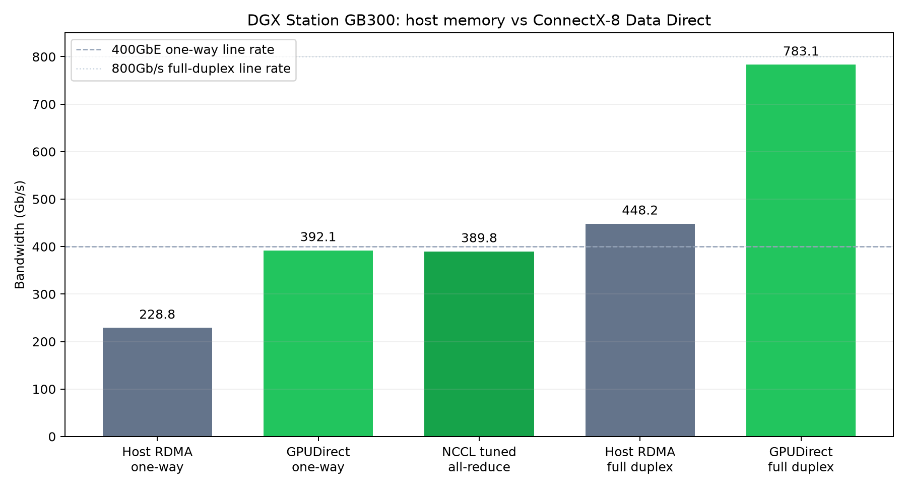

# Dual DGX Station GB300 networking

Two identically configured DGX Station GB300 systems were connected directly through their dual-port ConnectX-8 adapters. The useful GPU path reaches essentially the full rate of one 400GbE link when ConnectX-8 Data Direct is enabled.

## Headline results

| Path | Direction | Result | Relative to 400GbE line rate |
| --- | --- | ---: | ---: |
| Host-memory RDMA write | One way | 228.8 Gb/s | 57.2% |
| GPUDirect Data Direct RDMA write | One way | **392.1 Gb/s** | **98.0%** |
| Tuned NCCL 2-node all-reduce, 2 GiB | Bus bandwidth | **389.8 Gb/s** | **97.4%** |
| Host-memory RDMA write | Full-duplex aggregate | 448.2 Gb/s | 56.0% of 800Gb/s |
| GPUDirect Data Direct RDMA write | Full-duplex aggregate | **783.1 Gb/s** | **97.9% of 800Gb/s** |

The tuned NCCL result used eight channels, four queue pairs per connection, striped data across QPs, Ring, and Simple protocol. It improved the 2 GiB all-reduce result from 42.28 GB/s to **48.72 GB/s** while preserving zero validation errors.

## Systems and topology

| Item | node0 | node1 |
| --- | --- | --- |
| Management | Operator-provided SSH alias | Operator-provided SSH alias |
| Example rail 0 | `192.168.200.1/30` | `192.168.200.2/30` |
| GPU | NVIDIA GB300, 256,703 MiB | NVIDIA GB300, 256,703 MiB |
| NIC | ConnectX-8, 2 × 400GbE | ConnectX-8, 2 × 400GbE |
| Driver / firmware | 595.84 / 40.47.1088 | 595.84 / 40.47.1088 |
| Kernel | 6.17.0-1029-nvidia-64k | 6.17.0-1029-nvidia-64k |

Both NetworkManager rail profiles use MTU 9000, static `/30` addresses, no default route, and disabled IPv6. The 10GbE management default route remains unchanged. NVIDIA's `rdma_topo check` passes on both systems, including the shared IOMMU group for the GB300 and CX-8 Data Direct DMA function.

The ordinary NET-PF is `SYS` from the GPU, while the CX-8 Data Direct DMA function is `PXB`. Host-memory benchmarks therefore characterize a different path from production GPU collectives.

## Software

- CUDA 13.2
- DOCA userspace 3.2.1 / OFED 25.10-derived libraries
- CUDA-enabled `perftest` built from upstream commit `b848400`
- NCCL 2.31.2, commit `7b83616`, installed under `/opt/nccl-2.31.2`
- nccl-tests 2.19.7, commit `1a65d7f`, installed under `/opt/nccl-tests-2.19.7`
- OpenMPI 4.1.6

## Quality and link health

- 9,000-byte IP packets passed with zero loss.
- The 8-byte host-memory RDMA-write latency averaged 1.40 microseconds; p99 was 1.52 microseconds.
- RDMA transport counters reported zero sequence errors, retries, timeouts, RNR errors, or out-of-buffer events after Data Direct and NCCL testing.
- NCCL all-reduce reported zero out-of-bounds values.

## Reproduce

Follow the [agent-ready networking recipe](recipes/) for persistent ACS setup, raw host/GPU RDMA commands, and the tuned two-node NCCL invocation.

## Data

- [`data/throughput.csv`](data/throughput.csv)
- [`data/latency.csv`](data/latency.csv)

Measured August 19, 2026.
