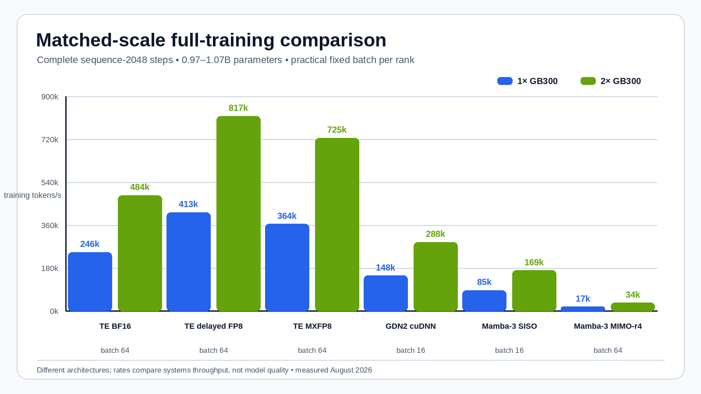
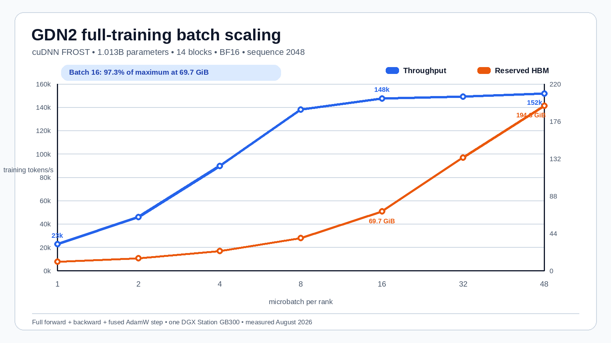
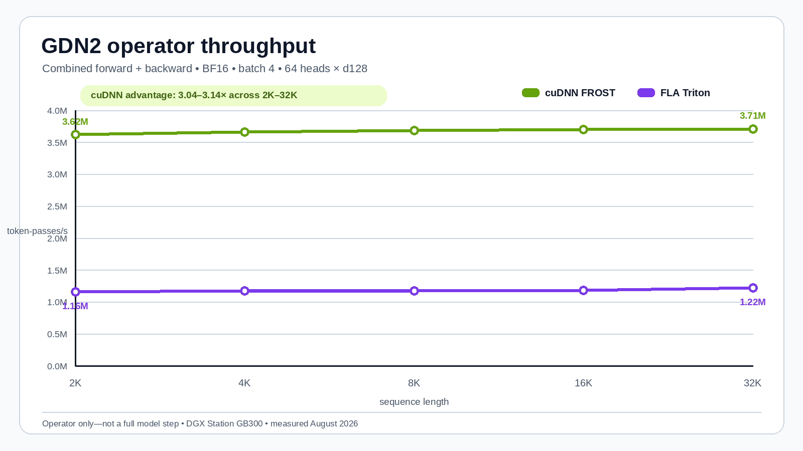
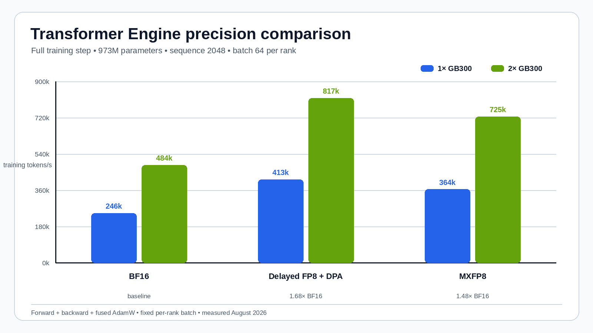

# GDN2, Mamba-3, and Transformer Engine on GB300

This page compares three sequence architectures at the same benchmark
boundary: approximately one billion trainable parameters, 2,048-token inputs,
and complete zero-grad, forward, loss, backward, and fused AdamW steps.

Transformer Engine with delayed-scaling FP8 and FP8 dot-product attention is
fastest at 413,257 tokens/s on one GB300 and 817,314 on two. The new 1.013B
Gated DeltaNet-2 stack reaches 151,568 tokens/s at its highest safe one-node
batch, or 147,535 / 288,174 tokens/s at the practical fixed batch used for DDP.
Mamba-3 SISO reaches 87,096 / 169,113; rank-4 MIMO reaches 17,136 / 33,664.

## Comparison boundary

| Family | Timed work | Scale | Precision | Optimizer included? | Valid use of result |
| --- | --- | ---: | --- | --- | --- |
| GDN2 | 14 official recurrent blocks, loss, backward, fused AdamW | 1.013B parameters | BF16 | Yes | Compare full training throughput and DDP scaling |
| Transformer Engine | Four decoder layers, loss, backward, fused AdamW | 973.1M parameters | BF16 / FP8 | Yes | Compare full training throughput and precision modes |
| Mamba-3 | Ten official SISO or MIMO blocks, loss, backward, fused AdamW | 1.03B / 1.07B parameters | BF16 | Yes | Compare full training throughput and DDP scaling |
| GDN2 operator microbenchmark | One attention operator, forward + backward | Batch 4, 64 heads × d128 | BF16 | No | Compare cuDNN and FLA kernels only |

All full-training rows use 2,048-token inputs and the NVIDIA PyTorch 26.07 base
on the same GB300 stations. Parameter scale and timing boundaries now match;
block counts, operations per token, precision, and model quality still differ.

## Headline at sequence length 2,048

The plot uses each implementation's practical fixed per-rank batch and shows
one- and two-station rates. These are systems-throughput comparisons, not claims
of equal optimization behavior or model quality.



| Implementation | Parameters | Batch / rank | 1× tokens/s | 2× tokens/s |
| --- | ---: | ---: | ---: | ---: |
| TE delayed FP8 + DPA | 973.1M | 64 | **413,257** | **817,314** |
| TE MXFP8 | 973.1M | 64 | 364,402 | 724,666 |
| TE BF16 | 973.1M | 64 | 245,620 | 484,343 |
| GDN2 cuDNN FROST | 1.013B | 16 | 147,535 | 288,174 |
| Mamba-3 SISO | 1.035B | 16 | 85,471 | 169,113 |
| Mamba-3 MIMO rank 4 | 1.068B | 64 | 17,136 | 33,664 |

## GDN2: matched full training



The recurrent-only stack takes the official `gdn2_1.3B` block dimensions and
reduces its 18 layers to 14, yielding 1,013,162,976 parameters without an
embedding or LM head. Each block retains both RMSNorms, the complete GDN2
projection/gating/short-convolution path, residuals, and its SwiGLU MLP.

cuDNN FROST reaches 151,568 tokens/s at batch 48 and 194.3 GiB reserved. Batch
16 is the practical point: 147,535 tokens/s, 97.3% of the maximum, at only
69.7 GiB. Two-node DDP reaches 288,174 tokens/s at the same batch per rank,
for 97.66% scaling efficiency.

At batch 1, cuDNN reaches 22,569 tokens/s versus 19,249 for current FLA Triton,
a 17.25% full-step advantage. Integrated one-block validation gives output
cosine 1.000000, input-gradient cosine 0.9999996, parameter-gradient cosine
0.9999989, and relative loss error 2.35e-7.

### Operator-only context



The earlier isolated operator result remains useful for backend analysis:
cuDNN processes 3.62--3.71 million operator token-passes/s and is 3.04--3.14×
FLA. It is no longer used as the architectural training comparison above.

## Transformer Engine: FP8 is the full-training winner



Delayed FP8 with FP8 DPA is 1.683× BF16 on one station and 1.687× on two.
MXFP8 is 1.484× and 1.496× BF16. Delayed FP8 is also the practical winner at
batch 16: it reaches 406,956 tokens/s, within 1.55% of batch 64, while reducing
reserved HBM from 85.7 GiB to 26.3 GiB.

The plot holds batch at 64 per rank, so the two-station bars perform twice the
global work. Scaling efficiency is 98.60% for BF16, 98.89% for delayed FP8,
and 99.43% for MXFP8.

## Mamba-3: SISO is usable; current MIMO is kernel-limited

At the fixed DDP batches, GDN2 is 1.73× SISO on one station and 1.70× on two.
SISO remains 4.99× MIMO on one and 5.02× on two.

This does not establish a general Transformer-versus-state-space result. The
official Mamba-3 SISO path uses Triton and performs well enough to scale at
98.93% DDP efficiency. The current MIMO TileLang path has roughly constant
7.4--7.6 second step time from batch 1 through 64 and emits an upstream warning
about direct in-memory kernel caching. Its 98.23% DDP efficiency shows that the
two 400 Gb/s links are not the limiting factor; the local kernel path is.

## Fixed-batch DDP comparison

| Implementation | Batch / rank | 1× tokens/s | 2× tokens/s | Scaling efficiency |
| --- | ---: | ---: | ---: | ---: |
| TE BF16 | 64 | 245,620 | 484,343 | 98.60% |
| TE delayed FP8 + DPA | 64 | **413,257** | **817,314** | 98.89% |
| TE MXFP8 | 64 | 364,402 | 724,666 | **99.43%** |
| GDN2 cuDNN FROST | 16 | 147,535 | 288,174 | 97.66% |
| Mamba-3 SISO | 16 | 85,471 | 169,113 | 98.93% |
| Mamba-3 MIMO rank 4 | 64 | 17,136 | 33,664 | 98.23% |

## Bottom line

- For a complete ~1B-parameter training step, **TE delayed FP8 + DPA is fastest**.
- In BF16, **TE is 1.62× GDN2 at their highest measured one-node rates**;
  practical GDN2 is **1.73× Mamba-3 SISO**.
- GDN2's **cuDNN backend is 17.25% faster than FLA** end to end at batch 1.
- For Mamba-3 today, **SISO is the viable training path**; MIMO needs kernel work.

## Data, plots, and source experiments

The values used by the figures are in
[`data/comparison.csv`](data/comparison.csv). Regenerate all four PNGs with:

```bash
python recipes/render_charts.py
```

The script uses Pillow and fixed fonts, dimensions, colors, and axes. Detailed
methodology, complete sweeps, validation, provenance, and guarded launchers
remain in the source experiment folders:

- [GDN2 full-training and operator benchmarks](../gdn2-linear-attention/)
- [Transformer Engine precision benchmark](../transformer-engine-training/)
- [Mamba-3 training benchmark](../mamba3-training/)

All source runs passed the journal-first idle-HBM gate, explicitly removed
their named containers, and used no GPU reset, driver reload, or reboot.
