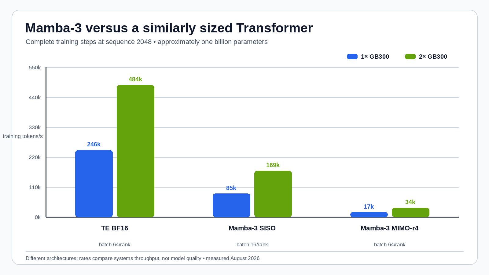

# GDN2, Mamba-3, and Transformer Engine on GB300

This page puts the three sequence-training experiments in one place. The
fastest measured **complete training workload** is the Transformer Engine
decoder with delayed-scaling FP8 and FP8 dot-product attention: 413,257
tokens/s on one GB300 and 817,314 tokens/s on two. Mamba-3 SISO reaches 87,096
tokens/s on one station and 169,113 tokens/s on two; the current rank-4 MIMO
path reaches 17,136 and 33,664 tokens/s.

The Gated DeltaNet-2 result is different in kind. It times one linear-attention
operator rather than a model, optimizer, or distributed training step. Its
cuDNN implementation processes 3.62--3.71 million forward-plus-backward
operator token-passes/s and is 3.04--3.14× faster than FLA. That is an excellent
kernel result, but it is not evidence that a complete GDN2 model trains 8.8×
faster than the FP8 Transformer.

## Comparison boundary

| Family | Timed work | Scale | Precision | Optimizer included? | Valid use of result |
| --- | --- | ---: | --- | --- | --- |
| GDN2 cuDNN / FLA | One attention operator, forward + backward | Batch 4, 64 heads × d128 | BF16 | No | Compare GDN2 kernels and sequence scaling |
| Transformer Engine | Four decoder layers, loss, backward, fused AdamW | 973.1M parameters | BF16 / FP8 | Yes | Compare full training throughput and precision modes |
| Mamba-3 | Ten official SISO or MIMO blocks, loss, backward, fused AdamW | 1.03B / 1.07B parameters | BF16 | Yes | Compare full training throughput and DDP scaling |

All three use 2,048-token inputs in the headline rows and ran on the same type
of GB300 station with the NVIDIA PyTorch 26.07 base. Transformer Engine and
Mamba-3 are reasonably useful systems comparisons at similar parameter scale,
although their block counts and operations per token differ. GDN2 remains on
the other side of the operator-versus-model boundary.

## Headline at sequence length 2,048

The rate unit deliberately says what each row counts. Step latency cannot be
compared without considering batch size, so throughput is the useful column.

| Implementation | Batch | Timed scope | Step / pass | Measured rate | Peak reserved HBM |
| --- | ---: | --- | ---: | ---: | ---: |
| GDN2 cuDNN | 4 | One operator, forward + backward | 2.265 ms | **3,616,777 operator token-passes/s** | Not recorded |
| GDN2 FLA | 4 | One operator, forward + backward | 7.074 ms | 1,158,044 operator token-passes/s | Not recorded |
| TE delayed FP8 + DPA | 64 | Full 973M training step | 317.168 ms | **413,257 model tokens/s** | 85.7 GiB |
| TE MXFP8 | 64 | Full 973M training step | 359.691 ms | 364,402 model tokens/s | 109.9 GiB |
| TE BF16 | 64 | Full 973M training step | 533.638 ms | 245,620 model tokens/s | 99.4 GiB |
| Mamba-3 SISO | 32 | Full 1.03B training step | 752.455 ms | 87,096 model tokens/s | 141.3 GiB |
| Mamba-3 MIMO rank 4 | 64 | Full 1.07B training step | 7,648.733 ms | 17,136 model tokens/s | 196.9 GiB |

## GDN2: a strong linear-attention operator


cuDNN's combined rate stays nearly flat as context increases, moving from
3.617 million operator token-passes/s at 2K to 3.706 million at 32K. FLA moves
from 1.158 million to 1.221 million. The corresponding cuDNN analytical rates
are 181--203 TFLOP/s forward and 67--69 TFLOP/s backward.

The raw 2K GDN2 rate is 8.75× the delayed-FP8 Transformer's model-token rate,
but that ratio has no architectural meaning: the GDN2 numerator contains one
attention operation, while the Transformer denominator contains four complete
decoder layers, loss, backward, and AdamW. A defensible model-level comparison
requires a complete GDN2 stack with projections, normalization, residuals,
channel mixing or MLP, optimizer state, and the same timing boundary.

## Transformer Engine: FP8 is the full-training winner


Delayed FP8 with FP8 DPA is 1.683× BF16 on one station and 1.687× on two.
MXFP8 is 1.484× and 1.496× BF16. Delayed FP8 is also the practical winner at
batch 16: it reaches 406,956 tokens/s, within 1.55% of batch 64, while reducing
reserved HBM from 85.7 GiB to 26.3 GiB.

The plot holds batch at 64 per rank, so the two-station bars perform twice the
global work. Scaling efficiency is 98.60% for BF16, 98.89% for delayed FP8,
and 99.43% for MXFP8.

## Mamba-3: SISO is usable; current MIMO is kernel-limited



For the DDP comparison, each implementation keeps its own per-rank batch fixed:
64 for TE BF16, 16 for SISO, and 64 for MIMO. At those settings, TE BF16 is
2.87× SISO on one station and 2.86× on two. SISO is 4.99× MIMO on one and
5.02× on two.

This does not establish a general Transformer-versus-state-space result. The
official Mamba-3 SISO path uses Triton and performs well enough to scale at
98.93% DDP efficiency. The current MIMO TileLang path has roughly constant
7.4--7.6 second step time from batch 1 through 64 and emits an upstream warning
about direct in-memory kernel caching. Its 98.23% DDP efficiency shows that the
two 400 Gb/s links are not the limiting factor; the local kernel path is.

## Fixed-batch DDP comparison

| Implementation | Batch / rank | 1× tokens/s | 2× tokens/s | Scaling efficiency |
| --- | ---: | ---: | ---: | ---: |
| TE BF16 | 64 | 245,620 | 484,343 | 98.60% |
| TE delayed FP8 + DPA | 64 | **413,257** | **817,314** | 98.89% |
| TE MXFP8 | 64 | 364,402 | 724,666 | **99.43%** |
| Mamba-3 SISO | 16 | 85,471 | 169,113 | 98.93% |
| Mamba-3 MIMO rank 4 | 64 | 17,136 | 33,664 | 98.23% |
| GDN2 operator | 4 | Not a DDP workload | Not measured | Not applicable |

## Bottom line

- For a complete ~1B-parameter training step, **TE delayed FP8 + DPA is fastest**.
- For Mamba-3 today, **SISO is the viable training path**; MIMO needs kernel work.
- For the isolated GDN2 attention core, **cuDNN FROST is extremely fast and
  clearly ahead of FLA**, but a full-model benchmark is still needed before it
  can be ranked against TE or Mamba-3 training.

## Data, plots, and source experiments

The values used by the figures are in
[`data/comparison.csv`](data/comparison.csv). Regenerate all three PNGs with:

```bash
python recipes/render_charts.py
```

The script uses Pillow and fixed fonts, dimensions, colors, and axes. Detailed
methodology, complete sweeps, validation, provenance, and guarded launchers
remain in the source experiment folders:

- [GDN2 linear-attention operator benchmark](../gdn2-linear-attention/)
- [Transformer Engine precision benchmark](../transformer-engine-training/)
- [Mamba-3 training benchmark](../mamba3-training/)

All source runs passed the journal-first idle-HBM gate, explicitly removed
their named containers, and used no GPU reset, driver reload, or reboot.
