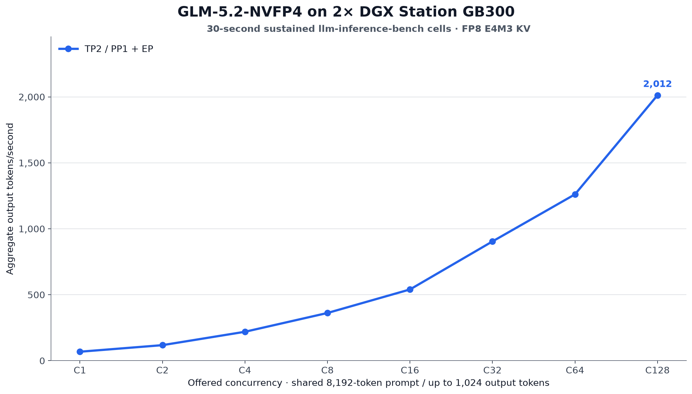
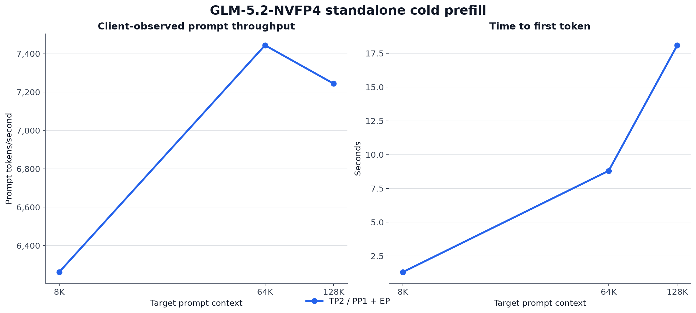

# GLM-5.2 NVFP4 on NVIDIA GB300

This experiment evaluates NVIDIA's NVFP4 quantization of GLM-5.2 on DGX
Station GB300 hardware. The checkpoint is a 753B-total/40B-active MoE model,
with a documented context ceiling of 1M tokens. Its expert linear layers use
NVFP4; the shared expert and several other tensors remain at higher precision.

The checkpoint does **not** fit in one DGX Station's GB300. The reproducible
one-station result is therefore a capacity measurement, not a throughput row.
Performance collection uses two identically configured DGX Stations connected
by a dedicated 400 GbE RoCE link, with no CPU or disk weight offload.

See the [agent-ready recipes](recipes/) for pinned download and verification,
the one-node capacity check, the accepted TP2 launch, failed-profile evidence,
`llm-inference-bench`, output-quality checks, and WikiText-2 setup.

The broader [deep optimization study](recipes/deep-study/) now has frozen
backend and autotune increments: an accepted CuTeDSL reproduction, two
excluded FlashInfer-CUTLASS capacity starts, a vLLM-CUTLASS compatibility
failure, and an accepted CuTeDSL autotune-on A/B. Compact evidence and
checksums are in [`data/deep-study/`](data/deep-study/).

## Checkpoint provenance

| Role | Hugging Face source | Exact revision | Status | Weight format | Retained size evidence |
| --- | --- | --- | --- | --- | --- |
| Target | [`nvidia/GLM-5.2-NVFP4`](https://huggingface.co/nvidia/GLM-5.2-NVFP4) | `aec724e8c7b8ee9db3b48c01c320f63f9cdaf8aa` | NVIDIA-produced quantization of GLM-5.2; not the upstream BF16 checkpoint | NVFP4 expert linear layers; shared expert and several tensors remain at higher precision | 47 indexed weight files, 464,823,042,096 bytes |

The shard count and byte total come from the pinned checkpoint's `model.safetensors.index.json` and are retained in [`data/capacity.csv`](data/capacity.csv).

## Status

<!-- BEGIN GENERATED:STATUS -->
- Checkpoint download and integrity verification: complete
- One-station capacity test: complete; no fit
- Accepted two-station performance: TP2 / PP1 + expert parallel; operator-observed startup failure (original logs not retained): TP1 / PP2
- Natural-output audits: TP2 / PP1 + expert parallel; WikiText-2: TP2 / PP1 + expert parallel
<!-- END GENERATED:STATUS -->

No pending field below should be interpreted as a zero.

PP2 was attempted, but its original startup logs were not retained. The operator
observed stage imbalance, one rank effectively full, and subsequent small
allocation failures. This is an operator-observed startup-failure note, not a
checksummed measurement, so it has no throughput row. The optimization path and
excluded starts are recorded in
[`data/failure-attempts.json`](data/failure-attempts.json).

## Deep-study increments: backend and autotune A/B

The existing canonical tables later in this README remain unchanged. P0 below
is an independent, fully captured repeat using the deep-study runner: the same
pinned checkpoint and image, TP2/PP1 + EP2, FP8 E4M3 KV, 135,168 maximum model
length, 93% static HBM utilization, no speculation, and no CPU offload.

| Frozen run | MoE backend | C1 | C2 | C4 | C8 | C16 | C32 | C64 | C128 | Result |
| --- | --- | ---: | ---: | ---: | ---: | ---: | ---: | ---: | ---: | --- |
| P0 | FlashInfer CuTeDSL, autotune off | 68.2 | 117.9 | 218.3 | 361.0 | 539.7 | 903.7 | 1,252.2 | 2,013.9 | Accepted |
| P3 | FlashInfer CuTeDSL, autotune on | 67.7 | 115.1 | 211.1 | 357.4 | 546.6 | 886.5 | 1,252.1 | 1,997.1 | Accepted |

Aggregate output tok/s; exactly targeted 8K input, up to 1K output, temperature
0, and a 30-second sustained window per cell.

| Frozen run | 8K prefill | 64K prefill | 128K prefill | GPU KV capacity | Natural outputs |
| --- | ---: | ---: | ---: | ---: | --- |
| P0, autotune off | 6,223 tok/s | 7,461 tok/s | 7,179 tok/s | 261,952 tokens | 4/4 finish naturally; 0 flags |
| P3, autotune on | 6,359 tok/s | 7,624 tok/s | 7,318 tok/s | 147,264 tokens | 4/4 finish naturally; 0 flags |

P3 changed only FlashInfer autotuning. Exact P3 deltas against P0 were:

| Metric | C1 | C2 | C4 | C8 | C16 | C32 | C64 | C128 | Mean |
| --- | ---: | ---: | ---: | ---: | ---: | ---: | ---: | ---: | ---: |
| Decode tok/s delta | -0.615% | -2.401% | -3.290% | -0.994% | +1.295% | -1.899% | -0.013% | -0.832% | -1.094% |

| Metric | 8K | 64K | 128K | Mean |
| --- | ---: | ---: | ---: | ---: |
| Prefill tok/s delta | +2.185% | +2.185% | +1.936% | +2.102% |

This single pass supports a small prefill lift, not a decode win. P3's cold
compile took 127.71 / 131.17 seconds by rank; FlashInfer then spent 28.087
seconds autotuning and wrote 23 new configurations. Its fixed capacity gate
passed with 147,264 GPU KV tokens, compared with P0's 261,952 tokens.

The backend A/B held every declared profile field constant except the MoE
backend. FlashInfer CUTLASS did not reach an API-ready state at the same
long-context envelope, so it has no throughput row.

| FlashInfer CUTLASS start | Compile state | Available KV GiB by rank | Required per rank | Disposition |
| --- | --- | ---: | ---: | --- |
| P1 cold | First backend-specific compile | 0.43 / 0.43 | 6.0 GiB for 135,168 tokens | Excluded before API; 0 requests |
| P1 warm | AOT cache hit, single controlled validation | 2.19 / 10.39 | 6.0 GiB for 135,168 tokens | Excluded before API; 0 requests; no further retry |

vLLM's native `VLLM_CUTLASS` arm, P2, was excluded even earlier. The pinned
kernel rejected the required EP2 `allgather_reducescatter` configuration during
model construction, before weight load or API readiness; no request was issued
and no smaller profile was substituted.

P0's quiet before/after RoCE counters recorded 1.236 TB in each direction over
372.4 seconds, or 26.55 Gb/s average, with no health-counter deltas. That is a
whole-matrix average, not a peak-link or bottleneck claim. P3 recorded 1.233 TB
in each direction over 370.5 seconds, or 26.62 Gb/s average, also with no
health-counter deltas. Its four natural outputs finished normally with zero
automatic flags. All starts used graceful teardown, passed the current-boot
kernel scan, and returned to 2–7 MiB idle HBM per rank. See the frozen
[`P0 evidence`](data/deep-study/2026-08-20-p0-cutedsl/),
[`P1 cold-capacity evidence`](data/deep-study/2026-08-20-p1-flashinfer-cutlass-cold-cache/),
[`P1 warm-capacity evidence`](data/deep-study/2026-08-20-p1-flashinfer-cutlass-warm-cache/),
[`P2 incompatibility evidence`](data/deep-study/2026-08-20-p2-vllm-cutlass-incompatible/),
and [`P3 autotune evidence`](data/deep-study/2026-08-20-p3-cutedsl-autotune-on/).

## One DGX Station: capacity result

| Configuration | Usable GB300 HBM | Indexed weight files | Weight-file bytes | Runtime headroom | Result |
| --- | ---: | ---: | ---: | ---: | --- |
| 1× DGX Station GB300 | 250.687 GiB | 47/47 | 432.900 GiB | −182.214 GiB before runtime | **Does not fit** |

The measured GPU reports 256,703 MiB of HBM. The 47 files referenced by
`model.safetensors.index.json` occupy 464,823,042,096 bytes. The weights alone
therefore exceed usable HBM by 195,650,437,168 bytes (182.214 GiB using the
unrounded byte values; displayed capacity arithmetic may differ by rounding).
The canonical `data/capacity.csv` records the exact byte values.

This project deliberately does not use CPU offload. Even if offload made the
server start, it would answer a different performance question and would make
the result dominated by host-memory traffic.

## Two DGX Stations: sustained decode (8K input / up to 1K output)

Aggregate output tokens/second. Every cell uses an exactly targeted 8,192-token
prompt, a 1,024-token per-request cap, temperature 0, EOS ignored, and a
30-second sustained measurement window after warm-up. `C` is offered request
concurrency. Streams still in flight at the window boundary contribute their
observed output to the server usage-counter aggregate but are not counted as
completed 1K responses; `data/throughput.csv` retains both counts.

<!-- BEGIN GENERATED:DECODE -->
| Topology | C1 | C2 | C4 | C8 | C16 | C32 | C64 | C128 |
| --- | ---: | ---: | ---: | ---: | ---: | ---: | ---: | ---: |
| TP2 / PP1 + expert parallel | 68.0 | 117.8 | 219.2 | 361.7 | 540.0 | 904.1 | 1,261.0 | 2,012.4 |
<!-- END GENERATED:DECODE -->

PP2 and TP2 are reported separately because their communication patterns are
materially different across Ethernet. Any capacity-limited cell will remain in
the raw data with its effective concurrency, maximum running requests, and an
explicit flag rather than being silently promoted to a full-concurrency result.

C128 is a shared-prefix result. The harness's unshared-KV admission estimate
was overridden, while the actual server had prefix caching enabled: all 128
requests became resident with zero queued, the log reached an 86.9% prefix hit
rate and 31.9% KV usage, and vLLM reported a 256,320-token KV cache. This is
shared-prefix capacity, not capacity for 128 unrelated 8K prompts.

## Two DGX Stations: cold prefill

Single-request client-observed prompt tokens/second and time to first token.

<!-- BEGIN GENERATED:PREFILL -->
| Topology | 8K | 64K | 128K |
| --- | ---: | ---: | ---: |
| TP2 / PP1 + expert parallel | 6,262 tok/s 1.309s TTFT | 7,444 tok/s 8.804s TTFT | 7,244 tok/s 18.095s TTFT |
<!-- END GENERATED:PREFILL -->

The server ceiling used for this initial comparison is 135,168 tokens, enough
for the 128K prompt plus output and chat-template overhead. This is a benchmark
profile, not the model's full documented 1M-token context ceiling.

## WikiText-2 and output quality

<!-- BEGIN GENERATED:QUALITY -->
| Topology | KV cache | Word PPL ↓ | Byte PPL ↓ | Bits/byte ↓ |
| --- | --- | ---: | ---: | ---: |
| TP2 / PP1 + expert parallel | bfloat16 | 3.352366 | 1.253844 | 0.326357 |

| Topology | Outputs | Automatic flags | Max repeated 8-gram fraction | Manual review |
| --- | ---: | ---: | ---: | --- |
| TP2 / PP1 + expert parallel | 4 | 0 | 0.049442 | clean |
<!-- END GENERATED:QUALITY -->

Natural outputs are audited separately from the forced-length throughput load.
The audit stores full reasoning/content, hashes, token usage, repeated 8-gram
fraction, identical-word runs, and identical-character runs for four unrelated
prompts. The published audit used BF16 KV and a 4,096-token cap; all four ended
naturally with complete final answers and no automatic flags. The original
1,024-token FP8-KV audit is preserved separately because two responses reached
the cap before finishing. Human inspection is required in addition to the
mechanical checks.

The first WikiText-2 evaluator attempt failed before inference because
Transformers 4 could not load the checkpoint's `TokenizersBackend` metadata.
A subsequent evaluator retry used a tokenizer-only `PreTrainedTokenizerFast`
compatibility directory validated token-for-token and completed all 62
document-level samples. The published result uses BF16 KV, batch size 4, and
lm-eval's effective 2,047-token window (2,048 requested with one token reserved
by the API adapter). The failed attempt is retained separately; no result from
it was used.

<!-- BEGIN GENERATED:CHARTS -->

<!-- END GENERATED:CHARTS -->

## Hardware and pinned software

- 2× DGX Station, each with one server-class NVIDIA GB300 (256,703 MiB reported)
- Dedicated 400 GbE RoCE rail, MTU 9000, one GPU per node
- NVIDIA driver 595.84 on the measured systems
- Checkpoint: `nvidia/GLM-5.2-NVFP4` at `aec724e8c7b8ee9db3b48c01c320f63f9cdaf8aa`
- vLLM 0.27.1 container digest: `sha256:0a51ea5b4ae2dc5d81890e5173f54203d2a3ae0cfffe51b8fd2afd4391bfd967`
- `llm-inference-bench`: commit `0b4185b5b435e948b199c9077a00b084864aa963`
- `lm-evaluation-harness`: commit `8a07e1110d060de48cfc7a9a7987b7659060b60b`
- Throughput/prefill: FP8 E4M3 KV cache and prefix caching
- Natural-output audit and WikiText-2: BF16 KV cache; `glm45` reasoning parser and `glm47` tool parser

## Data files

- [`data/capacity.csv`](data/capacity.csv) — exact one-station no-fit measurement
- [`data/throughput.csv`](data/throughput.csv) — schema for C1–C128 decode results
- [`data/prefill.csv`](data/prefill.csv) — schema for 8K/64K/128K cold-prefill results
- [`data/wikitext2-perplexity.csv`](data/wikitext2-perplexity.csv) — measured
  document-level WikiText-2 perplexity
- [`data/evidence/tp2-wikitext2.json`](data/evidence/tp2-wikitext2.json) —
  compact result, sample hash, tokenizer hashes, and runtime provenance
- [`data/quality-audit.csv`](data/quality-audit.csv) — natural-output audit summary schema
- [`data/evidence/tp2-quality.json`](data/evidence/tp2-quality.json) — full
  canonical 4,096-token BF16-KV natural outputs and hashed runtime provenance
- [`data/evidence/tp2-quality-1024-cap.json`](data/evidence/tp2-quality-1024-cap.json)
  — preserved noncanonical FP8-KV audit that exposed the shorter-cap truncation
- [`data/failure-attempts.json`](data/failure-attempts.json) — excluded startup
  profiles, the failed tokenizer attempt, and the measured retry disposition
- [`data/publication-manifest.json`](data/publication-manifest.json) — accepted,
  rejected, and absent topology state from the latest extraction
