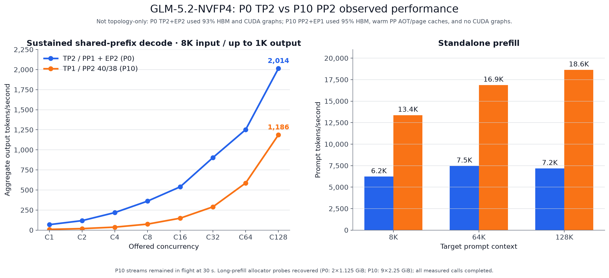

# P10: structurally accepted PP2 run; decode-performance failure

P10 is the first accepted request-bearing GLM-5.2 PP2 performance profile in
this study. It kept P9's 40/38 pipeline split, explicit 64-token KV block,
CuTeDSL backend, Inductor compilation, CUDA graph mode `NONE`, full
135,168-token context, and complete workload. The only declared profile change
was HBM utilization from 93% to 95%; P10 also started after P9 had populated
the PP-specific AOT and checkpoint page caches.

It passed the structural gates, but it is **not recommended for serving**:
decode reached only 13.5–58.9% of P0 across C1–C128. The higher standalone-
prefill result is retained separately and does not reverse that decode verdict.

| Pin or setting | Value |
| --- | --- |
| Checkpoint | [`nvidia/GLM-5.2-NVFP4`](https://huggingface.co/nvidia/GLM-5.2-NVFP4) at `aec724e8c7b8ee9db3b48c01c320f63f9cdaf8aa` |
| Runtime | vLLM 0.27.1, commit `6e448d0ea9bf3d88d898b65449ca6dc2aec170ac` |
| Image | `sha256:0a51ea5b4ae2dc5d81890e5173f54203d2a3ae0cfffe51b8fd2afd4391bfd967` |
| Topology | TP1/PP2, EP1; explicit 40/38 layer partition; no CPU offload |
| Backend | FlashInfer CuTeDSL NVFP4 MoE; autotuning and speculation off |
| KV / execution | FP8 E4M3, block64, Inductor, CUDA graph mode `NONE`, 95% HBM utilization |
| Full envelope | 135,168 max length; 128 sequences; 32,768 batched tokens |
| Workload | Exact 8K input/up-to-1K output, 30 seconds per C1–C128 cell; standalone 8K/64K/128K prefill |

## Decode and prefill

Aggregate output tokens/second; every P10 cell had zero errors, was not
capacity-limited, and reached the requested resident concurrency. This is
OpenAI continuous-usage output observed during each 30-second window. No P10
stream completed its 1,024-token cap within the window; mean observed length
per resident stream was 304–318 tokens. These are sustained in-flight token
rates, not completed-request or end-to-end request rates. Decode used a shared
8K prefix, so C128 does not represent 128 unrelated 8K prompts.

| Run / topology | C1 | C2 | C4 | C8 | C16 | C32 | C64 | C128 |
| --- | ---: | ---: | ---: | ---: | ---: | ---: | ---: | ---: |
| P0 TP2/PP1 + EP2 | 68.2 | 117.9 | 218.3 | 361.0 | 539.7 | 903.7 | 1,252.2 | 2,013.9 |
| P10 TP1/PP2 40/38 | 9.2 | 18.6 | 37.0 | 74.5 | 148.5 | 290.1 | 586.7 | 1,186.4 |
| P10 as % of P0 | 13.5% | 15.8% | 17.0% | 20.6% | 27.5% | 32.1% | 46.9% | 58.9% |

| Run / topology | 8K prefill | 64K prefill | 128K prefill |
| --- | ---: | ---: | ---: |
| P0 TP2/PP1 + EP2 | 6,223 tok/s | 7,461 tok/s | 7,179 tok/s |
| P10 TP1/PP2 40/38 | 13,371 tok/s | 16,870 tok/s | 18,637 tok/s |
| P10 versus P0 | +114.9% | +126.1% | +159.6% |

Target/actual prompt counts were 8,192/8,194, 65,536/65,538, and
131,072/131,073 tokens. Client TTFT was 1.317/8.785/18.258 seconds for P0 and
0.613/3.885/7.033 seconds for P10. P0 used 7/2/1 samples and P10 used 10/3/2
samples at 8K/64K/128K.

This exact P10 configuration observed lower decode and higher standalone
prefill throughput than P0. Its decode ratio rises from 13.5% of P0 at C1 to
58.9% at C128; its prefill is 2.15×, 2.26×, and 2.60× P0 at 8K, 64K, and
128K. P0's request-completion behavior differs, so the table does not compare
completed-request rates.

This is not a single-variable topology A/B. Both runs use the same checkpoint,
image, benchmark commit, FP8 KV type, context ceiling, and workload, but P0 uses
TP2/EP2 at 93% HBM with its normal CUDA-graph profile while P10 uses PP2/EP1 at
95% HBM with CUDA graphs disabled. [`comparison.csv`](comparison.csv) retains
high-precision graph inputs and ratios.

## Capacity and startup

| Stage | Assigned layers | Model memory | Weight load | Total model load | `torch.compile` | Profiling warmup | Available KV |
| --- | ---: | ---: | ---: | ---: | ---: | ---: | ---: |
| PP0 | 40 | 206.54 GiB | 57.81 s | 71.66 s | 0.98 s | 19.63 s | 20.27 GiB |
| PP1 | 38 | 209.74 GiB | 59.53 s | 73.44 s | 1.12 s | 18.83 s | 10.63 GiB |

Both stages directly loaded the PP-specific AOT artifacts created during P9;
checkpoint pages were also warm. CUDA-graph memory was 0.0 GiB on both stages,
and both logs explicitly recorded skipped CUDA-graph capture. vLLM initialized
494,528 coordinated KV tokens, well above the 139,264-token shared-prefix
minimum for the declared C128 workload. These startup timings must not be
interpreted as a topology comparison against P0's cold checkpoint page-cache
load; P0 also loaded cached AOT artifacts.

P9 at 93% was the cache-populating start and failed capacity after compilation;
P10 combined the warm AOT state with 95% HBM utilization. The capacity recovery
cannot be attributed to the extra two percentage points alone.

During the 64K/128K prefill cells, PP1 logged nine recovered allocator
failures, each for 2,415,919,104 bytes (2.25 GiB). Every recorded prefill call
still completed. P0 also logged two recovered 1.125-GiB allocation failures
during its long prefill. These are observed client TTFT/throughput results from
memory-tight profiles, not evidence of memory robustness or spare headroom.

## Retained and natural output quality

Before headline traffic, exact 8,192-token prompts forced one 512-token and one
4,097-token completion. Both finished at the requested length and passed every
retained text check.

| Forced output | Characters | Words | Repeated 8-grams | Max character run | Max word run | Flags |
| --- | ---: | ---: | ---: | ---: | ---: | ---: |
| 512 tokens | 2,436 | 306 | 1.003% | 3 | 1 | 0 |
| 4,097 tokens | 16,948 | 2,207 | 1.000% | 3 | 2 | 0 |

The separate four-prompt natural audit produced 906, 1,444, 1,005, and 2,612
completion tokens. All four ended with `finish_reason=stop`; all automatic
degeneration checks passed. The maximum repeated 8-gram fraction was 6.947%,
and the maximum identical character/word runs were 3/2. Exact hashes and all
per-output metrics are in [`quality-summary.json`](quality-summary.json).
The text metrics and hashes cover combined parsed reasoning plus answer, not
only the visible final answer; they assess coherence/degeneration rather than
factual accuracy.

## Network and teardown

The quiet benchmark-counter window lasted 366.219 seconds. PP0 transmitted
16,531,660,610 RDMA bytes toward PP1, an average of 0.361 Gb/s; the reverse
direction carried 47,255,664 bytes, about 0.001 Gb/s. Both ranks had empty
configured health-counter delta sets. The whole-window counters do not suggest
sustained bulk-bandwidth saturation, but they do not exclude brief bursts,
small-message latency, synchronization, or pipeline bubbles. The forward rate
uses PP0's 366.218603-second interval; the reverse rate uses PP1's
366.217416-second interval. Outside the configured health filter, raw ethtool
counters included 102 / 14 corrected receive bits by rank; this result is not
a claim of zero physical-layer corrections.

Both named containers stopped gracefully. The current-boot kernel-danger scan
remained clean, idle HBM returned to 2 / 7 MiB, and the structural validator
accepted all 8 decode rows, 3 prefill rows, both retained outputs, all natural
outputs, capacity, provenance, and filtered network health. The validator did
not reject the recovered allocator warnings disclosed above.

[`runtime-summary.json`](runtime-summary.json),
[`benchmark-summary.json`](benchmark-summary.json),
[`quality-summary.json`](quality-summary.json), and
[`network-summary.json`](network-summary.json) retain the publication-sized
evidence and private-raw-source hashes. [`resolved-plan.json`](resolved-plan.json)
is the exact launch plan; [`validation.json`](validation.json) is the unchanged
structural result. `SHA256SUMS` covers every file in this increment.
