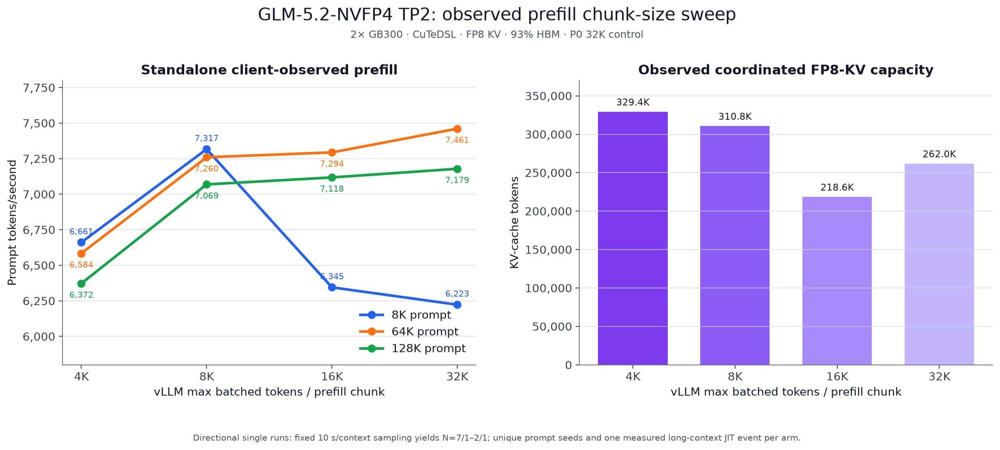

# P11–P13: TP2 prefill chunk-size sweep

This frozen increment varies vLLM's `--max-num-batched-tokens` on the accepted
P0 TP2 + EP2 CuTeDSL configuration. The new 4K, 8K, and 16K arms are
prefill-only; the accepted [P0 result](../2026-08-20-p0-cutedsl/) supplies the
32K control using the same standalone-cold prefill method.

| Max batched tokens | 8K prefill | 64K prefill | 128K prefill | Observed FP8-KV capacity |
| ---: | ---: | ---: | ---: | ---: |
| 4,096 | 6,661 tok/s 1.230s TTFT · N=7 | 6,584 9.954s · N=1 | 6,372 20.570s · N=1 | 329,408 tokens |
| **8,192** | **7,317** **1.120s · N=7** | 7,260 9.028s · N=2 | 7,069 18.542s · N=1 | 310,784 tokens |
| 16,384 | 6,345 1.291s · N=7 | 7,294 8.985s · N=2 | 7,118 18.414s · N=1 | 218,624 tokens |
| **32,768 (P0)** | 6,223 1.317s · N=7 | **7,461** **8.785s · N=2** | **7,179** **18.258s · N=1** | 261,952 tokens |

The 8K chunk produced the best observed 8K-prefill result, 17.58% above the
32K control. The 32K control remained best at 64K and 128K. The 4K arm was
11.75% and 11.24% below the control at those long contexts. Capacity is an
observed startup-profiler result, not a guaranteed monotonic relationship:
the 16K arm's limiting rank retained less activation/KV headroom despite a
clean idle-HBM start.

## What was held fixed

All four points use the pinned NVIDIA NVFP4 checkpoint, vLLM 0.27.1 image,
two GB300s with TP2/PP1 + EP2, FlashInfer CuTeDSL MoE, autotuning off, FP8 E4M3
KV, 93% HBM utilization, 135,168 maximum model length, 128 maximum sequences,
prefix caching enabled, speculation off, and no CPU offload. The current
resolved plans make the graph configuration explicit: Inductor with
`FULL_AND_PIECEWISE` CUDA graphs at C1–C128. Runtime auto-selected a 64-token
KV block/page size in every arm.

The semantic server-argument change against P0 is only
`--max-num-batched-tokens`; `chunked_prefill_size` is the manifest's second
name for that same vLLM knob. The new workload scope is prefill-only, whereas
P0 ran decode after its standalone prefill phase.

## Measurement and request sanity

`llm-inference-bench` 0.4.29 at commit
`0b4185b5b435e948b199c9077a00b084864aa963` measures actual API prompt tokens
divided by client TTFT. It gives each context a fixed 10-second window, checked
between completed requests, with at least one and at most seven samples. This
is why the 4K arm has N=1 at 64K and every 128K row has N=1. A unique prefix is
generated for every sample.

The new arms' final server counters reconcile to 262,178 / 327,715 / 327,716
prompt tokens for 4K / 8K / 16K. Every token was locally computed; cached
tokens, prefix hits, preemptions, aborts, request errors, and repetition
finishes were all zero. Server-computed prefill timing counters were not
available, so these are client-observed rates rather than server-kernel rates.

No natural outputs were retained for the three lean prefill-only arms. Their
one-token requests prove API/request health, not semantic quality or
non-degeneracy. P0's separate natural-output audit retained four normal
finishes with zero automatic flags, but it is not represented as a per-arm
quality rerun here.

## Single-run caveats

- Each arm used a separately generated padding seed. Token targets match, but
  prompt contents are not bit-identical; some 128K API counts differ by one
  chat-template token.
- One `BuildPrefillChunkMetadataKernel` runtime-JIT warning occurred on both
  ranks in each new arm: in the 4K arm's sole 128K sample and the 8K/16K arms'
  second 64K sample. Individual sample latencies were not retained, so the
  effect cannot be removed after the fact. P0 likewise JIT-compiled during its
  sole 128K sample.
- P0 logged two recovered 1.125-GiB allocator failures during 64K prefill. The
  three new arms logged none. All recorded requests completed.
- These are directional single runs, not repeated warm steady-state estimates.
  Startup and page-cache timing is therefore not compared.

The quiet request windows averaged approximately 72.31, 81.86, and 81.96 Gb/s
of RDMA traffic in each direction for 4K, 8K, and 16K respectively. The 4K arm
ran one fewer 64K sample, so those averages are not a chunk-speed comparison.
All configured health-counter delta sets were empty. Raw counters still
recorded 20, 8, and 28 corrected PHY bits respectively, plus one PCI
signal-integrity increment in the 8K arm. Whole-window averages do not exclude
brief saturation, latency, synchronization, or routing effects.

All three new arms passed the structural/capacity validator, used graceful
teardown, passed the post-run current-boot kernel scan, and returned to 2–7 MiB
idle HBM per rank.

## Artifacts

- [`prefill.csv`](prefill.csv): high-precision chart/table inputs including P0.
- [`runtime-summary.json`](runtime-summary.json): configuration proof,
  request/cache counters, capacity, JIT, network, teardown, and raw-source
  hashes.
- `benchmark-chunk*.json`: sanitized full benchmark results; measurement fields
  are unchanged.
- `resolved-plan-chunk*.json` and `validation-chunk*.json`: exact declared plans
  and structural validation.
- [`SHA256SUMS`](SHA256SUMS): per-file integrity manifest.

Use the [deep-study recipe](../../../recipes/deep-study/) and the three
`vllm-tp2-prefill-*` profiles to reproduce the new points. Regenerate the
chart with `render_prefill_chunk_sweep.py`.
