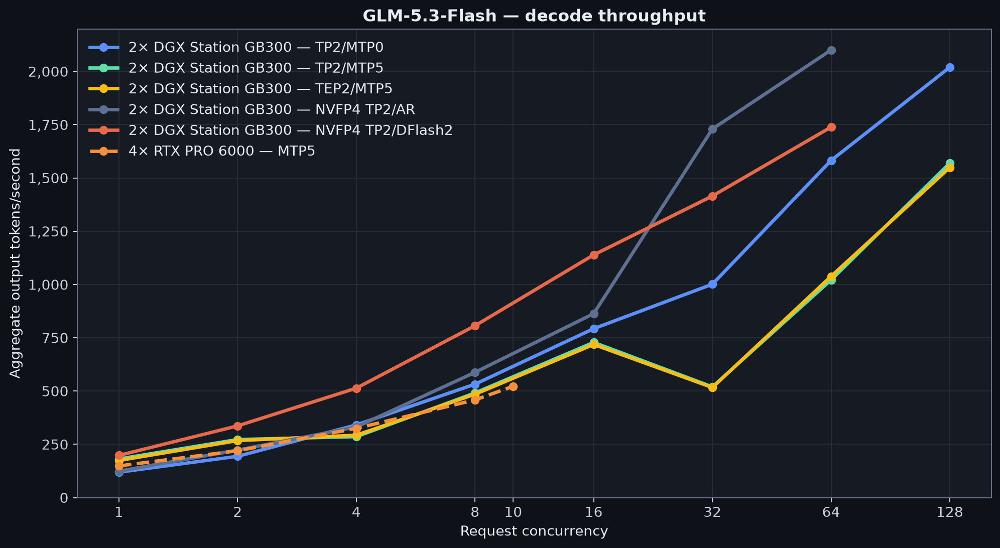
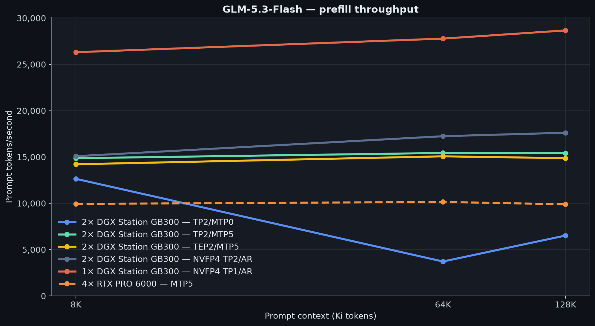

# GLM-5.3-Flash

This section tracks the native-FP8
[`zai-org/GLM-5.3-Flash`](https://huggingface.co/zai-org/GLM-5.3-Flash)
checkpoint at revision `3f1971b7b5f7a528c9c4ef6212c8785298a8c24a`.
It also includes
[`LibertAIDAI/GLM-5.3-Flash-NVFP4`](https://huggingface.co/LibertAIDAI/GLM-5.3-Flash-NVFP4/tree/aa28e1f54130286c95fee10d0705c74ce8743734)
at exact revision `aa28e1f54130286c95fee10d0705c74ce8743734`. The model is a
320B-total, 18B-active mixture of experts with 45 layers and 288 experts, 8 of
which are selected per token.

## 2× DGX Station GB300

Decode uses an exact 8,192-token prompt and 1,024-token output. Every DGX
column reports one distributed model server across both Stations. Native FP8
uses vLLM. The NVFP4 columns use SGLang with routed-expert NVFP4 weights and
the remaining weights and activations in BF16; DFlash2 is speculative decoding
on that same NVFP4 base.

| C | FP8 TP2/MTP0 | FP8 TP2/MTP5 | FP8 TEP2/MTP5 | NVFP4 TP2/AR | NVFP4 TP2/DFlash2 |
| ---: | ---: | ---: | ---: | ---: | ---: |
| 1 | 119.0 | 181.2 | 174.1 | 124.0 | 198.0 |
| 2 | 193.7 | 272.4 | 267.4 | 222.8 | 336.5 |
| 4 | 340.8 | 285.9 | 292.7 | 331.2 | 513.4 |
| 8 | 532.2 | 490.9 | 485.0 | 587.7 | 806.5 |
| 16 | 792.7 | 728.1 | 718.4 | 863.1 | 1,138.9 |
| 32 | 1,001.4 | 519.5 | 516.4 | 1,729.8 | 1,415.3 |
| 64 | 1,582.1 | 1,021.6 | 1,038.2 | 2,100.4 | 1,738.6 |
| 128 | 2,019.5 | 1,569.3 | 1,549.3 | — | — |

Cold-prefill rates are prompt tokens per second.

| Context | FP8 TP2/MTP0 | FP8 TP2/MTP5 | FP8 TEP2/MTP5 | NVFP4 TP2/AR |
| ---: | ---: | ---: | ---: | ---: |
| 8K | 12,645 | 14,871 | 14,214 | 15,088 |
| 64K | 3,721 | 15,438 | 15,076 | 17,245 |
| 128K | 6,519 | 15,431 | 14,873 | 17,622 |

DFlash2 changes decode only, so its matching cold-prefill baseline is the
NVFP4 TP2/AR column rather than a duplicate DFlash2 prefill series.

## 4× RTX PRO 6000 comparison

| Decode C | MTP5 output tok/s |
| ---: | ---: |
| C1 | 148.5 |
| C2 | 219.8 |
| C4 | 324.8 |
| C8 | 458.3 |
| C10 | 522.4 |

| Prefill context | Prompt tok/s |
| ---: | ---: |
| 8K | 9,936 |
| 64K | 10,152 |
| 128K | 9,892 |

See the [reproduction recipe](recipes/) for workload details, runtime pins,
provenance, observed concurrency, and operational notes. Machine-readable
results are in [`data/`](data/).

Return to the [repository overview](../).
