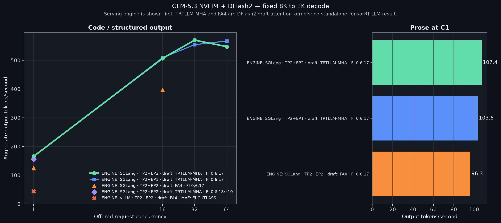
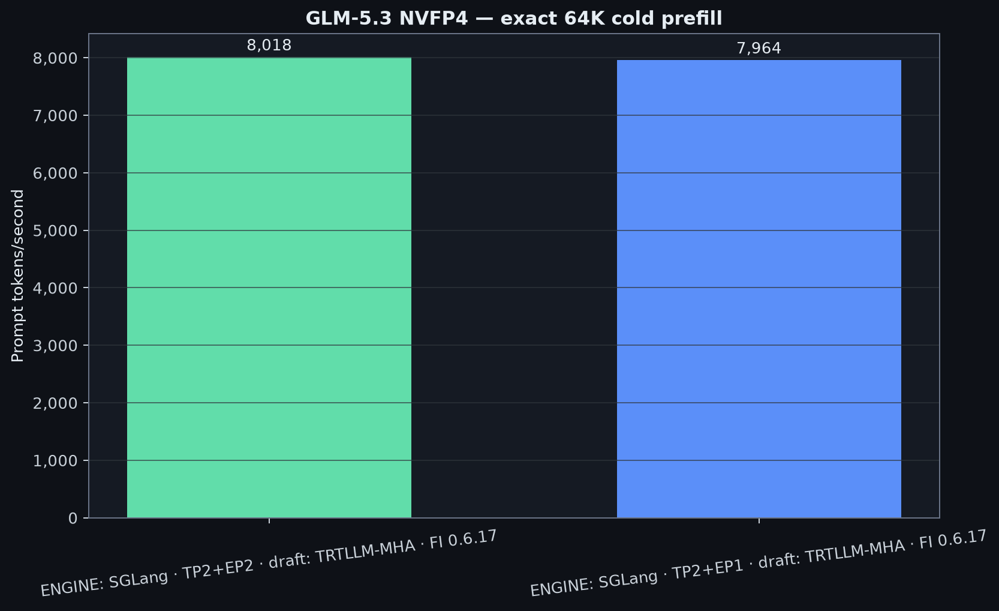

# GLM-5.3

This section benchmarks the full-size
[`incoai/GLM-5.3-NVFP4`](https://huggingface.co/incoai/GLM-5.3-NVFP4/tree/54e52520606f96b3d9fc84088ad22882a61648ac)
checkpoint with
[`incoai/GLM-5.3-DFlash2`](https://huggingface.co/incoai/GLM-5.3-DFlash2/tree/425aa615ce320caac34400208b30808c8f14f76c).
It is the 464.8 GB `glm_moe_dsa` model, not the smaller
[`GLM-5.3-Flash`](../glm-5.3-flash/) model.

## 2× DGX Station GB300

One SGLang server spans both Stations. The final TP2+EP2 profile reached
**165.5 output tok/s** for code at C1, **107.4 tok/s** for prose at C1, and
**570.0 aggregate tok/s** at offered C32. Decode uses exact 8,192-token prompts
and 1,024-token outputs.

| Serving engine | Topology | DFlash2 draft attention | FlashInfer | C1 code | C1 prose | C16 code | C32 code | C64 code |
| --- | --- | --- | --- | ---: | ---: | ---: | ---: | ---: |
| **SGLang** | TP2+EP2 | TRTLLM-MHA | 0.6.17 | **165.5** | **107.4** | 506.3 | **570.0** | 547.3 |
| **SGLang** | TP2+EP1 | TRTLLM-MHA | 0.6.17 | 164.7 | 103.6 | **508.5** | 554.2 | **566.9** |
| **SGLang** | TP2+EP2 | FA4 | 0.6.17 | 124.4 | 96.3 | 396.5 | — | — |
| **SGLang** | TP2+EP2 | TRTLLM-MHA | 0.6.18rc10 | 155.6 | — | — | — | — |
| **vLLM** | TP2+EP2 | FA4 | 0.6.17 | 43.8 | — | — | — | — |

`TRTLLM-MHA` and `FA4` name the DFlash2 draft-attention kernel. They are not
serving engines, and this table contains no standalone TensorRT-LLM result.

The final TP2+EP2 profile's exact 65,536-token cold prefill reached **8,018
prompt tok/s** with an **8.174-second TTFT**.

See the [reproduction recipe](recipes/) for the exact runtime, topology,
request settings, observed concurrency, and operational notes. Machine-readable
results are in [`data/`](data/).

Return to the [repository overview](../).
