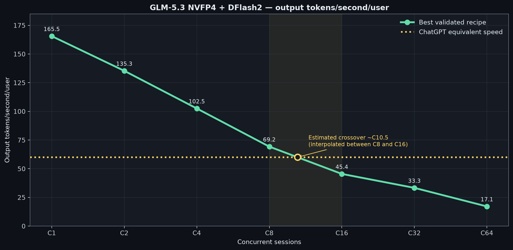
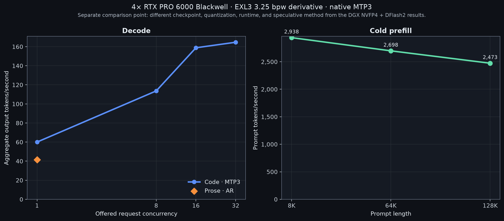

# GLM-5.3 NVFP4 + DFlash2

The published measurements below use full-size
[`incoai/GLM-5.3-NVFP4@54e5252`](https://huggingface.co/incoai/GLM-5.3-NVFP4/tree/54e52520606f96b3d9fc84088ad22882a61648ac)
with
[`incoai/GLM-5.3-DFlash2@425aa61`](https://huggingface.co/incoai/GLM-5.3-DFlash2/tree/425aa615ce320caac34400208b30808c8f14f76c)
on 2× NVIDIA DGX Station GB300.

The current serving recipes instead pin
[`local-inference-lab/GLM-5.3-NVFP4@cca10d1`](https://huggingface.co/local-inference-lab/GLM-5.3-NVFP4/tree/cca10d1586255195d3279785fc85577bfc1e9227).
That replacement has passed a metadata and source-compatibility audit only;
none of the performance, acceptance, or memory figures on this page measure it.

## TP2 headline — SGLang TP2+EP2 · DFlash2 K7

| Workload | C1 | C2 | C4 | C8 | C16 | C32 | C64 |
| --- | ---: | ---: | ---: | ---: | ---: | ---: | ---: |
| Code aggregate tok/s | **165.5** | — | — | — | **506.3†** | **570.0†** | **547.3†** |
| Prose aggregate tok/s | **107.4** | — | — | — | — | — | — |

† Queueing observed; C32/C64 reached at most 29 active requests.

## PP2 headline — vLLM PP2 42/36 · DFlash2

| Workload | C1 | C2 | C4 | C8 | C16 | C32 | C64 |
| --- | ---: | ---: | ---: | ---: | ---: | ---: | ---: |
| Code aggregate tok/s | **154.9 K4** | **270.6 K5** | **409.9 K5** | **553.8 K7** | **742.0 K7** | **1,065.0 K7** | **1,093.8 K7** |
| Prose aggregate tok/s | **106.3 K4** | — | — | — | — | — | — |

## Cold prefill

| Profile | Exact 8K | Exact 64K | Exact 128K |
| --- | ---: | ---: | ---: |
| SGLang PP2/AR 40/38 | **16,425 tok/s · 0.499 s** | **25,854 tok/s · 2.535 s** | **25,249 tok/s · 5.191 s** |
| SGLang TP2+EP2/DFlash2 | — | **8,018 tok/s · 8.174 s** | — |

## PP2 DFlash2 proposal sweep

| Proposals | C1 code | C1 prose | C2 | C4 | C8 | C16 | C32 | C64 |
| ---: | ---: | ---: | ---: | ---: | ---: | ---: | ---: | ---: |
| **K4** | **154.9** | **106.3** | 270.6 | 399.9 | 542.5 | 725.6* | — | — |
| **K5** | 152.6 | 104.1 | **270.6** | **409.9** | 538.9 | 723.6 | — | — |
| **K7** | 146.0 | 92.7 | 267.0 | 405.7 | **553.8** | **742.0** | **1,065.0** | **1,093.8** |

Aggregate output tok/s, exact 8,192-token input and 1,024-token output. All
cells use `5×C` measured requests except the validated `K4 C16` `2×C` screen.

## 4× RTX PRO 6000 comparison — different model stack

**EXL3 3.25 bpw derivative checkpoint · native MTP3**

| Decode | Mode | Aggregate output tok/s | Max resident |
| --- | --- | ---: | ---: |
| C1 code | MTP3 | **60.03** | 1 |
| C1 prose | AR | **41.53** | 1 |
| C8 code | MTP3 | **113.63** | 8 |
| C16 code | MTP3 | **158.85** | 16 |
| C32 code | MTP3 | **164.64** | 29 |

| Cold prefill | Prompt tok/s | TTFT |
| ---: | ---: | ---: |
| 8K | **2,937.94** | 2.788 s |
| 64K | **2,698.40** | 24.290 s |
| 128K | **2,473.41** | 52.999 s |

This is a comparison point, not the exact Inco NVFP4 target or DFlash2 draft
used in the DGX Station tables.

[`PP2 + DFlash2 recipe`](recipes/pp2_dflash2.md) ·
[`General recipe`](recipes/) · [`Data`](data/)

Return to the [repository overview](../).
