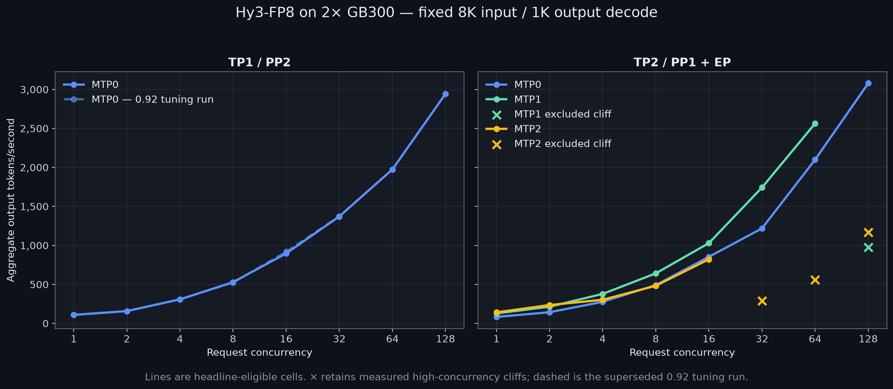
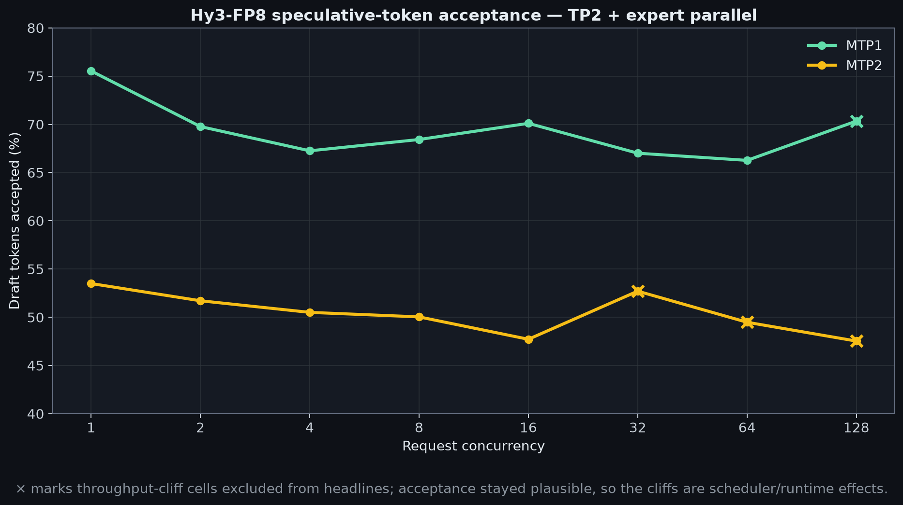
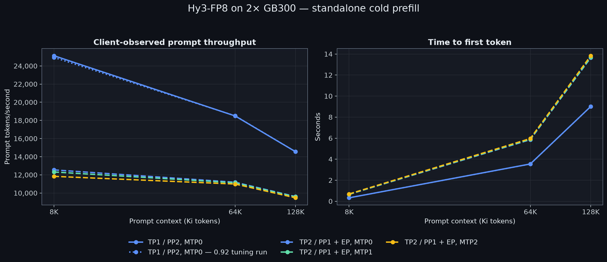
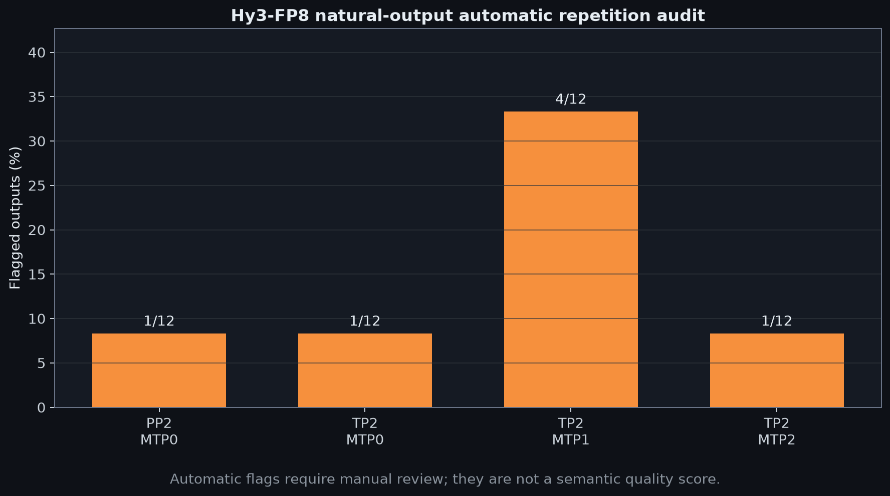

# Tencent Hy3-FP8 on 2× NVIDIA GB300 DGX Stations

This experiment measures the official
[`tencent/Hy3-FP8`](https://huggingface.co/tencent/Hy3-FP8) checkpoint at
revision `ecc1d8e194e093f33177f2f0ef7ce8f397b2d68b`. Hy3 is a 295B-total,
21B-active mixture-of-experts model with 80 transformer layers, 192 experts,
top-8 routing, one native MTP layer, and a 262,144-token context window.

The complete 101-shard, 299,889,838,946-byte checkpoint was verified on both
systems. The accepted matrix contains PP2/MTP0 and TP2+expert-parallel
MTP0/MTP1/MTP2, each at C1–C128, cold 8K/64K/128K prefill, and 12 natural
outputs. PP2 MTP1/MTP2 are explicitly unsupported by the pinned runtime; they
are not missing measurements or estimates.

The [reproduction recipe](recipes/) covers the checkpoint, capacity guard,
safe two-node launch, exact workload, quality audit, and strict extraction.

## Checkpoint provenance

| Role | Hugging Face source | Exact revision | Status | Weight format | Retained size evidence |
| --- | --- | --- | --- | --- | --- |
| Target | [`tencent/Hy3-FP8`](https://huggingface.co/tencent/Hy3-FP8) | `ecc1d8e194e093f33177f2f0ef7ce8f397b2d68b` | Official Tencent checkpoint | Native FP8 checkpoint | 101 indexed safetensor shards, 299,889,838,946 bytes |

Both benchmark nodes independently verified the complete pinned checkpoint. The exact capacity evidence is retained in [`data/capacity.csv`](data/capacity.csv); no third-party quantization was used.

## Headline results

- Fastest eligible single stream: **141.9 output tok/s** with TP2+EP/MTP2.
- Fastest eligible C16: **1,029.8 output tok/s** with TP2+EP/MTP1.
- Fastest eligible C64: **2,563.7 output tok/s** with TP2+EP/MTP1.
- Fastest stable C128 result: **3,078.5 output tok/s** with TP2+EP/MTP0.
- Fastest cold prefill: **25,126 / 18,490 / 14,549 prompt tok/s** at
  8K / 64K / 128K with PP2/MTP0.

MTP1 falls from 2,563.7 tok/s at C64 to 973.9 at C128. A separately launched
60-second C128 run at utilization 0.958 reproduced the cliff at 957.2 tok/s,
with all 128 requests resident, zero errors, and 71.3% speculative acceptance.
MTP2 develops a separate throughput cliff beginning at C32. Those measured
cells remain in the tables and CSV with a dagger, but are deliberately excluded
from headlines.

## Fixed 8K input / 1K output decode

Aggregate output tokens/second; each cell ran in duration mode for 30 seconds.
All accepted cells had zero request errors and reached the full offered
concurrency. Boundary requests can remain in flight at the cutoff, so the CSV
retains submitted and completed counts separately.

| Topology / draft depth | C1 | C2 | C4 | C8 | C16 | C32 | C64 | C128 |
| --- | ---: | ---: | ---: | ---: | ---: | ---: | ---: | ---: |
| TP1 / PP2, MTP0 | 109.3 | 158.2 | 308.3 | 529.5 | 896.9 | 1,371.3 | 1,974.3 | 2,943.6 |
| TP2 / PP1 + EP, MTP0 | 83.2 | 143.6 | 276.7 | 491.2 | 853.9 | 1,218.6 | 2,099.7 | **3,078.5** |
| TP2 / PP1 + EP, MTP1 | 128.4 | 214.7 | 378.6 | 641.7 | **1,029.8** | **1,742.5** | **2,563.7** | 973.9† |
| TP2 / PP1 + EP, MTP2 | **141.9** | **235.8** | 303.4 | 483.0 | 822.2 | 288.1† | 561.1† | 1,170.1† |

† Accepted measurement retained for diagnosis, but excluded from headline
selection because of the reproducible high-concurrency throughput cliff.

The no-speculation topology comparison changes with concurrency: PP2 is faster
through C32 and has much higher prefill throughput, while TP2+EP overtakes it at
C64 and reaches 3,078.5 tok/s at C128.

## Speculative acceptance

| Draft depth | C1 | C2 | C4 | C8 | C16 | C32 | C64 | C128 |
| --- | ---: | ---: | ---: | ---: | ---: | ---: | ---: | ---: |
| MTP1 | 75.5% | 69.8% | 67.3% | 68.4% | 70.1% | 67.0% | 66.3% | 70.3%† |
| MTP2 | 53.5% | 51.7% | 50.5% | 50.0% | 47.7% | 52.7%† | 49.5%† | 47.5%† |

Acceptance remains plausible in the cliff cells. Together with zero errors and
full residency, this points to a scheduler/runtime scaling effect rather than
degenerate draft tokens or capacity-limited admission.

## Cold prefill

The API template adds two tokens to each tokenizer-targeted prompt. Values are
client-observed prompt tok/s / time to first token; the nominal contexts are
8K, 64K, and 128K, while actual API prompt lengths are 8,194, 65,538, and
131,074 tokens.

| Topology / draft depth | 8K | 64K | 128K |
| --- | ---: | ---: | ---: |
| TP1 / PP2, MTP0 | **25,126 / 0.326s** | **18,490 / 3.545s** | **14,549 / 9.009s** |
| TP2 / PP1 + EP, MTP0 | 12,547 / 0.653s | 11,188 / 5.858s | 9,606 / 13.646s |
| TP2 / PP1 + EP, MTP1 | 12,316 / 0.665s | 11,126 / 5.891s | 9,579 / 13.684s |
| TP2 / PP1 + EP, MTP2 | 11,836 / 0.692s | 10,990 / 5.964s | 9,470 / 13.841s |

## Natural-output audit

Each accepted configuration generated 12 natural responses: four prompts at
each of `no_think`, `low`, and `high`. All 48 responses were read manually and
were coherent and nondegenerate. Twenty thinking responses reached the
1,024-token cap; that is a truncation caveat, not evidence of repetition.
Automatic flags were caused by Markdown punctuation or repeated code fragments
and were manually checked rather than treated as a semantic score.

| Topology / draft depth | Outputs | Stop / length | Automatic flags | Max repeated 8-gram fraction | Manual review |
| --- | ---: | ---: | ---: | ---: | --- |
| TP1 / PP2, MTP0 | 12 | 8 / 4 | 1 | 3.45% | Clean |
| TP2 / PP1 + EP, MTP0 | 12 | 7 / 5 | 1 | 0.32% | Clean |
| TP2 / PP1 + EP, MTP1 | 12 | 7 / 5 | 4 | 3.45% | Clean |
| TP2 / PP1 + EP, MTP2 | 12 | 6 / 6 | 1 | 0.34% | Clean |

## Runtime and capacity

Two GB300s expose 501.373 GiB aggregate usable HBM over one 400-GbE/RoCE
rail (`mlx5_0`, MTU 9000). The base runtime is vLLM 0.27.1 at
`vllm/vllm-openai@sha256:0a51ea5b...1bfd967`; speculative configurations use
the documented local `hy3-vllm:0.27.1-mtp-compile` image. The benchmark commit
is `0b4185b5b435e948b199c9077a00b084864aa963`. All cells use FP8 E4M3 KV,
temperature 0, a 262,144-token server limit, prefix caching, CUDA-graph capture
through 128 sequences, and `max_num_batched_tokens=32768`.

| Accepted profile | Utilization | Global KV tokens | Guard | Margin |
| --- | ---: | ---: | ---: | ---: |
| PP2, MTP0 | 0.956 | 1,189,328 | 1,179,904 | +9,424 |
| TP2+EP, MTP0 | 0.956 | 1,231,232 | 1,179,904 | +51,328 |
| TP2+EP, MTP1 | 0.956 | 1,183,696 | 1,179,904 | +3,792 |
| TP2+EP, MTP1 C128 confirmation | 0.958 | 1,185,664 | 1,179,904 | +5,760 |
| TP2+EP, MTP2 | 0.958 | 1,187,056 | 1,179,904 | +7,152 |

Utilization 0.956 is the baseline profile. MTP2 could not meet the fixed KV
guard at 0.956; its accepted 0.958 run exceeded the guard by 7,152 tokens. The
separately launched MTP1 C128 stability check also used 0.958 after
activation-profile variance made its 0.956 relaunch miss the guard by 688
tokens.

## 1× DGX Station: does not fit

The installed GB300 exposes 256,703 MiB of usable HBM. The verified FP8 weight
shards alone occupy 299,889,838,946 bytes (279.294 GiB), before KV cache,
CUDA graphs, or kernel workspaces.

| Item | Binary |
| --- | ---: |
| GB300 reported usable HBM | 250.687 GiB |
| Hy3-FP8 weight shards | 279.294 GiB |
| Weight-only shortfall | **28.608 GiB** |

There is no GPU-native 1× result. CPU offload is intentionally excluded because
it would measure host memory and the interconnect instead of comparable
GPU-native inference.

## Distributed-runtime findings

### PP2 requires FlashInfer autotuning disabled

With vLLM 0.27.1 / FlashInfer 0.6.16.post3, the unequal PP stages entered
different distributed kernel-tuning sequences. PP1 finished while PP0 remained
blocked, followed by unavailable shared-memory broadcast messages. This is a
confirmed distributed-autotune deadlock. The working PP2 launch adds
`--no-enable-flashinfer-autotune`; FlashInfer attention and MoE kernels remain
enabled and use their normal heuristic configurations.

### TP2 requires expert parallelism

Plain TP2 loaded the checkpoint but exhausted both GB300s during warmup while
trying repeated 20-MiB allocations. All accepted TP2 results use
`--enable-expert-parallel`, distributing the 192 experts rather than
replicating them. No plain-TP2 number is published.

### PP2 speculative decoding is unsupported

The pinned runtime resolves the draft model as `HYV3MTPModel`, then rejects
pipeline parallelism because it lacks the `SupportsPP` interface. Therefore
PP2/MTP1 and PP2/MTP2 are explicitly unsupported. The recipe refuses those
combinations instead of patching model semantics or fabricating comparisons.

### Preserved capacity failures

Two clean-idle speculative launches were rejected before benchmarking: MTP1 at
0.956 exposed 1,179,216 KV tokens (688 below guard), and MTP2 at 0.956 exposed
1,175,760 (4,144 below guard). These attempts justify the narrowly scoped
0.958 speculative profile.

Checksummed, retained capacity-failure evidence is in
[`data/failure-evidence.json`](data/failure-evidence.json) and
[`data/kv-capacity.csv`](data/kv-capacity.csv). Operational launch and cleanup
checks are documented in the [reproduction recipes](recipes/).

## Superseded 0.92 tuning run

The preserved PP2/MTP0 run at utilization 0.92 produced C1–C64 and all three
prefill contexts but no C128 or natural-output audit. Its rows remain labeled
`provisional_tuning` in the CSV and appear as a dashed line in charts. They are
not used for any headline; the accepted 0.956 PP2/MTP0 run supersedes them.

## Data and tooling

- [`data/throughput.csv`](data/throughput.csv) — exact C1–C128 decode rows,
  scheduler counters, speculative counters, and headline policy
- [`data/prefill.csv`](data/prefill.csv) — 8K/64K/128K prompt throughput and TTFT
- [`data/quality-summary.csv`](data/quality-summary.csv) — automatic and manual
  natural-output audit
- [`data/stability-confirmation.csv`](data/stability-confirmation.csv) — the
  separate 60-second MTP1 C128 confirmation
- [`data/kv-capacity.csv`](data/kv-capacity.csv) — accepted and rejected KV profiles
- [`data/evidence/`](data/evidence/) and [`data/runtime/`](data/runtime/) —
  compact checksummed source evidence and runtime manifests
- [`recipes/extract-results.py`](recipes/extract-results.py) — strict,
  allowlisted raw-result ingestion
- [`charts/render-charts.py`](charts/render-charts.py) — publication chart renderer

Return to the [repository overview](../).
