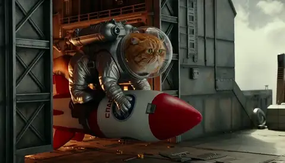
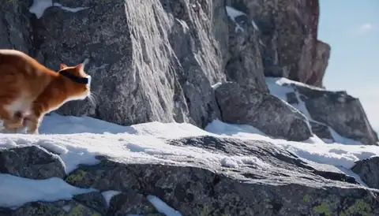
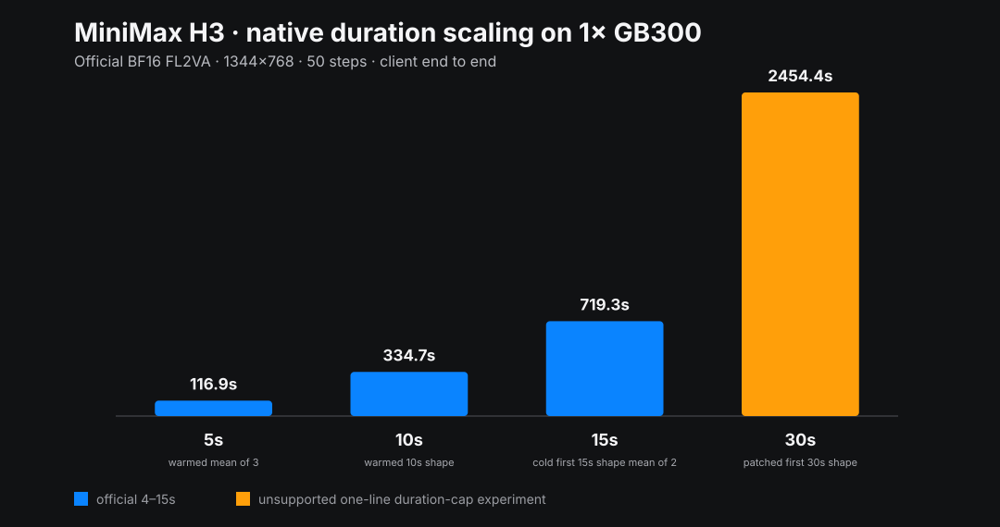
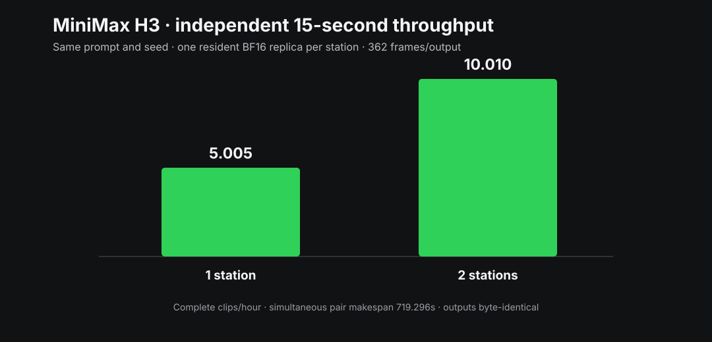
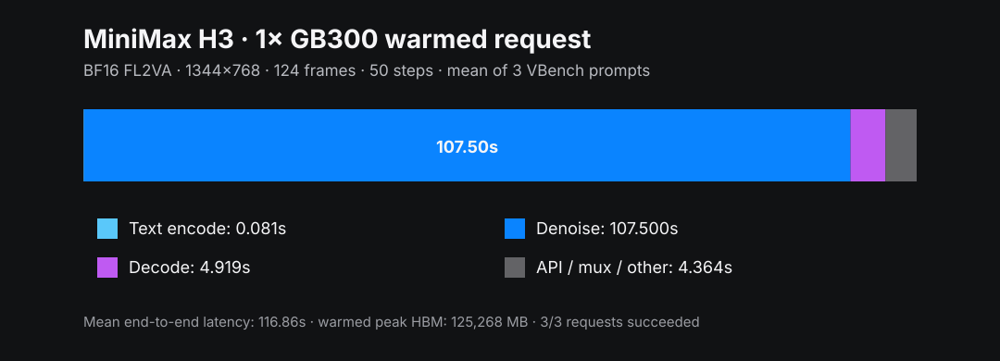

# MiniMax H3 video generation on DGX Station GB300

Official BF16 MiniMax H3 FL2VA runs fully resident on one GB300—no CPU or
layerwise offload—and produces native H.264 video with generated stereo audio.

> [!IMPORTANT]
> MiniMax H3 weights use the [MiniMax H3 Community License](https://huggingface.co/MiniMaxAI/MiniMax-H3/blob/42ed227ee7df40d41602854ae760620d6eb651fe/LICENSE), not Apache-2.0. Its default grant excludes the EU, UK, Republic of Korea, and United States. Obtain separate MiniMax authorization before downloading or running the weights in an excluded territory.

> [!NOTE]
> **Benchmark matrix complete.** The official 5-, 10-, and 15-second rows are
> complete. A single native-30-second request also completed after a one-line
> duration-cap overlay; that result is explicitly unsupported and is kept
> separate from the upstream-supported 4–15-second range.

## Watch the generated samples

Click an animated preview for the original 1344×768 MP4 with generated
32-kHz stereo AAC audio. GitHub's inline HTML player is best effort; the bold
MP4 link always exposes the file directly.

### Rocket cat · native 10 seconds

**[Open/download the full rocket-cat MP4 with audio](samples/rocket-cat-10s.mp4)**

<video controls preload="metadata" src="samples/rocket-cat-10s.mp4"></video>

| Field | Value |
|---|---|
| Prompt | A large heroic orange cat is clearly visible in every shot, wearing a shiny miniature bubble spacesuit and securely strapped into a saddle astride the OUTSIDE of a small red-and-white toy rocket. Begin with a close-up hero shot of the cat and rocket together on a miniature launchpad. The camera stays close enough to see the cat riding safely as the rocket launches through bright clouds into orbit. Absurd cinematic adventure, dynamic tracking camera, rich stereo launch rumble and rocket ambience, clearly fictional, no injury, and no one is harmed. |
| Duration | 10.125 seconds / 243 frames at 24 FPS |
| Runtime | 334.731 seconds client end to end |
| Seed | 1011 |

### Mountain cat · native 15 seconds

**[Open/download the full mountain-cat MP4 with audio](samples/mountain-cat-15s.mp4)**

<video controls preload="metadata" src="samples/mountain-cat-15s.mp4"></video>

| Field | Value |
|---|---|
| Prompt | A clearly fictional athletic orange cat wearing secure protective goggles sprints impossibly at 60 miles per hour along a dramatic mountain crag trail, controlled action-comedy, stones and powdery snow streaming behind, dynamic low tracking camera, crisp stereo wind and pawstep ambience, no falls, no injury, and no one is harmed. |
| Duration | 15.083 seconds / 362 frames at 24 FPS |
| Runtime | 719.283 seconds client end to end |
| Seed | 1515 |

### Martial-arts cat · experimental native 30 seconds

**[Open/download the full martial-arts-cat MP4 with audio](samples/martial-arts-cat-30s.mp4)**

<video controls preload="metadata" src="samples/martial-arts-cat-30s.mp4"></video>

| Field | Value |
|---|---|
| Prompt | A clearly fictional, cinematic orange cat performs extreme but controlled martial-arts wire-fu without injury: acrobatic forms, spinning kicks and a clean board break in a lantern-lit dojo, then a dramatic temple-rooftop finale at night, dynamic tracking camera, stylized action, stereo impacts and wind ambience, no gore and no one is harmed. |
| Duration | 30.667 seconds / 736 frames at 24 FPS |
| Runtime | 2,454.442 seconds client end to end |
| Seed | 3030 |

This third sample used the unsupported duration-cap overlay documented below.
The [sample gallery](samples/README.md) also includes the 5-second
marching-cats quality fixture.

## Headline results

| Workload | Runtime state | Stations | Client E2E | Peak HBM | Encoded output | Clips/hour |
|---|---|---:|---:|---:|---:|---:|
| Canonical 5-second VBench | warmed; mean of 3 | 1 | **116.865 s** | 125,268 MB | 124 frames / 5.167 s | 30.805 |
| Rocket cat 10-second | warmed 10-second shape | 1 | **334.731 s** | 131,946 MB | 243 frames / 10.125 s | 10.755 |
| Mountain cat 15-second | cold first 15-second shape; mean of 2 | 1 each | **719.290 s** | 141,424 MB | 362 frames / 15.083 s | 5.005 each |
| Same simultaneous 15-second pair | two independent replicas | 2 | **719.296 s makespan** | 141,424 MB each | 724 aggregate frames | **10.010 aggregate** |
| Martial-arts cat 30-second | unsupported patched first 30-second shape | 1 | **2,454.442 s** | 156,852 MB | 736 frames / 30.667 s | 1.467 |

The orange 30-second bar is an unsupported source-overlay experiment, not an
upstream-supported configuration. Publication-ready sample-level measurements
are below; file size is the original H.264/AAC MP4.

| Requested | Client E2E | Text | Denoise | Decode | Peak HBM | Frames/wall-s | Video-s/wall-s | RTF | MP4 bytes | Clips/hour |
|---:|---:|---:|---:|---:|---:|---:|---:|---:|---:|---:|
| 10 s | 334.731 s | 0.062 s | 314.970 s | 9.366 s | 131,946 MB | 0.725956 | 0.030248 | 33.060× | 2,360,823 | 10.755 |
| 15 s | 719.283 s | 23.749 s | 643.907 s | 31.687 s | 141,424 MB | 0.503279 | 0.020970 | 47.687× | 5,589,603 | 5.005 |
| 30 s patched | 2,454.442 s | 0.061 s | 2,365.021 s | 28.960 s | 156,852 MB | 0.299865 | 0.012494 | 80.036× | 6,608,480 | 1.467 |

The two independent 15-second jobs used identical prompt, seed, launch path,
and hardware. Their client times were 719.296342 and 719.283174 seconds—a
0.013167-second range—and their MP4s were byte-identical. This is the measured
two-station throughput path: each station serves a complete resident replica,
with no cross-node communication.

The 10-second shape had already been compiled by a discarded semantic-miss
draft, so its selected sample is warmed. The 15-second pair is deliberately
labeled cold first-seen shape; the two rows are not a same-warmup-state
comparison. The canonical 5-second result uses one full 50-step warmup followed
by three measured VBench prompts at concurrency one.

| Canonical warmed mean stage | Time | Share of client latency |
|---|---:|---:|
| Text encode | 0.081 s | 0.1% |
| Denoise | 107.500 s | 92.0% |
| Video/audio decode | 4.919 s | 4.2% |
| API, mux, and other | 4.364 s | 3.7% |

## Checkpoint provenance

| Item | Exact source |
|---|---|
| Checkpoint | Official [`MiniMaxAI/MiniMax-H3`](https://huggingface.co/MiniMaxAI/MiniMax-H3/tree/42ed227ee7df40d41602854ae760620d6eb651fe/FL2VA) on Hugging Face |
| Component | `FL2VA`, official CFG-distilled BF16 weights for T2VA and FL2VA |
| Revision | `42ed227ee7df40d41602854ae760620d6eb651fe` |
| Payload | 144,051,182,625 bytes (134.16 GiB), including 29 safetensor files |
| License | Official/community checkpoint under the [MiniMax H3 Community License](https://huggingface.co/MiniMaxAI/MiniMax-H3/blob/42ed227ee7df40d41602854ae760620d6eb651fe/LICENSE); authorization caveat above |

The download recipe fetches root metadata plus `FL2VA/*` only. Ref2VA and the
duplicate Diffusers layout are excluded from this experiment.

## Runtime and workload

| Item | Pinned value |
|---|---|
| SGLang source | `c0b6474b43363c2f4bc60fe3d7817d393fb51d32` |
| ARM64 image | `lmsysorg/sglang@sha256:c3c427732dd726b6e1656dd3cb491bee3629a269c83c57496d26fe28b4d8c5ea` |
| Serve path | Resident BF16 FL2VA, Ulysses1 × Ring1, performance mode `speed` |
| Canvas | 1344×768, 16:9 |
| Sampling | 50 sigma-grid points / 49 model evaluations; video/audio flow shifts 12/3 |
| Output | H.264 at 24 FPS plus 32-kHz stereo AAC |
| Excluded | CPU offload, layerwise offload, quantization, Cache-DiT, reduced steps, and `torch.compile` |

The released local pipeline combines a 33B dense joint audio/video transformer,
the full Qwen3-VL-32B encoder, a video VAE, and an audio VAE. The separate H3
Context-IR and 2K regeneration stages are hosted services and are not part of
this checkpoint.

## Experimental native 30 seconds

Stock SGLang accepts 4–15 seconds and rejects 30 seconds with HTTP 400. Static
inspection found that this limit is a single constant while frame alignment,
latent tensors, RoPE positions, attention lengths, and VAE temporal chunks are
dynamic. The bounded experiment overlays a one-line `15.0` → `30.0` change and
does not modify model weights, sampling, or kernels.

The supported 15-second run peaked at 141,424 MB. Using the measured resident
120.52-GB model footprint and the 2.028× 30/15 token-row ratio gives a 162.9-GB
linear estimate; adding 50% margin to incremental dynamic memory gives 184.1 GB,
leaving about 59.5 GB below the runtime's 243.62-GB free-at-start ceiling. On
that basis exactly one patched request was authorized. It completed in
2,454.442 seconds client end to end and peaked at 156,852 MB—below the
conservative estimate. This row remains unsupported regardless of its
successful outcome. See the [source audit, rejection, run records, and
hashes](data/experimental-native30/README.md).

## Media quality

Selected files fully decode with the expected video/audio streams and show
active, evolving motion. The automated audit found no ≥0.5-second black
interval, ≥1-second freeze, or ≥0.25-second silence below −50 dB in the selected
10-, 15-, or 30-second clips. The 30-second sequence progresses from a dojo
board break and acrobatics to rooftop and courtyard action without a frozen
loop or collapse; manual review did note minor stylized body elongation during
some upright/flip poses. The first rocket seed was excluded because it omitted
the cat despite producing a coherent rocket sequence. Concise manual notes and
raw `ffprobe`/warning records are in [`data/duration-scaling/`](data/duration-scaling/README.md)
and [`data/experimental-native30/`](data/experimental-native30/README.md).

## Reproduction and data

- [One-station-first recipes](recipes/README.md) cover authorization, exact
  download, resident launch, canonical benchmark, media validation, two
  independent replicas, and the isolated unsupported duration overlay.
- [Machine-readable data](data/README.md) retains request, client timing, job,
  media, hash, and normalized records.
- [Generated charts](charts/README.md) are rebuilt by
  [`recipes/render-charts.py`](recipes/render-charts.py).

Cross-node Ring sequence parallelism is intentionally not published as a
headline result here. The two-station number above is independent replica
throughput and is reproducible by readers with either one or two DGX Stations.

## Primary sources

- [Official MiniMax H3 model card and weights](https://huggingface.co/MiniMaxAI/MiniMax-H3)
- [Official MiniMax H3 source repository](https://github.com/MiniMax-AI/MiniMax-H3)
- [SGLang MiniMax H3 deployment and benchmark cookbook](https://docs.sglang.io/cookbook/diffusion/MiniMax/MiniMax-H3)
- [vLLM-Omni MiniMax H3 recipe](https://recipes.vllm.ai/MiniMaxAI/MiniMax-H3)
- [VBench benchmark](https://github.com/Vchitect/VBench)
