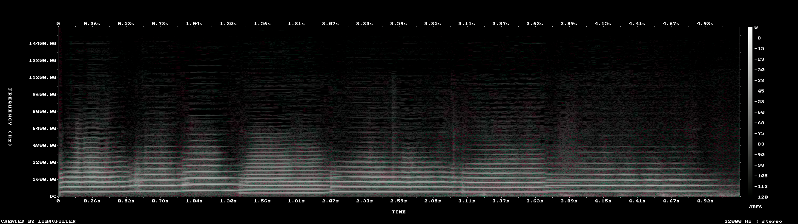

# MiniMax H3 video generation on DGX Station GB300

This experiment measures local MiniMax H3 text-to-video-and-audio generation on one and two DGX Station GB300 systems. The first checkpoint under test is the official BF16 `FL2VA` partition, which serves both text-to-video (`t2va`) and first/last-frame-to-video (`fl2va`). No CPU or layerwise offload is used.

> [!IMPORTANT]
> MiniMax H3 weights are **not** Apache-2.0. They use the [MiniMax H3 Community License](https://huggingface.co/MiniMaxAI/MiniMax-H3/blob/42ed227ee7df40d41602854ae760620d6eb651fe/LICENSE), whose default grant excludes the EU, UK, Republic of Korea, and United States. In an excluded territory, obtain a separate MiniMax authorization before downloading or running the weights. The source repositories have separate licenses.

## Status

The one-station resident BF16 baseline and fixed-seed quality audit are complete. The two-station Ring2 launch was stopped by the idle-HBM safety gate before model startup, so it remains unmeasured pending clean post-reboot baselines. FP8 and the 15-second stress case also remain pending; no estimates are published as measurements.

| Item | Pinned value |
|---|---|
| Model | [`MiniMaxAI/MiniMax-H3`](https://huggingface.co/MiniMaxAI/MiniMax-H3) |
| Model revision | `42ed227ee7df40d41602854ae760620d6eb651fe` |
| Partition | `FL2VA`, official CFG-distilled BF16 weights |
| Downloaded files | Root metadata plus `FL2VA/*` only |
| FL2VA payload | 144,051,182,625 bytes (134.16 GiB), including 29 safetensor files |
| SGLang source | `c0b6474b43363c2f4bc60fe3d7817d393fb51d32` |
| ARM64 container | `lmsysorg/sglang@sha256:c3c427732dd726b6e1656dd3cb491bee3629a269c83c57496d26fe28b4d8c5ea` |
| Container stack | SGLang `0.0.0.dev1+gc0b6474b4`, PyTorch `2.13.0+cu130`, Transformers `5.12.1`, Diffusers `0.37.0`, FlashAttention-4 `4.0.0b19` |

## Headline 1× result

One full 50-step request was used as the client warmup, followed by three measured VBench prompts at concurrency one. All three completed successfully.

| Precision | Mean | P50 | P90 | Warmed peak HBM | Generated frames/s | Video-seconds/wall-second | Real-time factor |
|---|---:|---:|---:|---:|---:|---:|---:|
| Official BF16 FL2VA | **116.86 s** | 117.20 s | 117.20 s | 125,268 MB | 1.061 | 0.0442× | 22.62× |

The 124-frame output represents 5.167 seconds of generated video. In throughput terms, this is 30.8 complete clips/hour if requests remain serialized. The benchmark is intentionally single stream; it does not infer batch throughput from latency.

| Mean measured stage | Time | Share of client latency |
|---|---:|---:|
| Text encode | 0.081 s | 0.1% |
| Denoise | 107.500 s | 92.0% |
| Video/audio decode | 4.919 s | 4.2% |
| API, mux, and other | 4.364 s | 3.7% |

Raw client metrics are in [`data/1x-bf16/raw/benchmark.json`](data/1x-bf16/raw/benchmark.json); the normalized row and per-request stage timings are in [`data/1x-bf16/`](data/1x-bf16/).

The raw client JSON directly supports end-to-end latency, throughput, success count, and peak HBM. It does not contain the per-request component timings; the original server log behind `stage-timings.csv` was not retained in this package, so the stage breakdown is internally consistent but has a weaker provenance trail than the headline latency.

The released H3 Base pipeline combines a 33B dense joint audio/video transformer with the full Qwen3-VL-32B encoder, a video VAE, and an audio VAE. It emits H.264 video at 24 FPS together with 32-kHz stereo AAC audio. The open local checkpoint targets a 768-pixel short edge and 4–15 second clips. The separate H3 Context-IR and 2K regeneration stages are hosted services and are not part of the open local release.

## Why one GB300 should fit

One official FL2VA partition occupies about 134 GiB on disk. A DGX Station GB300 provides 288 GB of coherent HBM3e, leaving substantial room for activations and decode buffers with one task partition resident. As a cross-check, the official SGLang H3 measurements report a complete resident one-GPU run on a 192-GB MI300X with a 137,626-MB peak for a 209-frame T2VA workload. GB300 results are still measured rather than inferred.

Only one DiT partition is loaded for the first series. Loading FL2VA and Ref2VA together would consume avoidable memory and makes the result harder to reproduce.

## Canonical performance workload

The primary row follows the SGLang H3 cookbook so it can be compared with upstream results:

| Setting | Value |
|---|---|
| Task | T2VA through the FL2VA partition |
| Canvas | 1344×768 (16:9) |
| Requested duration | 5 seconds |
| Encoded result | 124 frames / about 5.167 seconds at 24 FPS |
| Denoising | 50 sigma-grid points, 49 model evaluations |
| Video/audio flow shifts | 12 / 3 |
| Concurrency | 1 for latency; two independent servers for 2× throughput |
| Warmup | One full 50-step request before measurement |
| Prompt source | Pinned VBench prompts |

Headline performance will report client end-to-end latency, encode/denoise/decode stage times, peak HBM, generated frames per second, generated video-seconds per wall-second, and real-time factor. A 15-second 768p case is included as the long-sequence stress point.

## Planned matrix

| Topology | Precision / path | 5-second T2VA | 15-second T2VA | Purpose |
|---|---|---:|---:|---|
| 1× GB300 | Official BF16, resident | **116.86 s mean** | pending | Lossless reference and latency |
| 1× GB300 | Online FP8 DiT, resident | pending | pending | Blackwell quantization trade-off |
| 2× GB300 | Two independent BF16 replicas | pending safety gate | pending | Aggregate throughput |
| 2× GB300 | Ring2 sequence parallel, BF16 | pending safety gate | pending | Single-request latency scaling |

Two independent replicas are the expected throughput winner. Ring2 is a separate latency experiment: SGLang has verified cross-node H3 Ring parallelism on 2×8 H200, but a 2×1 GB300 topology remains to be measured. It uses node-local Ulysses degree 1, cross-node Ring degree 2, and replicated encoders.

No 2× number was attempted after one system failed the prelaunch idle-HBM capacity guard. Ownerless residual HBM must not be hidden with a more aggressive memory setting or an in-place GPU reset; the recovery boundary is a user-coordinated normal reboot followed by a fresh two-host gate.

## Quality and non-degeneracy checks

Every published performance configuration must first produce a decodable MP4 with the expected video and audio streams. The quality corpus uses fixed prompts and seeds and records:

- H.264 frame count, dimensions, frame rate, and decode success;
- AAC channel count, sample rate, duration drift, silence, and clipping checks;
- black-frame, frozen-frame, and near-duplicate-frame warnings;
- representative contact sheets and a manual prompt/adherence/motion/audio review;
- same-seed SSIM, PSNR, CLIP cosine, and audio log-mel cosine against BF16 for approximate FP8 or caching paths;
- VBench's 16 dimensions for the final selected configurations.

FP8 is not labeled lossless. Cache-DiT, reduced-step LoRAs, sparse/approximate attention, and `torch.compile` are kept out of the initial headline until their audio and video quality are compared independently.

The fixed-seed BF16 audit passed. The MP4 decoded end to end and contained 124 H.264 frames at 1344×768/24 FPS plus 32-kHz stereo AAC. No black interval of at least 0.5 seconds, frozen interval of at least 1 second, or audio silence of at least 0.25 seconds below −50 dB was detected. The visual sequence is coherent and changes throughout: cats and brass instruments are visible, the cats move through the bedroom, and they leave the frame. No repetition or degeneracy was observed.

The generated soundtrack contains changing harmonic structure rather than silence or a static tone. It is quiet: −37.7 dB mean volume, −33.9 LUFS integrated, and −21.1 dBFS true peak.

The machine-readable audit is [`data/1x-bf16/quality-seed1101.json`](data/1x-bf16/quality-seed1101.json). The generated MP4 is not committed; its SHA-256 is retained in the audit.

## Reproduction

See the [recipes](recipes/README.md) for the authorization gate, exact download, one-station resident launch, two-station Ring2 launch, benchmark command, and media validation. Raw measurements will live in [`data/`](data/README.md), with generated charts in [`charts/`](charts/README.md).

## Primary sources

- [Official MiniMax H3 model card and weights](https://huggingface.co/MiniMaxAI/MiniMax-H3)
- [Official MiniMax H3 source repository](https://github.com/MiniMax-AI/MiniMax-H3)
- [SGLang MiniMax H3 deployment and benchmark cookbook](https://docs.sglang.io/cookbook/diffusion/MiniMax/MiniMax-H3)
- [vLLM-Omni MiniMax H3 recipe](https://recipes.vllm.ai/MiniMaxAI/MiniMax-H3)
- [VBench benchmark](https://github.com/Vchitect/VBench)
