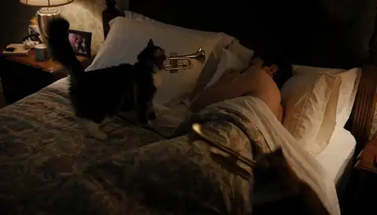

# MiniMax H3 generated samples

Click an animated preview to open the full MP4 with generated stereo audio.
The HTML player is included as a best-effort fallback; GitHub rendering varies.

## Rocket cat · native 10 seconds

**[Open/download the full MP4 with audio](rocket-cat-10s.mp4)**

<video controls preload="metadata" src="rocket-cat-10s.mp4"></video>

| Field | Value |
|---|---|
| Prompt | A large heroic orange cat is clearly visible in every shot, wearing a shiny miniature bubble spacesuit and securely strapped into a saddle astride the OUTSIDE of a small red-and-white toy rocket. Begin with a close-up hero shot of the cat and rocket together on a miniature launchpad. The camera stays close enough to see the cat riding safely as the rocket launches through bright clouds into orbit. Absurd cinematic adventure, dynamic tracking camera, rich stereo launch rumble and rocket ambience, clearly fictional, no injury, and no one is harmed. |
| Duration | 10.125 seconds / 243 frames at 24 FPS |
| Runtime | 334.731 seconds client end to end |
| Seed | 1011 |

## Mountain cat · native 15 seconds

**[Open/download the full MP4 with audio](mountain-cat-15s.mp4)**

<video controls preload="metadata" src="mountain-cat-15s.mp4"></video>

| Field | Value |
|---|---|
| Prompt | A clearly fictional athletic orange cat wearing secure protective goggles sprints impossibly at 60 miles per hour along a dramatic mountain crag trail, controlled action-comedy, stones and powdery snow streaming behind, dynamic low tracking camera, crisp stereo wind and pawstep ambience, no falls, no injury, and no one is harmed. |
| Duration | 15.083 seconds / 362 frames at 24 FPS |
| Runtime | 719.283 seconds client end to end |
| Seed | 1515 |

## Bonus quality fixture · native 5 seconds

**[Open/download the full MP4 with audio](marching-cats-5s.mp4)**

<video controls preload="metadata" src="marching-cats-5s.mp4"></video>

| Field | Value |
|---|---|
| Prompt | At night, while their owner sleeps in a bedroom, three cats march in loudly playing tiny brass instruments, then abruptly file out. |
| Duration | 5.167 seconds / 124 frames at 24 FPS |
| Runtime | 116.992 seconds server inference |
| Seed | 1101 |

Machine-readable media audits and benchmark provenance are in [`../data/`](../data/README.md).
