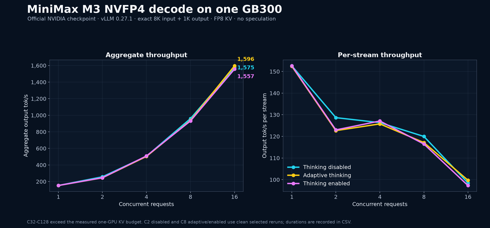
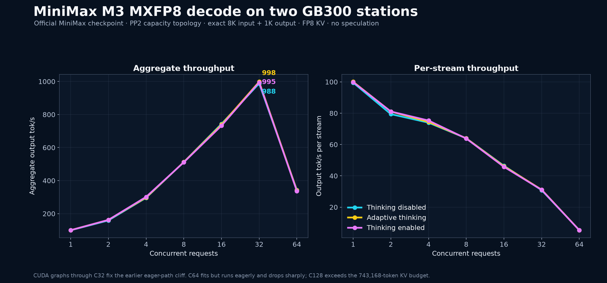
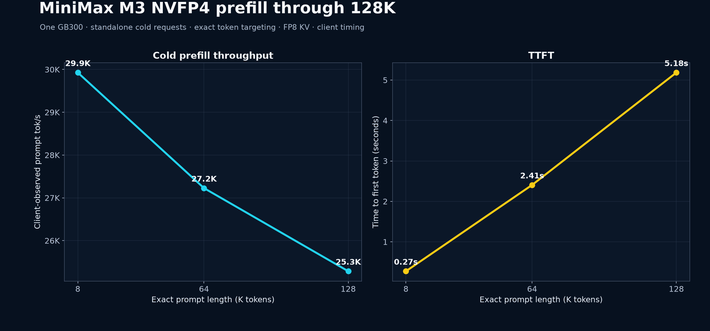
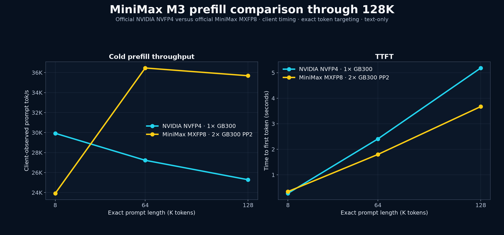
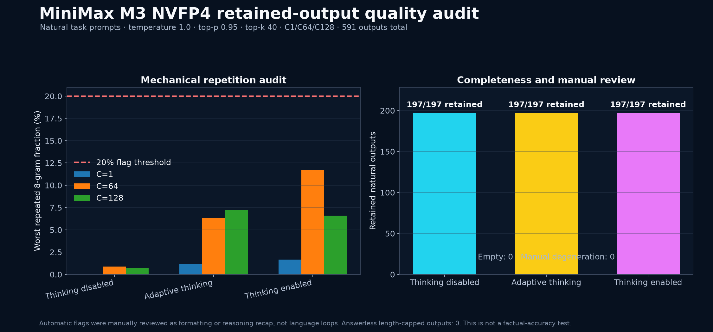
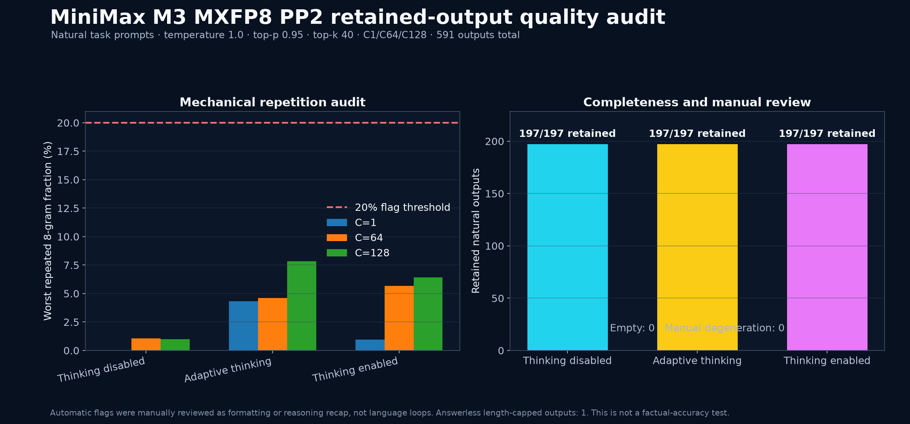
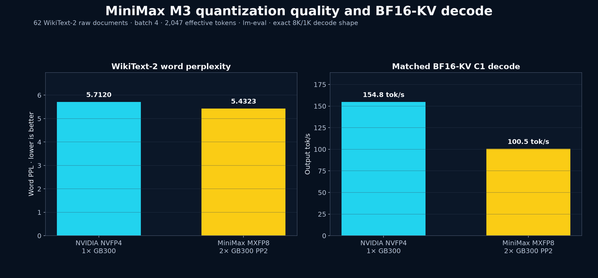

# MiniMax M3 on DGX Station GB300

This track benchmarks the official NVIDIA `nvidia/MiniMax-M3-NVFP4`
checkpoint on one DGX Station GB300 and the official MiniMax
`MiniMaxAI/MiniMax-M3-MXFP8` checkpoint across two stations with PP2. MiniMax M3 is a
multimodal understanding model: it accepts text, images, and video and emits
text. It is separate from the MiniMax H3 audio/video generation experiment.

> [!IMPORTANT]
> The weights use the [MiniMax Community License](https://huggingface.co/nvidia/MiniMax-M3-NVFP4/blob/901464083161bf8612a29ff7ad29914cd4ab4a85/LICENSE),
> not an OSI open-source license. Commercial use requires attribution and a
> notice or prior authorization depending on yearly revenue. The license also
> contains prohibited-use terms. Read it before downloading or running the
> checkpoint.

## Status

> [!NOTE]
> **Measured base-model milestone.** NVIDIA NVFP4 and MiniMax MXFP8 now have
> complete fixed-shape decode across all three thinking policies, cold
> 8K/64K/128K prefill, retained-natural-output audits, and document-level
> WikiText-2 perplexity. The optional third-party EAGLE3 speculative track
> remains pending.

| Item | Pinned value |
|---|---|
| Primary checkpoint | [`nvidia/MiniMax-M3-NVFP4`](https://huggingface.co/nvidia/MiniMax-M3-NVFP4) |
| Revision | `901464083161bf8612a29ff7ad29914cd4ab4a85` |
| Repository payload | 250,137,296,832 bytes (232.96 GiB), including 88 safetensor shards |
| Quantization | ModelOpt mixed precision: NVFP4 experts with MXFP8/non-quantized exceptions |
| Runtime | vLLM 0.27.1, commit `6e448d0ea9bf3d88d898b65449ca6dc2aec170ac` |
| Container | `vllm/vllm-openai@sha256:0a51ea5b4ae2dc5d81890e5173f54203d2a3ae0cfffe51b8fd2afd4391bfd967` |
| Tasks in this track | Text decode, cold prefill, retained natural output, WikiText-2 PPL, two-station PP2 capacity |
| CPU offload | Disabled |

## Headline one-station results

The most useful result is a 152.6 output tok/s single stream with an exact 8K
prompt and 1K forced output. Aggregate output reaches 1,575.4 tok/s at C16 with
thinking disabled. The three thinking policies are effectively tied on this
fixed-token workload; their meaningful behavioral difference appears in the
retained natural responses, where adaptive and enabled modes emit separate
reasoning.

| Concurrency | Thinking disabled | Adaptive thinking | Thinking enabled |
|---:|---:|---:|---:|
| 1 | **152.6** | 152.4 | 152.6 |
| 2 | **257.3** | 245.3 | 246.0 |
| 4 | 505.4 | 503.1 | **508.4** |
| 8 | **959.7** | 937.1 | 931.6 |
| 16 | 1,575.4 | **1,595.8** | 1,556.8 |
| 32 | capacity limit | capacity limit | capacity limit |
| 64 | capacity limit | capacity limit | capacity limit |
| 128 | capacity limit | capacity limit | capacity limit |

Values are aggregate output tokens/s. The canonical matrix uses a 30-second
sustained window. The disabled C2 result is a clean selected 30-second rerun;
adaptive and enabled C8 are clean selected 60-second reruns. Those cells replace
canonical rows where the benchmark's time-averaged scheduler sample fell just
below its concurrency-validity threshold despite zero request errors. Exact
durations, effective concurrency, selection notes, and both canonical and
selected raw JSON are in [`data/`](data/README.md).

## Official MXFP8 on two stations: PP2 capacity result

The 443.78-GB official MiniMax MXFP8 checkpoint needs two GB300s for capacity.
It was split evenly across the stations' disks, hash-verified against all 31
pinned Hugging Face LFS objects, exposed to both ranks as one read-only logical
directory, and loaded fully into HBM with PP2. This is a capacity topology, not
a claim that two-station PP is faster than the one-station NVFP4 build.

| Concurrency | Thinking disabled | Adaptive thinking | Thinking enabled | Execution tier |
|---:|---:|---:|---:|---|
| 1 | 99.5 | **100.1** | 99.9 | CUDA graph |
| 2 | 158.8 | 162.1 | **162.2** | CUDA graph |
| 4 | 295.8 | 297.7 | **301.3** | CUDA graph |
| 8 | **512.0** | 511.9 | 510.7 | CUDA graph |
| 16 | **743.1** | 738.8 | 732.2 | CUDA graph |
| 32 | 987.7 | **998.3** | 994.7 | CUDA graph |
| 64 | **343.3** | 341.0 | 337.0 | eager path |
| 128 | capacity limit | capacity limit | capacity limit | — |

These are client-counted 30-second sustained rows from
`llm-inference-bench` with the same exact 8K input and 1K output shape as the
NVFP4 table. The stable vLLM 0.27.1 PP2 profile uses synchronous scheduling and
disables the unused auto-tool parser. That avoids the upstream PP request-ID
race exposed by the initial asynchronous duration run. Because synchronous PP
does not expose usable live scheduler gauges, the benchmark used its documented
OpenAI continuous-usage fallback through a loopback proxy that intentionally
hid `/metrics`; exact client tokens and durations remain authoritative.

The tuned launch captures CUDA graphs through C32. Disabled-thinking C32
reached 987.7 tok/s in the canonical matrix and 995.1 tok/s in a separate
isolated confirmation. The original C1-C16-graph launch produced a 195.5 tok/s
C32 eager-path cliff; it is retained as explicitly superseded evidence, and
the graph-C32 result is 5.05× faster. C64 now fits the clean-start KV budget,
but remains beyond the captured graph tier and falls to 337–343 tok/s. C128 is
the only capacity-limited row. No CPU offload or tensor parallelism was used.

## Prefill through 128K

| Exact requested prompt | Client prompt tokens | Client prompt tok/s | TTFT | Samples |
|---:|---:|---:|---:|---:|
| 8K | 8,194 | **29,927** | 0.274 s | 4 |
| 64K | 65,538 | **27,227** | 2.407 s | 3 |
| 128K | 131,074 | **25,285** | 5.184 s | 2 |

The requested lengths are exactly 8,192, 65,536, and 131,072 prompt tokens
before the API's two chat-template tokens. Prefix caching was enabled, but each
standalone sample was cold; server validation reports 128 cached framing tokens
and independently measured 32.4K, 29.2K, and 27.1K computed-token/s.

The two-station MXFP8 PP2 profile measured 23,924, 36,457, and 35,683 prompt
tok/s at 8K, 64K, and 128K, with TTFT of 0.343, 1.798, and 3.673 seconds.
Those are client-timed cold samples with 20, 5, and 3 retained measurements.

## Retained natural-output audit

For NVFP4, we retained 591 natural responses across disabled, adaptive, and enabled
thinking at C1, C64, and C128. All 591 contain text; manual review found no
degenerate output. Five responses reached the 4,096-token audit cap, while the
other 586 stopped normally.

| Thinking policy | Retained outputs | Empty | Manual degeneration | Worst repeated 8-gram fraction |
|---|---:|---:|---:|---:|
| Disabled | 197 / 197 | 0 | 0 | 0.87% |
| Adaptive | 197 / 197 | 0 | 0 | 7.20% |
| Enabled | 197 / 197 | 0 | 0 | 11.71% |

The automatic detector also flags identical-character runs. Its reported flags
were Markdown separators, not language loops; identical-word runs never
exceeded three. The largest repeated-phrase score came from a correct interval
merging answer revisiting its code and remains below the 20% threshold. This is
a degeneration/repetition audit, not a factual-accuracy benchmark. Sanitized
retained samples plus all output hashes are published in
[`data/evidence/nvfp4-natural-output-audit.json`](data/evidence/nvfp4-natural-output-audit.json).

The independent MXFP8 audit retained another 591 responses. Every output was
nonempty and all 591 hashes were unique; manual review again found no
degenerate language or repetition loops. Six responses reached the 4,096-token
cap. One enabled-thinking C64 response used the entire cap for reasoning and
therefore had no final-answer field; this is reported as a length-capped
incomplete answer, not hidden as a clean stop.

| Thinking policy | Retained outputs | Unique | Empty output | No final answer | Length caps | Worst repeated 8-gram |
|---|---:|---:|---:|---:|---:|---:|
| Disabled | 197 | 197 | 0 | 0 | 0 | 1.08% |
| Adaptive | 197 | 197 | 0 | 0 | 2 | 7.83% |
| Enabled | 197 | 197 | 0 | 1 | 4 | 6.41% |

## Memory envelope and maximum measured context

The tuned one-GPU server loads 231.51 GiB of language-model weights and exposes
a 156,160-token FP8 KV budget (1,220 blocks × 128) with a 132,096-token server
context limit. That permits one exact 128K prompt plus 1K output, or C16 at the
fixed 8K+1K workload. C32-C128 exceed this one-GPU KV budget and are recorded as
capacity limits instead of being forced with CPU offload.

The working profile uses `--gpu-memory-utilization 0.98`, CUDA graph sizes
1/2/4/8/16, and a maximum 132,096-token context. A clean 0.95 launch left only
2.05 GiB for KV (about 32K maximum context), so the longer profile was selected
only after a clean idle-HBM gate; it was not used to hide retained allocations.
After the large C128 natural audit, a subsequent sparse-attention workspace
allocation could OOM from allocator fragmentation. Reproduction runs should
restart the container and repeat the kernel-first idle-HBM gate between that
stress audit and another benchmark phase.

The stable MXFP8 PP2 profile loads 195.80 GiB on pipeline stage 0 and 216.19
GiB on stage 1. Its clean limiting stage produces a global 743,168-token FP8
KV budget and a 132,096-token server limit.
C64's fixed 8K+1K set requires 589,824 tokens and fits; C128 would require
1,179,648 tokens and is therefore an explicit capacity skip. CUDA graphs were
captured through C32. The lower 505,984-token budget from the pre-restart
provisional launch is retained only as diagnostic evidence of why clean
idle-HBM gating matters; it is not the published capacity envelope.

vLLM 0.27.1 is a correctness requirement, not just a convenience. The MiniMax
M3 NVFP4 SwiGLU/indexer correctness fix landed on 2026-08-05 and is present in
the pinned release. Earlier MiniMax vendor images and vLLM 0.26.x predate that
fix and are excluded from these measurements.

## Checkpoint provenance

| Role | Source classification | Checkpoint and exact revision | Format | Payload / shards |
|---|---|---|---|---:|
| Primary one-station result | Official NVIDIA release | [`nvidia/MiniMax-M3-NVFP4@901464083161bf8612a29ff7ad29914cd4ab4a85`](https://huggingface.co/nvidia/MiniMax-M3-NVFP4/tree/901464083161bf8612a29ff7ad29914cd4ab4a85) | ModelOpt mixed NVFP4, with MXFP8 and unquantized exceptions | 250,137,296,832 bytes / 88 safetensor shards |
| Two-station capacity result | Official MiniMax release | [`MiniMaxAI/MiniMax-M3-MXFP8@c5454eb03678d8710e54a4e0fc681b9f3b4a3dba`](https://huggingface.co/MiniMaxAI/MiniMax-M3-MXFP8/tree/c5454eb03678d8710e54a4e0fc681b9f3b4a3dba) | Native MXFP8 | 443,776,005,285 bytes / 31 safetensor shards |
| Optional speculative draft | Third-party Inferact release recommended by the official vLLM recipe | [`Inferact/MiniMax-M3-EAGLE3-GQA@96692486b5fd38ebf8fd2a5f6bb53427d30819a8`](https://huggingface.co/Inferact/MiniMax-M3-EAGLE3-GQA/tree/96692486b5fd38ebf8fd2a5f6bb53427d30819a8) | BF16 GQA EAGLE3 draft | 6,149,993,396 bytes / 1 safetensor file |

“Official” in this report describes the publishing organization of the exact
checkpoint above. The speculative draft is not a MiniMax or NVIDIA release and
is always reported as a separate optimization, never as the base result.

## Why NVFP4 is the primary result

The official checkpoint family has three useful reference points:

| Checkpoint | Revision | Download payload | GB300 plan |
|---|---|---:|---|
| MiniMax BF16 | `f0e1c1e04d40177e4673a22097036854f536e9c0` | 854,200,504,173 bytes | Does not fit one or two 288-GB GPUs without another strategy; not staged |
| MiniMax MXFP8 | `c5454eb03678d8710e54a4e0fc681b9f3b4a3dba` | 443,776,005,285 bytes | Measured across two GPUs with PP2; each rank sees one verified read-only logical checkpoint |
| NVIDIA NVFP4 | `901464083161bf8612a29ff7ad29914cd4ab4a85` | 250,137,296,832 bytes | Practical one-station baseline; no multi-node run planned |

NVIDIA's model card reports only small evaluation deltas from the native MXFP8
baseline (for example GPQA Diamond 91.92 versus 92.53 and MMMU-Pro 71.01 versus
71.97). That makes the official NVFP4 build the most useful one-station
Blackwell result, subject to our own WikiText-2 and retained-output checks.

An optional top-speed row uses the GQA EAGLE3 draft that the official vLLM
recipe recommends: `Inferact/MiniMax-M3-EAGLE3-GQA` at revision
`96692486b5fd38ebf8fd2a5f6bb53427d30819a8` (6,149,993,396 bytes). Its
four-KV-head design uses 16 times less draft KV than the original 64-KV-head
draft. This is a third-party draft checkpoint, not a MiniMax or NVIDIA weight
release. Its model-card metadata says MIT, while its repository also ships the
MiniMax M3 Community License for the target/base-model obligations; both are
disclosed in the reproduction recipe.

## Blackwell execution path

The launch follows the current official vLLM recipe:

- 128-token KV blocks, matching MiniMax Sparse Attention (MSA);
- FlashInfer/TensorRT-LLM attention with the CUTLASS MSA decode backend;
- FP8 indexer KV and FP8 main KV for throughput runs;
- BF16 KV in the separate WikiText-2 quality run;
- `VLLM_FLOAT32_MATMUL_PRECISION=high`;
- the model-specific `minimax_m3` reasoning and tool parsers;
- text-only loading for the language benchmark, leaving the vision tower out of
  HBM rather than using CPU offload.

MSA is part of the model architecture, not an optional approximation. It scores
128-token blocks and attends to selected blocks to reduce long-context cost.
M3 advertises a one-million-token window; this experiment measures 8K, 64K,
and 128K prefill rather than inferring one-million-token performance.

## Measurement matrix and remaining work

| Topology | Checkpoint | Thinking | Decode | Prefill | Quality | Status |
|---|---|---|---|---|---|---|
| 1× GB300 | NVIDIA NVFP4 | disabled, adaptive, enabled | C1–C16 measured; C32–C128 capacity-limited | cold 8K/64K/128K measured | 591 retained natural outputs pass; WikiText-2 measured | **Measured milestone** |
| 1× GB300 optimization | NVIDIA NVFP4 + EAGLE3-GQA | disabled first | C1–C128 where capacity permits | base-only prefill | acceptance + retained text | Pending capacity check |
| 2× GB300 PP2 capacity path | MiniMax MXFP8 | disabled, adaptive, enabled | C1–C64 measured; C128 capacity-limited | cold 8K/64K/128K measured | 591 retained natural outputs pass; WikiText-2 measured | **Measured milestone** |

The decode sweep uses `llm-inference-bench` with exact token
targeting, a 30-second sustained window per cell, an 8,192-token prompt, up to
1,024 generated tokens, and C1, C2, C4, C8, C16, C32, C64, and C128. The raw
JSON remains authoritative for errors, completed requests, actual concurrency,
and capacity limits. Three scheduler-boundary cells use explicitly disclosed
clean selected reruns, as described above and in the normalized CSV.

EAGLE3 gets a separate series rather than being combined with the base run. It
uses three speculative tokens, acceptance statistics, and the same
natural-output audit. The extra 6.15-GB draft may be too tight on one GB300;
failure at the benchmark memory profile will be recorded as a capacity result.

The two-station PP2 row is reserved for the larger official MXFP8 checkpoint,
which needs aggregate HBM capacity. It is not a speed path for a checkpoint
that already fits one GB300. Its immutable checkpoint is split across the two
stations' disks and presented to both ranks as one logical read-only model
directory; every shard and metadata object was verified at the pinned revision.

Thinking mode changes the generated token distribution and therefore gets its
own decode rows. Cold prefill is reported once with thinking disabled because
the prompt-side forward pass is unchanged by a generation policy. WikiText-2
uses the raw completions/log-probability API and therefore has no chat thinking
mode.

## Multimodal scope

M3's image/video understanding path is real but is not represented by the
language throughput table. The text series uses `--language-model-only`, so its
HBM capacity, prefill rate, and concurrency describe text-only performance.
After the primary matrix, a separate fixed-image and short-video
smoke test may be run by relaunching without that flag and recording encoder
latency, visual-token count, peak HBM, and answer quality. The unquantized
vision tower will reduce KV headroom, so those rows stay separate from text.

## WikiText-2 quality and BF16-KV decode

| Checkpoint | KV dtype | Effective length | Batch | Documents | Word PPL | Byte PPL | Bits/byte | C1 decode |
|---|---|---:|---:|---:|---:|---:|---:|---:|
| NVIDIA NVFP4 | BF16 | 2,047 | 4 | 62 | **5.7120** | **1.3852** | **0.4701** | **154.8 tok/s** |
| MiniMax MXFP8, PP2 | BF16 | 2,047 | 4 | 62 | **5.4323** | **1.3723** | **0.4566** | **100.5 tok/s** |

WikiText-2 uses `EleutherAI/wikitext_document_level`, configuration
`wikitext-2-raw-v1`, the pinned model tokenizer, and lm-eval across all 62 raw
documents. The C1 number is a separate exact 8K/1K 30-second decode row from
the same checkpoint's BF16-KV server profile. MXFP8's word PPL is 4.90% lower
than NVFP4 in this matched evaluation, while NVFP4 is 1.54× faster at C1.
These quality values are not directly
comparable with token-level WikiText recipes that concatenate or rechunk the
corpus.

## Reproduction

See the [recipes](recipes/README.md) for the license gate, exact checkpoint
download, one- and two-station launches, benchmark matrix, natural-output
audit, and WikiText-2 run. Sanitized normalized results and evidence are under
[`data/`](data/README.md); publication charts are under
[`charts/`](charts/README.md).

## Primary sources

- [MiniMax M3 official model card](https://huggingface.co/MiniMaxAI/MiniMax-M3)
- [MiniMax official MXFP8 checkpoint](https://huggingface.co/MiniMaxAI/MiniMax-M3-MXFP8)
- [NVIDIA official NVFP4 checkpoint](https://huggingface.co/nvidia/MiniMax-M3-NVFP4)
- [vLLM MiniMax M3 recipe](https://github.com/vllm-project/recipes/blob/main/models/MiniMaxAI/MiniMax-M3.yaml)
- [vLLM MiniMax M3 implementation](https://docs.vllm.ai/en/latest/api/vllm/models/minimax_m3/)
- [vLLM PP2 request-ID scheduler issue](https://github.com/vllm-project/vllm/issues/46263)
- [SGLang MiniMax M3 cookbook](https://github.com/sgl-project/sglang/blob/main/docs/cookbook/autoregressive/MiniMax/MiniMax-M3.mdx)
- [MiniMax Sparse Attention kernels](https://github.com/MiniMax-AI/MSA)
