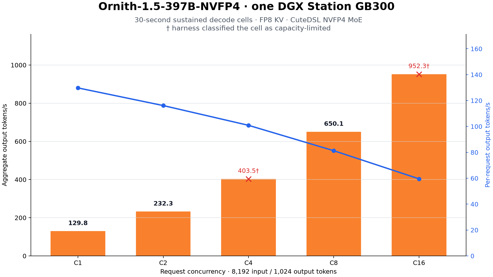
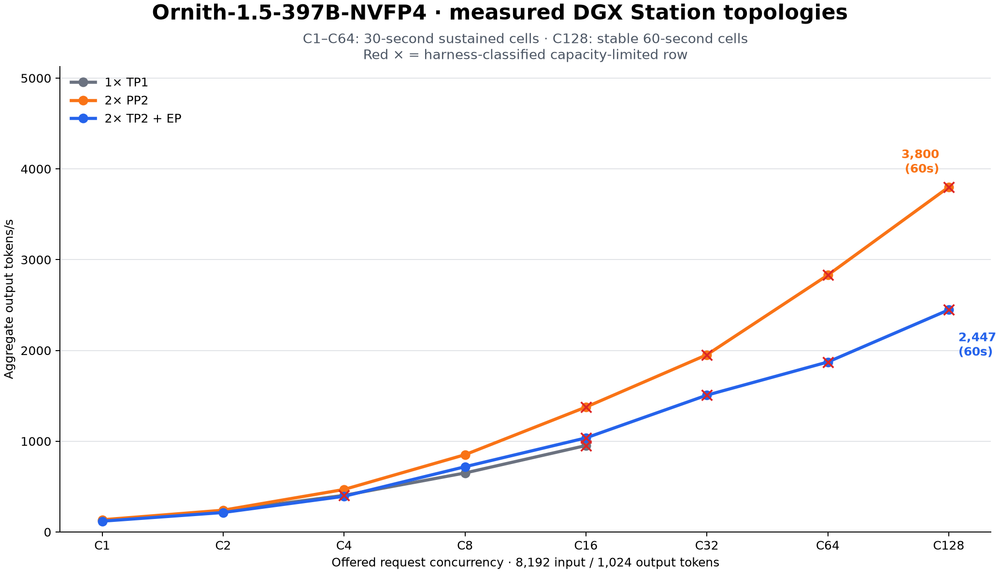
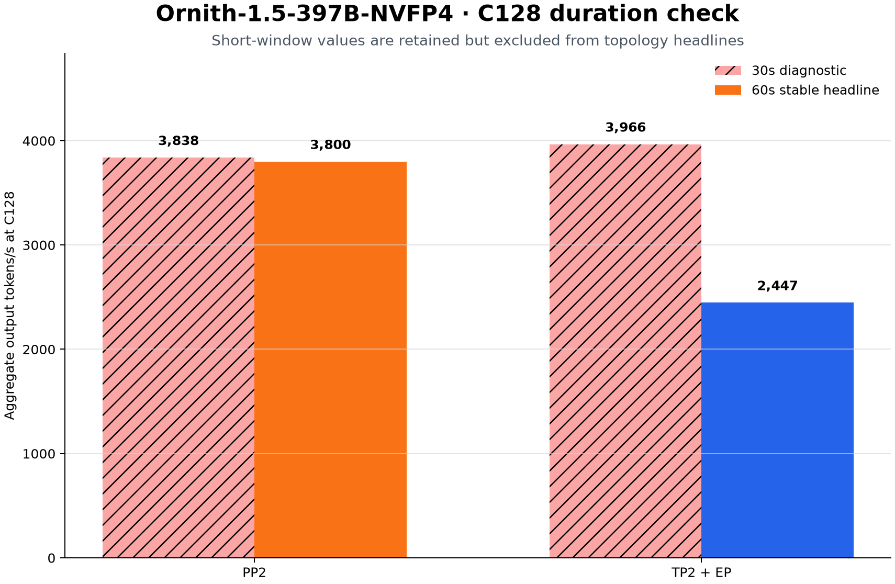
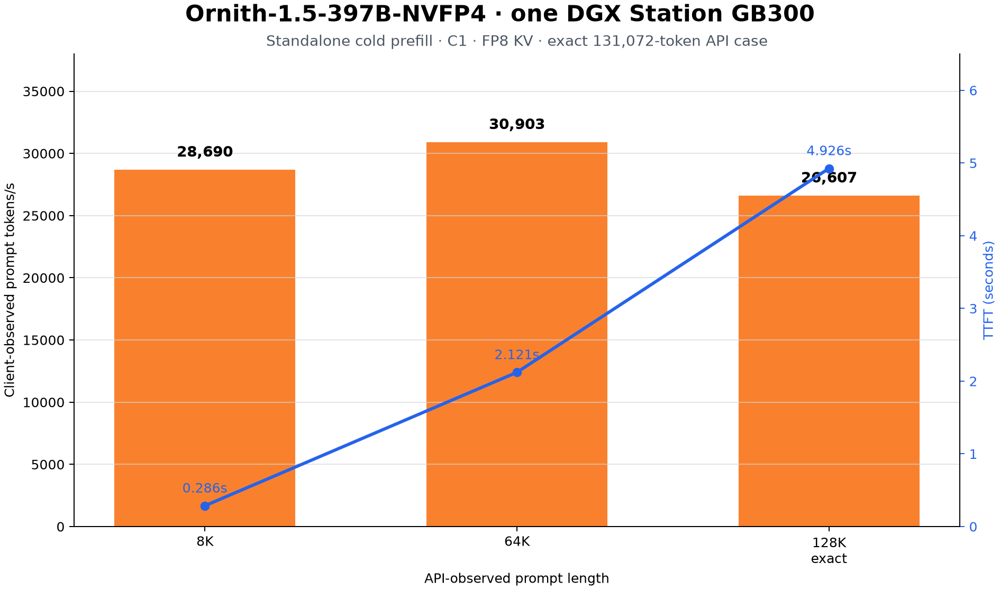
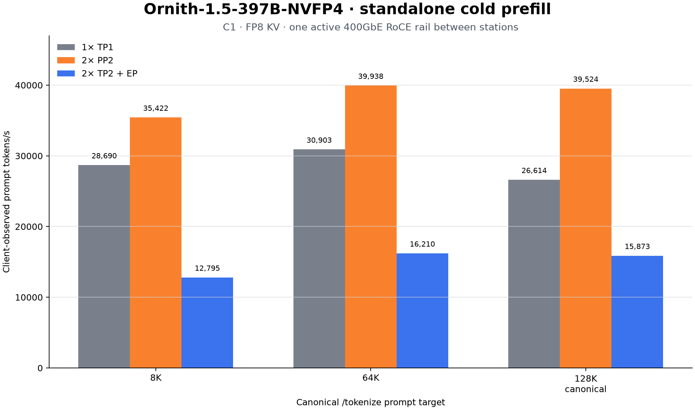

# Ornith-1.5-397B-NVFP4 on one and two NVIDIA GB300s

This experiment measures the official [`ornith-ai/Ornith-1.5-397B-NVFP4`](https://huggingface.co/ornith-ai/Ornith-1.5-397B-NVFP4) checkpoint on one NVIDIA DGX Station and across two stations. The 397B-parameter MoE model fits on one 256 GB server-class GB300 as its native ModelOpt NVFP4 W4A4 checkpoint; CPU weight offload was not used.

The retained one-station run was measured on a secondary DGX Station. The two-station runs used `node0` and `node1` over one active 400GbE RoCE rail, comparing pipeline parallelism (PP2) against tensor plus expert parallelism (TP2+EP). See the [one-station recipe](recipes/) and [two-station RDMA recipe](recipes/README-2x.md).

> **GB300 recovery safety:** Do not execute generic `suggested_reload` text
> retained inside the raw JSON; it is historical tool output, not an instruction.
> Never use GPU reset, unload or reload NVIDIA modules, or perform PCI
> unbind/rescan. Remove only the named containers. If GPU accounting or the
> driver remains unhealthy, stop GPU work and coordinate a controlled host
> reboot with the operator; never reboot automatically.

## Headline results

| Test | Headline result |
| --- | ---: |
| 1× TP1 C1 sustained decode, 8K input / 1K output | **129.8 output tok/s** |
| 1× TP1 C16 sustained decode | **952.3 aggregate output tok/s**† |
| 2× PP2 C128 sustained decode, stable 60s | **3,799.6 aggregate output tok/s**† |
| 2× TP2+EP C128 sustained decode, stable 60s | **2,447.1 aggregate output tok/s**† |
| 2× PP2 canonical 128K prefill, C1 | **39,524 prompt tok/s** |
| 1× TP1 WikiText-2 word perplexity, BF16 KV | **4.6196** |
| Output degeneration audit | **0 / 16 flagged** |

† The benchmark harness classified these rows as capacity-limited. Offered concurrency, average scheduler occupancy, and aggregate throughput are reported separately below.

## Sustained decode

All cells used an exact 8,192-token API prompt target, 1,024 generated tokens, temperature 0, EOS ignored, FP8 E4M3 KV cache, and a 30-second saturated measurement window after warm-up.

| Offered concurrency | Aggregate output tok/s | Aggregate / offered stream | TTFT p50 (s) | ITL p50 (ms) | Average running | Capacity limited |
| ---: | ---: | ---: | ---: | ---: | ---: | :---: |
| 1 | 129.8 | 129.8 | 0.153 | 7.55 | 1.0 | No |
| 2 | 232.3 | 116.1 | 0.281 | 8.38 | 1.9 | No |
| 4 | 403.5 | 100.9 | 0.467 | 9.43 | 3.6 | Yes |
| 8 | 650.1 | 81.3 | 0.856 | 11.59 | 7.7 | No |
| 16 | 952.3 | 59.5 | 1.462 | 15.22 | 15.3 | Yes |

There were zero request errors. “Aggregate / offered stream” is aggregate throughput divided by offered concurrency; it is the roughly 60 tok/s/user figure at C16, not the engine's active-token ITL rate. C4 and C16 are shown because they are useful measured operating points, but the harness detected that average scheduler occupancy fell short of the offered concurrency. These are sustained-decode cells from current `llm-inference-bench`, not the finite `5 × concurrency` request bursts used by the Qwen and DeepSeek experiments elsewhere in this repository. Compare them only when the benchmark layer and workload match.

## Two-station sustained decode

The table uses 30-second sustained cells through C64 and the separate stable 60-second cells at C128. All cells were zero-error with exact 8,192-token input and 1,024-token output.

| C | PP2 aggregate | PP2 / offered stream | PP2 avg. running | PP2 limited | TP2+EP aggregate | TP2 / offered stream | TP2 avg. running | TP2 limited |
| ---: | ---: | ---: | ---: | :---: | ---: | ---: | ---: | :---: |
| 1 | 134.7 | 134.7 | 1.0 | No | 119.5 | 119.5 | 1.0 | No |
| 2 | 240.1 | 120.1 | 2.0 | No | 214.6 | 107.3 | 2.0 | No |
| 4 | 468.6 | 117.2 | 3.9 | No | 393.3 | 98.3 | 3.9 | No |
| 8 | 851.5 | 106.4 | 8.0 | No | 719.0 | 89.9 | 8.0 | No |
| 16 | 1,376.1 | 86.0 | 15.5 | Yes | 1,036.4 | 64.8 | 14.6 | Yes |
| 32 | 1,952.4 | 61.0 | 29.7 | Yes | 1,507.2 | 47.1 | 29.2 | Yes |
| 64 | 2,829.9 | 44.2 | 60.5 | Yes | 1,872.7 | 29.3 | 55.4 | Yes |
| 128, 60s | **3,799.6** | **29.7** | **123.5** | **Yes** | **2,447.1** | **19.1** | **118.1** | **Yes** |

PP2 was the fastest measured two-station configuration at every stable comparison point and reached 44.5% more aggregate throughput than the one-station configuration at C16. That is a measured configuration comparison, not isolated parallelism scaling: the one-station run used CuteDSL while both distributed runs required the TRT-LLM FlashInfer MoE backend.

### Why the C128 headline uses 60 seconds

| Topology | C128 at 30s | C128 at 60s | Headline choice |
| --- | ---: | ---: | --- |
| PP2 | 3,837.9 | **3,799.6** | 60s; 1.0% below the short cell |
| TP2+EP | 3,966.5 | **2,447.1** | 60s; short-cell rate did not persist |

Both 30-second results remain in the raw JSON and `decode-throughput.csv`. The 60-second pair is isolated in `c128-stability.csv`; it is used in the comparison graph and headlines so a transient TP2 cell is not presented as steady-state throughput.

## Long-context prefill

| Target | API prompt tokens | TTFT (s) | Prompt tok/s | Samples |
| --- | ---: | ---: | ---: | ---: |
| 8K | 8,195 | 0.286 | 28,690 | 28 |
| 64K | 65,538 | 2.121 | 30,903 | 6 |
| 128K canonical CLI | 131,074 | 4.925 | 26,614 | 3 |
| 128K API-exact | **131,072** | **4.926** | **26,607** | **3** |

The benchmark's `128k` tokenizer target produced 131,074 tokens at the chat-completions API boundary. A separate calibration targeted 131,070 tokens at `/tokenize`, which produced exactly 131,072 API-observed prompt tokens. Both results are retained; the chart uses the API-exact row. The long-context server used `--max-model-len 135168`, C1, 32K prefill chunks, and FP8 KV cache.

### Prefill topology comparison

| Canonical target | 1× TP1 prompt tok/s | 2× PP2 prompt tok/s | 2× TP2+EP prompt tok/s |
| --- | ---: | ---: | ---: |
| 8K | 28,690 | **35,422** | 12,795 |
| 64K | 30,903 | **39,938** | 16,210 |
| 128K | 26,614 | **39,524** | 15,873 |

At canonical 128K, PP2 was 48.5% faster than the measured one-station configuration; TP2+EP was 40.4% slower. The 1× 8K API count was 8,195 tokens while the distributed parser configuration produced 8,194; the 64K and 128K API counts match at 65,538 and 131,074.

## WikiText-2 perplexity

Canonical EleutherAI `wikitext` document-level evaluation used all 62 documents, maximum sequence length 2,048, API batch size 4, and **explicit BF16 KV cache**.

| Word PPL | Byte PPL | Bits/byte |
| ---: | ---: | ---: |
| **4.6195928** | 1.3313254 | 0.4128632 |

vLLM `auto` selects FP8 KV for this quantized checkpoint. The PPL server therefore specified `--kv-cache-dtype bfloat16`; this quality result must not be relabeled as FP8-KV perplexity. The speed tests above deliberately used FP8 E4M3 KV.

## Output-quality audit

Sixteen 8K-input, 1,024-output generations were saved in full. The one-station set contains four normal-EOS-policy and four forced-length outputs; each two-station topology adds four normal-EOS-policy outputs from its `natural-quality-audit.json`. All outputs reached the length limit, remained coherent on manual review, and passed the automatic degeneration rule.

| Metric | Result |
| --- | ---: |
| Outputs flagged | **0 / 16** |
| Maximum repeated 8-gram fraction | **0.000** |
| Maximum identical-word run | **1** |
| Maximum identical-character run | **4** |
| Observed unique-word-ratio range | 0.434–0.598 |

The audit prompt is the deterministic mixed/reference prompt constructed by `llm-inference-bench`; it is not a natural WikiText prompt. Temperature-zero requests can be byte-identical without being internally repetitive: each distributed topology produced two unique hashes across four requests, while every output had zero repeated 8-grams and a maximum identical-word run of one. Full response text is retained in the [one-station audits](data/1x/raw/) and [two-station audits](data/2x/raw/).

## Configuration

| Component | Pinned configuration |
| --- | --- |
| Hosts | `node0` and `node1`, NVIDIA DGX Stations |
| Inference GPU | 1× NVIDIA GB300 per station, 256,703 MiB reported HBM each |
| OS / architecture | Ubuntu 24.04.4 LTS, Linux 6.17.0-1029-nvidia-64k, Arm64 |
| NVIDIA driver | 595.84 |
| Checkpoint revision | `745c3c8236ca1dc6f3aced3a0c3e7508fd9d98b6` |
| Checkpoint precision | ModelOpt NVFP4 W4A4, group size 16 |
| vLLM | 0.27.1, build commit `6e448d0ea9bf3d88d898b65449ca6dc2aec170ac` |
| Container digest | `sha256:0a51ea5b4ae2dc5d81890e5173f54203d2a3ae0cfffe51b8fd2afd4391bfd967` |
| MoE backend | 1×: `flashinfer_cutedsl`; 2×: `flashinfer_trtllm` |
| Distributed configurations | PP2: TP1/PP2; TP2+EP: TP2/PP1 with expert parallelism |
| Interconnect | One active 400GbE RoCE rail, `mlx5_0`, GPU Direct RDMA / DMA-BUF |
| `llm-inference-bench` | v0.4.29, commit `0b4185b5b435e948b199c9077a00b084864aa963` |
| `lm-evaluation-harness` | 0.4.13.dev0, commit `8a07e1110d060de48cfc7a9a7987b7659060b60b` |

The checkpoint occupied 221.65 GiB. SHA-256 hashes for its config and safetensor index are in the [checkpoint manifest](data/1x/raw/checkpoint-manifest-sha256.txt). The one-station environment capture did not record a model revision; the revision shown above comes from the already checked-in pinned reproduction recipe, not from recovered runtime metadata.

## Data and reproduction

- [One-station decode CSV](data/1x/decode-throughput.csv)
- [One-station prefill CSV](data/1x/prefill.csv)
- [One-station WikiText-2 CSV](data/1x/wikitext2-perplexity.csv)
- [Output-audit summary](data/1x/quality-audit-summary.json)
- [Compact retained raw evidence](data/1x/raw/)
- [Self-contained one-station recipe](recipes/)
- [Two-station decode CSV](data/2x/decode-throughput.csv)
- [C128 duration-check CSV](data/2x/c128-stability.csv)
- [Two-station prefill CSV](data/2x/prefill.csv)
- [Two-station output-audit summary](data/2x/quality-audit-summary.json)
- [Compact two-station raw evidence](data/2x/raw/)
- [Self-contained two-station RDMA recipe](recipes/README-2x.md)

[Back to all DGX Station benchmarks](../README.md)
