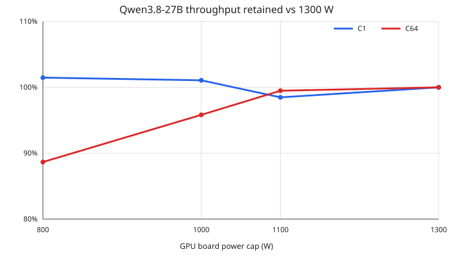
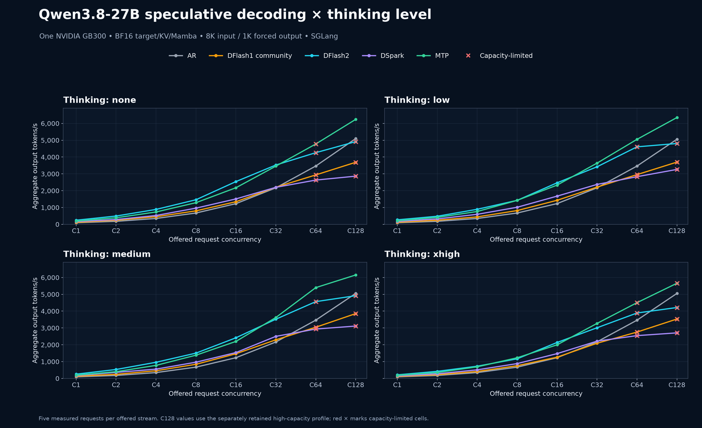
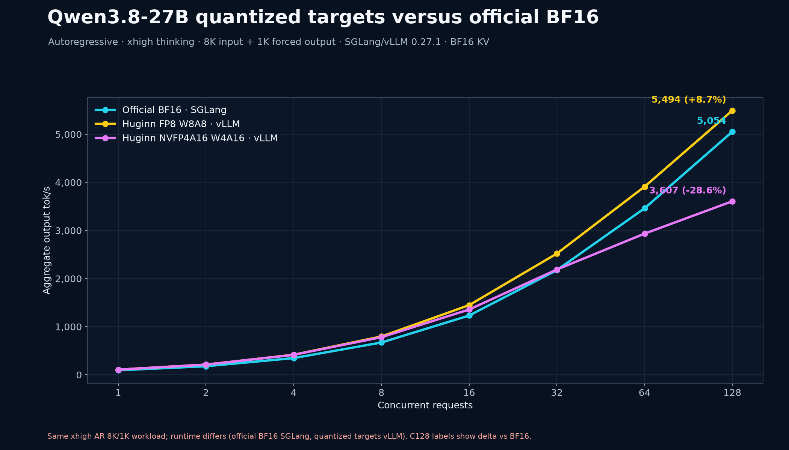
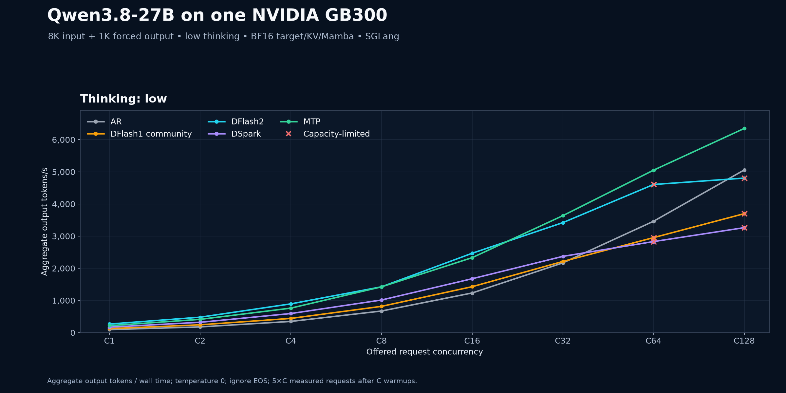
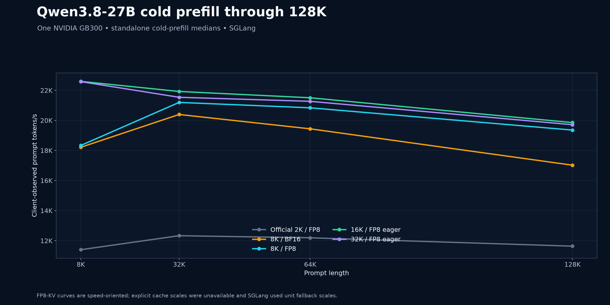
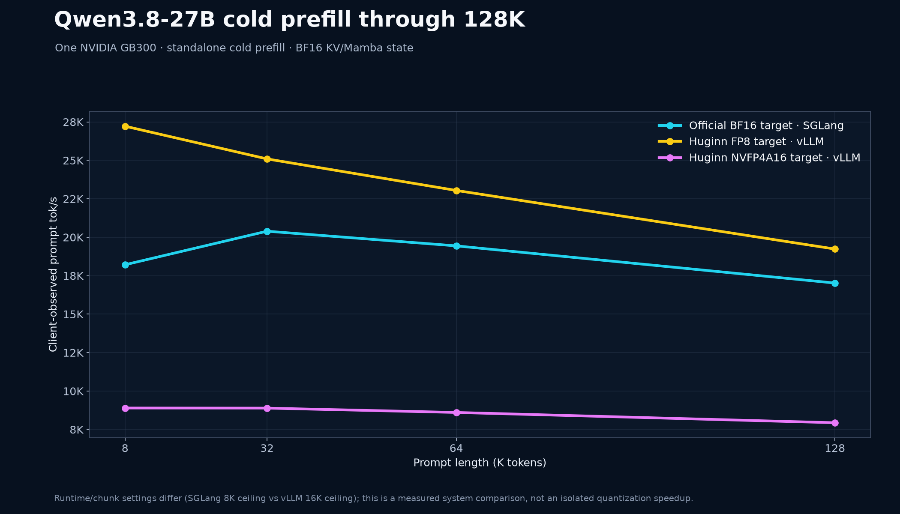
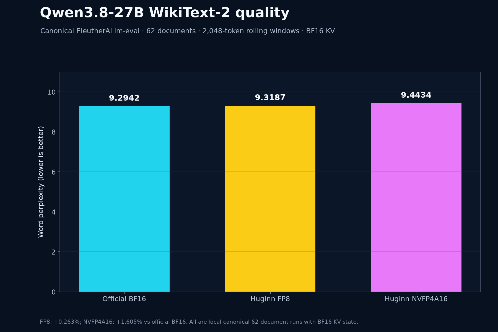
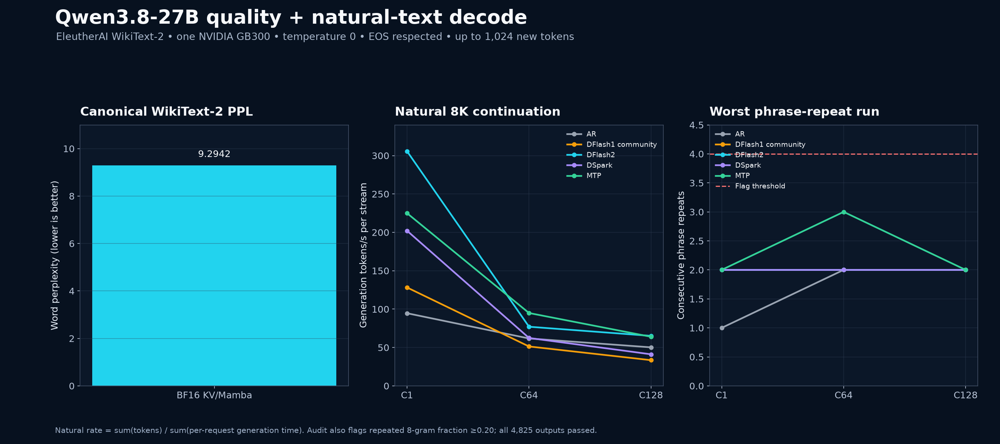
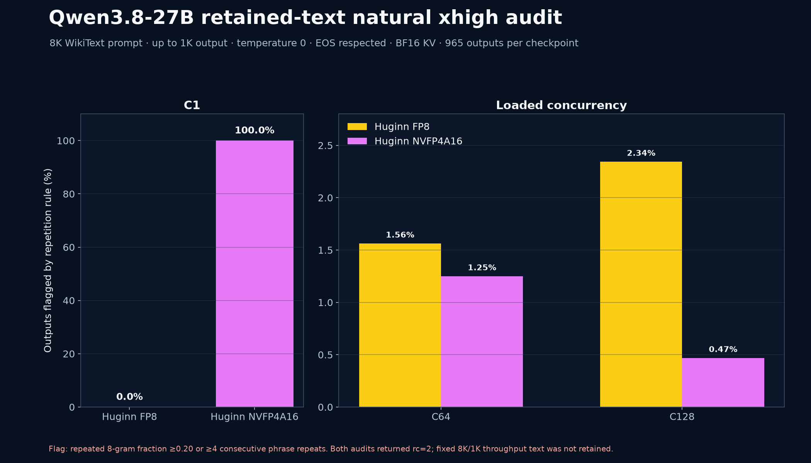

# Qwen3.8-27B on one NVIDIA GB300

Qwen3.8-27B was benchmarked on a DGX Station with one server-class NVIDIA GB300. The target weights and headline decode cache/state are BF16.

To recreate the environment and every benchmark cell, follow the [agent-ready reproducibility recipe](recipes/). It includes pinned downloads, the SGLang build, exact launch flags, C1–C128 commands, and result validation.

An [independent replay on an identically configured secondary DGX Station](verification/secondary-node-official-bf16/) reproduced the official BF16 WikiText-2 perplexity bit-for-bit and natural C1 decode within 0.265%, with byte-identical temperature-zero output.

## Checkpoint provenance

| Role | Hugging Face source | Exact revision | Status | Weight format / role | Retained size evidence |
| --- | --- | --- | --- | --- | --- |
| Target | [`Qwen/Qwen3.8-27B`](https://huggingface.co/Qwen/Qwen3.8-27B) | `1d4bf0f2ff6012fd82039f2fa52739d0dd7c60c0` | Official Qwen checkpoint | BF16 target weights | Exact tree total was not retained in this package |
| DFlash2 draft | [`incoai/Qwen3.8-27B-DFlash2`](https://huggingface.co/incoai/Qwen3.8-27B-DFlash2) | `adde41d8fde3a75dc905a7df0bd5088d2a44b5a1` | Inco-published draft; not an official Qwen target | Speculative draft; every accepted token is verified by the BF16 target | Exact tree total was not retained |
| DFlash1 draft | [`kstoyanov99/Qwen3.8-27B-Dflash`](https://huggingface.co/kstoyanov99/Qwen3.8-27B-Dflash) | `0e6412afb974d65455703026ff4cfa9118ad13cd` | Community draft | Speculative draft; every accepted token is verified by the BF16 target | Exact tree total was not retained |
| DSpark draft | [`RadixArk/Qwen3.8-27B-DSpark`](https://huggingface.co/RadixArk/Qwen3.8-27B-DSpark) | `85ef153be924f17ce4bf62726954eeaa4a73e854` | Third-party draft; not an official Qwen target | Draft trained against an FP8 target, but benchmark proposals are verified by the BF16 target | Exact tree total was not retained |
| Quantized target | [`huginnfork/Qwen3.8-27B-FP8`](https://huggingface.co/huginnfork/Qwen3.8-27B-FP8) | `ee0358b3e33d7bedcd6db022c5039385b1ac72f2` | Unofficial/community quantization | MLP W8A8 FP8 with dynamic per-token activations; attention and state-space paths remain BF16 | Verified tree: 93 files, 38,485,660,981 bytes |
| Quantized target | [`huginnfork/Qwen3.8-27B-NVFP4A16`](https://huggingface.co/huginnfork/Qwen3.8-27B-NVFP4A16) | `6916a5bb185e57c6e32bcffdc13a92fdea3b4095` | Unofficial/community quantization | MLP weight-only W4A16, group size 16; not native W4A4 FP4 | Verified tree: 84 files, 30,993,761,606 bytes |

The Huginn tree counts, byte totals, and content hashes are retained in [`data/huginn-quant-provenance.json`](data/huginn-quant-provenance.json). The main speculative-decoding matrix always uses the official BF16 target; the unofficial quantized targets appear only in explicitly labeled vLLM rows.

## Headline results

- DFlash2 delivered the fastest fixed-length single-stream result: **265.8 output tok/s at C1**, 2.85× the 93.4 tok/s autoregressive baseline on the low-thinking workload.
- DFlash2 led most low-to-moderate concurrency tests. MTP took the lead at high concurrency and reached the overall BF16 peak: **6,348.8 aggregate output tok/s at C128** with low thinking.
- Tuned cold prefill reached **22,595 prompt tok/s at 8K** and **19,853 prompt tok/s at 128K** with 16K chunks, FP8 KV, and eager prefill graphs.
- Canonical WikiText-2 word perplexity was **9.2942** with BF16 KV/Mamba state.
- The unofficial Huginn FP8 target reached **5,494.4 aggregate output tok/s at C128** in vLLM autoregressive xhigh decode; its locally measured WikiText-2 word perplexity was **9.3187** (+0.263% versus official BF16).
- Huginn NVFP4A16 measured **9.4434 word perplexity** (+1.605% versus official BF16) and **7,939 prompt tok/s at 128K** in a cold BF16-KV prefill run.
- The natural-output repetition audit flagged **0/1,600 Qwen C64 outputs and 0/3,200 C128 outputs** across AR, DFlash1, DFlash2, DSpark, and MTP.
- A separate retained-text natural xhigh audit of the unofficial quants did find loops: **20/965 FP8** and **12/965 NVFP4A16** outputs were flagged. Those rates do not apply to the fixed-length throughput rows, which did not retain text.

## GB300 power scaling

At C64, a 1,100 W cap retained **99.5%** of 1,300 W throughput while median GPU-board tok/J increased **8.4%**. At 800 W, it retained **88.7%** while tok/J increased **28.0%**.

| GPU cap | C1 output tok/s | C1 board W · tok/J | C64 aggregate output tok/s | C64 board W · tok/J |
| ---: | ---: | ---: | ---: | ---: |
| 800 W | 213.2 (101.5%) | 778 W · 0.280 | 4,500.8 (88.7%) | 787 W · 6.247 |
| 1,000 W | 213.5 (101.1%) | 779 W · 0.281 | 4,788.5 (95.8%) | 988 W · 5.499 |
| 1,100 W | 208.1 (98.5%) | 779 W · 0.274 | 4,994.7 (99.5%) | 1,086 W · 5.290 |
| 1,300 W | 211.3 (100.0%) | 779 W · 0.278 | 5,035.1 (100.0%) | 1,192 W · 4.880 |

Values are medians of four host×block cells. Percentages pair each cell with the 1,300 W result from the same host and block. The workload is the official BF16 checkpoint with native MTP, low thinking, an exact 8K input, and a forced 1K output. [Data](data/power-scaling.csv) · [provenance](data/power-scaling-provenance.json) · [recipe](recipes/power-scaling.md)

### Unofficial quantizations versus the official BF16 baseline

The directly comparable decode workload is autoregressive xhigh thinking with
an 8K input and forced 1K output. Values are aggregate output tok/s; the value
in parentheses is the change from the official BF16 row at the same
concurrency.

| Target / runtime | C1 | C16 | C64 | C128 |
| --- | ---: | ---: | ---: | ---: |
| Official BF16 / SGLang | 93.0 (baseline) | 1,231.5 (baseline) | 3,461.9 (baseline) | 5,054.2 (baseline) |
| Huginn FP8 / vLLM | **108.0 (+16.2%)** | **1,447.8 (+17.6%)** | **3,912.1 (+13.0%)** | **5,494.4 (+8.7%)** |
| Huginn NVFP4A16 / vLLM | 107.4 (+15.5%) | 1,357.0 (+10.2%) | 2,934.9 (−15.2%) | 3,607.4 (−28.6%) |

The FP8 target was the clear quantized throughput winner: it stayed 8.7–17.6%
ahead of the official BF16 autoregressive baseline at these four points.
NVFP4A16 helped at low concurrency but crossed behind BF16 at higher load. It
is a weight-only W4A16 Marlin path—not native W4A4 NVFP4 tensor-core execution.

Prefill used different runtimes and batching ceilings, so the following is an
end-to-end system comparison rather than an isolated quantization speedup.

| Metric | Official BF16 | Huginn FP8 | Huginn NVFP4A16 |
| --- | ---: | ---: | ---: |
| Cold prefill, 8K | 18,212 tok/s | **27,220 (+49.5%)** | 8,897 (−51.1%) |
| Cold prefill, 128K | 17,022 tok/s | **19,234 (+13.0%)** | 7,939 (−53.4%) |
| WikiText-2 word PPL ↓ | **9.2942** | 9.3187 (+0.263%) | 9.4434 (+1.605%) |

Quality is the main caveat. Separate EOS-respecting natural xhigh runs flagged
20/965 FP8 outputs (2.07%) and 12/965 NVFP4A16 outputs (1.24%) for repetition;
the NVFP4A16 C1 continuation repeated deterministically in all five trials.
Those audits are not failure rates for the forced-length throughput matrix,
whose output text was not retained.

### BennyDaBall GGUF NVFP4/MTP parallel-instance replay

Two independent llama.cpp instances were run simultaneously, one on each
station; these are per-host results, not combined or model-sharded throughput.
The workload used an approximately 8K cached prompt, a forced 1,024-token
output, temperature zero, and five measured waves. MTP used the checkpoint's
embedded heads with `draft-n-max=2` and `p-split=0.2`.

| Host / mode | C1 | C2 | C4 | C8 | C16 | C32 | C64 | C128 |
| --- | ---: | ---: | ---: | ---: | ---: | ---: | ---: | ---: |
| gemini2 autoregressive | 91.5 | 153.9 | 208.6 | 220.1 | 197.7 | 161.7 | **224.6** | 152.0 |
| gemini2 embedded MTP-2 | **133.3** | **187.1** | 197.9 | 212.6 | **203.9** | 161.1 | 122.5 | **239.4** |
| gemini1 autoregressive | 91.9 | 154.5 | 208.5 | **220.1** | 196.7 | **161.2** | **225.7** | 153.6 |
| gemini1 embedded MTP-2 | **136.9** | **190.5** | 204.4 | 217.4 | **203.1** | 159.8 | 121.4 | **240.1** |

MTP improved C1 by 45.7% on gemini2 and 49.0% on gemini1. It was roughly
throughput-neutral from C4 through C32, fell about 46% behind autoregressive at
C64 under prompt-cache pressure, then reached 239.4--240.1 tok/s at C128 after
the measured cohorts reused warmed cache state. C128 tail latency remained
large (roughly 375--378 seconds p50 and 1,216--1,218 seconds p90), so the C128
aggregate win is not a low-latency result.

This GGUF is an unofficial/community checkpoint. The 27B backbone is NVFP4,
while embeddings, output head, and MTP tensors remain BF16. The pinned
llama.cpp build targeted GB300 `sm_103a`, but upstream's native NVFP4 MMA
selector identifies `sm_120` only; these measurements therefore use the
generic CUDA fallback and must not be described as native Blackwell NVFP4 MMA
performance. No `sm_120` selector was forced.

All 32 primary result files completed their exact request target with zero
errors. A separate 600-second C128 timeout diagnostic and a no-cache C1
diagnostic are retained but excluded. Exact checkpoint/runtime provenance,
postflight safety evidence, and the text-free raw result files are under
[`data/benny-nvfp4-gguf-provenance.json`](data/benny-nvfp4-gguf-provenance.json)
and [`verification/benny-nvfp4-gguf/`](verification/benny-nvfp4-gguf/).

## Fixed-length decode throughput

Aggregate output tokens/second. `C` is request concurrency. All runs use 8,192 input tokens, 1,024 forced output tokens, temperature 0, and BF16 KV/Mamba state.

### Thinking: none

| Mode | C1 | C2 | C4 | C8 | C16 | C32 | C64 | C128 |
| --- | ---: | ---: | ---: | ---: | ---: | ---: | ---: | ---: |
| Autoregressive | 93.3 | 176.9 | 347.7 | 671.5 | 1,228.4 | 2,168.9 | 3,466.2 | 5,098.0 |
| DFlash1 (community) | 118.6 | 242.8 | 449.9 | 799.7 | 1,341.4 | 2,205.0 | 2,936.7 | 3,688.5† |
| DFlash2 | 243.0 | 491.4 | 884.3 | 1,460.5 | 2,539.9 | 3,524.7 | 4,259.4 | 4,916.6† |
| DSpark | 162.6 | 283.9 | 523.5 | 960.7 | 1,509.7 | 2,198.8 | 2,629.9 | 2,862.7† |
| MTP | 197.5 | 387.8 | 732.7 | 1,286.3 | 2,173.4 | 3,458.3 | 4,776.2 | **6,241.0** |

### Thinking: low

| Mode | C1 | C2 | C4 | C8 | C16 | C32 | C64 | C128 |
| --- | ---: | ---: | ---: | ---: | ---: | ---: | ---: | ---: |
| Autoregressive | 93.4 | 177.2 | 347.3 | 671.2 | 1,232.8 | 2,168.8 | 3,463.1 | 5,058.1 |
| DFlash1 (community) | 123.8 | 241.8 | 441.2 | 816.2 | 1,427.9 | 2,212.3 | 2,953.9 | 3,699.0† |
| DFlash2 | **265.8** | **478.7** | **893.0** | **1,423.6** | **2,467.8** | 3,420.2 | 4,606.1 | 4,804.8† |
| DSpark | 169.5 | 320.2 | 592.9 | 1,013.2 | 1,675.5 | 2,371.2 | 2,830.9 | 3,263.5† |
| MTP | 214.7 | 412.0 | 760.9 | 1,423.0 | 2,331.0 | **3,637.2** | **5,051.5** | **6,348.8** |

### Thinking: medium

| Mode | C1 | C2 | C4 | C8 | C16 | C32 | C64 | C128 |
| --- | ---: | ---: | ---: | ---: | ---: | ---: | ---: | ---: |
| Autoregressive | 93.5 | 177.1 | 347.2 | 671.0 | 1,231.4 | 2,166.1 | 3,465.4 | 5,056.0 |
| DFlash1 (community) | 129.5 | 244.6 | 455.8 | 839.9 | 1,466.2 | 2,295.2 | 3,042.9 | 3,854.4† |
| DFlash2 | 252.3 | 530.1 | 959.5 | 1,503.2 | 2,415.0 | 3,522.1 | 4,565.8 | 4,918.4† |
| DSpark | 173.9 | 356.9 | 552.0 | 963.9 | 1,536.5 | 2,500.5 | 2,936.3 | 3,113.5† |
| MTP | 201.9 | 399.6 | 775.2 | 1,381.5 | 2,199.2 | 3,622.2 | **5,399.2** | **6,151.6** |

### Thinking: xhigh

| Mode | C1 | C2 | C4 | C8 | C16 | C32 | C64 | C128 |
| --- | ---: | ---: | ---: | ---: | ---: | ---: | ---: | ---: |
| Autoregressive | 93.0 | 177.1 | 347.1 | 670.6 | 1,231.5 | 2,176.1 | 3,461.9 | 5,054.2 |
| DFlash1 (community) | 119.5 | 221.6 | 413.3 | 756.1 | 1,263.2 | 2,091.5 | 2,755.2 | 3,532.0† |
| DFlash2 | 212.2 | 419.9 | 725.8 | 1,165.3 | 2,138.4 | 3,011.5 | 3,888.9 | 4,215.2† |
| DSpark | 151.7 | 276.3 | 509.9 | 880.9 | 1,474.1 | 2,215.4 | 2,544.1 | 2,708.1† |
| MTP | 186.9 | 350.9 | 688.5 | 1,227.8 | 1,997.8 | 3,270.6 | 4,503.5 | **5,658.1†** |
| Huginn FP8 AR (vLLM)‡ | 108.0 | 211.6 | 416.6 | 796.0 | 1,447.8 | 2,520.0 | 3,912.1 | 5,494.4 |
| Huginn NVFP4A16 AR (vLLM)‡ | 107.4 | 211.4 | 414.4 | 780.6 | 1,357.0 | 2,188.3 | 2,934.9 | 3,607.4 |

The fixed-length workload makes modes directly comparable but is not a proxy for answer quality. Thinking controls alter the prompt/template and speculative acceptance even though each request is forced to generate the same 1,024 tokens. C64/C128 are finite five-wave drains of 320/640 measured requests and can include end-of-run scheduling effects. `†` marks runs classified as capacity-limited; all requests completed without errors, and resolved concurrency is retained in the CSV. `‡` marks unofficial quantized targets measured with vLLM 0.27.1 rather than SGLang. Both quant rows use autoregressive decoding, prefix caching, and BF16 KV/Mamba state; incomplete or no-prefix quantized MTP runs are deliberately excluded.

## Cold prefill through 128K

Single-request client-observed prompt throughput and time to first token (TTFT):

| Configuration | 8K tok/s / TTFT | 32K | 64K | 128K |
| --- | ---: | ---: | ---: | ---: |
| Official-like 2K chunks / FP8 KV | 11,401 / 0.719s | 12,332 / 2.657s | 12,193 / 5.375s | 11,638 / 11.263s |
| 8K chunks / BF16 KV | 18,212 / 0.450s | 20,393 / 1.607s | 19,439 / 3.372s | 17,022 / 7.700s |
| 8K chunks / FP8 KV | 18,333 / 0.447s | 21,196 / 1.546s | 20,837 / 3.145s | 19,356 / 6.772s |
| 16K chunks / FP8 KV / eager | 22,595 / 0.363s | 21,924 / 1.495s | 21,504 / 3.048s | **19,853 / 6.602s** |
| 32K chunks / FP8 KV / eager | 22,577 / 0.363s | 21,537 / 1.522s | 21,268 / 3.082s | 19,714 / 6.649s |
| Huginn FP8 / vLLM / BF16 KV | **27,220 / 0.301s** | **25,093 / 1.306s** | **23,042 / 2.844s** | 19,234 / 6.815s |
| Huginn NVFP4A16 / vLLM / BF16 KV | 8,897 / 0.921s | 8,891 / 3.686s | 8,608 / 7.614s | 7,939 / 16.509s |

The FP8-KV prefill tests are speed-oriented: SGLang warned that explicit cache scaling factors were unavailable and used unit fallback scales. Perplexity and the headline decode matrix therefore use BF16 state. Both Huginn rows are cold vLLM measurements with a 16K batching ceiling and zero cached prompt tokens. They are system results, not isolated quantization speedups against the SGLang rows. The NVFP4A16 W4A16 path was much slower in prefill than either FP8 target.

## WikiText-2 quality and natural decode

Canonical EleutherAI `lm-evaluation-harness` WikiText document-level task, WikiText-2-raw-v1, 2,048-token rolling windows, API batch 8, 62 documents:

| Cache | Word PPL ↓ | Byte PPL ↓ | Bits/byte ↓ |
| --- | ---: | ---: | ---: |
| BF16 KV/Mamba | **9.2942** | **1.5173** | **0.6015** |
| Huginn FP8 / BF16 KV/Mamba | 9.3187 | 1.5180 | 0.6022 |
| Huginn NVFP4A16 / BF16 KV/Mamba | 9.4434 | 1.5218 | 0.6058 |

The Huginn FP8 word-PPL delta is +0.0245 absolute, or +0.263%, versus the official BF16 target. NVFP4A16 is +0.1492 absolute, or +1.605%. The checkpoint authors provide separate non-overlapping-chunk PPL files, but those are not mixed with these local canonical `lm-eval` results.

Speculative modes preserve target-model perplexity because every accepted draft token is verified by the target.

Natural decode used an approximately 8K WikiText prompt, up to 1,024 new tokens, temperature 0, and respected EOS:

| Mode | C1 tok/s per stream | C64 | C128 | C1 avg TTFT | C64 | C128 |
| --- | ---: | ---: | ---: | ---: | ---: | ---: |
| Autoregressive | 94.6 | 61.8 | 50.2 | 0.232s | 2.106s | 9.542s |
| DFlash1 (community) | 128.2 | 51.3 | 33.5 | 0.239s | 1.677s | 10.520s |
| DFlash2 | **305.7** | 77.1 | **65.1** | 0.239s | 1.551s | 8.967s |
| DSpark | 202.1 | 62.4 | 41.1 | 0.235s | 1.737s | 12.231s |
| MTP | 225.0 | **94.9** | 64.0 | 0.237s | **1.383s** | **7.917s** |

The natural C64/C128 tok/s fields are `sum(tokens) / sum(per-request generation time)`, so they are per-stream rather than total server throughput. Use the fixed-length tables for aggregate throughput.

### Repetition audit

The audit flags an output if it has at least four consecutive phrase repeats or a repeated 8-gram fraction of at least 0.20. All Qwen single-stream outputs passed, as did **0/1,600 C64 and 0/3,200 C128 outputs** across the five BF16 modes. Maximum observed consecutive phrase repeats was 3.

The two Huginn fixed-length xhigh AR matrices completed without request errors, but those result files did **not** retain generated text; they therefore have no output-quality pass attached. To close that evidence gap as far as the retained workload permits, both checkpoints were rerun with the same autoregressive, xhigh, prefix-cache, and BF16-KV profile using an 8,051-token natural WikiText continuation, EOS respected, and full text retained:

| Checkpoint | C1 flagged | C64 flagged | C128 flagged | Total flagged | Per-stream tok/s C1 / C64 / C128 |
| --- | ---: | ---: | ---: | ---: | ---: |
| Huginn FP8 | 0/5 (0%) | 5/320 (1.56%) | 15/640 (2.34%) | **20/965 (2.07%)** | 108.9 / 63.4 / 52.7 |
| Huginn NVFP4A16 | 5/5 (100%) | 4/320 (1.25%) | 3/640 (0.47%) | **12/965 (1.24%)** | 109.0 / 50.8 / 35.7 |

Both audits intentionally preserved exit code 2 because at least one output crossed the published repetition threshold. The deterministic NVFP4A16 C1 continuation produced the same flagged output five times; loaded runs also contained severe phrase loops. These are real quality findings for this natural xhigh audit, but they are not failure rates for the fixed 8K/1K matrix: that workload ignored EOS, forced every request to 1,024 tokens, and did not retain its text.

Earlier, methodologically different retained-text runs also found 6/320 flagged FP8 MTP-2 xhigh outputs at C64 with prefix caching disabled and 1/640 flagged NVFP4A16 natural AR outputs at C128 with thinking disabled. They remain separate from both the standardized natural xhigh audit and the published fixed matrix. Exact source checksums are recorded in [`data/huginn-quant-provenance.json`](data/huginn-quant-provenance.json).

## Software and checkpoints

- Qwen3.8-27B target revision: `1d4bf0f…`
- Unofficial Huginn FP8 target: `huginnfork/Qwen3.8-27B-FP8@ee0358b3e33d7bedcd6db022c5039385b1ac72f2`
- Unofficial Huginn NVFP4A16 target: `huginnfork/Qwen3.8-27B-NVFP4A16@6916a5bb185e57c6e32bcffdc13a92fdea3b4095`
- Inco DFlash2 draft revision: `adde41…`
- Community DFlash1 draft revision: `0e641…`
- DSpark draft revision: `85ef…`
- SGLang custom PR build: commit `4cdb1dc…`
- vLLM quant runtime: v0.27.1, pinned image digest `sha256:0a51ea5…`
- `llm-inference-bench`: v0.4.29, commit `0b4185b5…`
- `lm-evaluation-harness`: v0.4.13.dev0, commit `8a07e111…`

The best local DFlash1 configuration used four draft proposals and FlashAttention 4. DFlash2 used eight draft tokens, a 2,048-token draft window, FlashAttention 4, TRT-LLM MHA, and FlashInfer linear attention. The published quantized rows are autoregressive: FP8 selected the Cutlass scaled-FP8 linear kernel, while NVFP4A16 selected Marlin's weight-only W4A16 path. The latter is not native W4A4 FP4 tensor-core execution. Excluded experimental quantized MTP runs used two draft proposals.

## Data files

- [`data/power-scaling.csv`](data/power-scaling.csv) — C1/C64 throughput, paired retention, measured board power, and output tok/J at 800–1,300 W
- [`data/power-scaling-provenance.json`](data/power-scaling-provenance.json) — balanced schedule, exact pins, descriptive ranges, quality gate, and completion evidence
- [`data/throughput.csv`](data/throughput.csv) — 160 BF16-mode rows plus 16 Huginn quantized AR rows, with detailed latency/speculation fields
- [`data/official-bf16-c128-provenance.json`](data/official-bf16-c128-provenance.json) — hashes and extraction invariants for the 20 retained official BF16 C128 sources
- [`data/prefill.csv`](data/prefill.csv) — all Qwen prefill configurations through 128K
- [`data/wikitext2-perplexity.csv`](data/wikitext2-perplexity.csv)
- [`data/wikitext2-natural-decode.csv`](data/wikitext2-natural-decode.csv)
- [`data/wikitext2-natural-c128-source.json`](data/wikitext2-natural-c128-source.json) — exact raw-source identities plus compact, text-free run provenance for all five natural C128 measurements
- [`data/wikitext2-quality-audit.json`](data/wikitext2-quality-audit.json) — per-output repetition statistics
- [`data/huginn-natural-xhigh-audit.csv`](data/huginn-natural-xhigh-audit.csv) — compact retained-text audit metrics for both unofficial checkpoints
- [`data/huginn-followup-evidence.json`](data/huginn-followup-evidence.json) — exact NVFP4A16 prefill/PPL measurements plus compact natural-audit provenance
- [`data/huginn-quant-provenance.json`](data/huginn-quant-provenance.json) — exact unofficial checkpoint revisions, tree/config/index hashes, source-result checksums, publication scope, and quality caveats

Return to the [repository overview](../).
