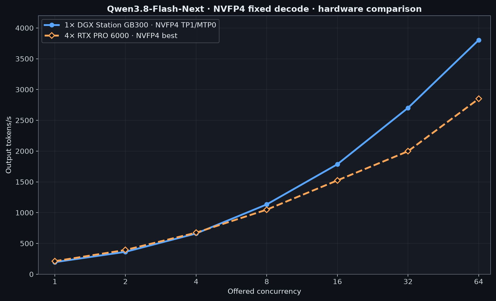
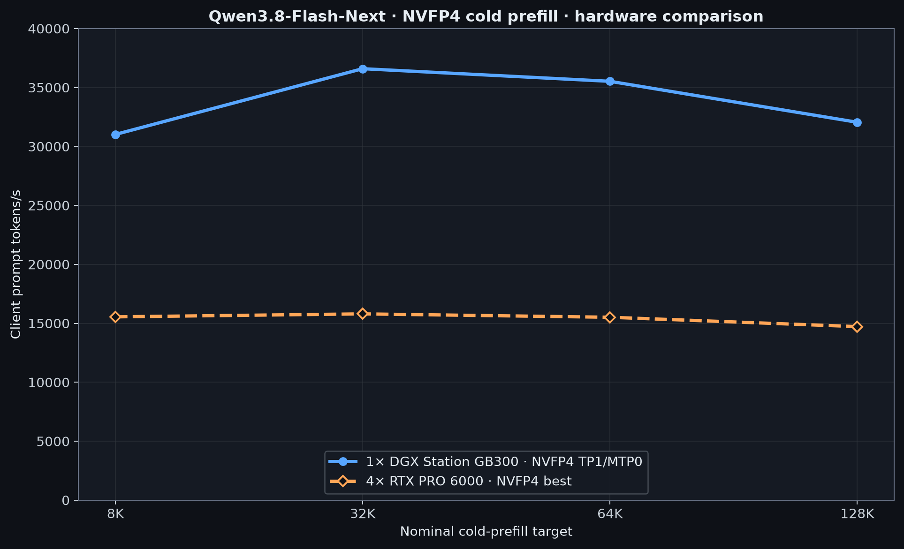

# Qwen3.8-Flash-Next

The current benchmark measures Qwen3.8-Flash-Next on one DGX Station GB300.
This is the Flash-Next MoE model, not Qwen3.8-27B.

## DGX Station benchmark

Radix NVFP4 on SGLang, TP1/MTP0. Results are for one engine on one GB300.

| C | 1× DGX tok/s | TTFT p50 ms | 4× RTX PRO 6000 NVFP4 best tok/s |
| ---: | ---: | ---: | ---: |
| 1 | 195.9 | 218.4 | 211.7 |
| 2 | 363.5 | 388.0 | 394.0 |
| 4 | 661.1 | 386.3 | 674.8 |
| 8 | 1,133.7 | 545.3 | 1,049.0 |
| 16 | 1,786.2 | 759.5 | 1,524.2 |
| 32 | 2,702.1 | 1,089.9 | 1,997.6 |
| 64 | 3,803.8 | 2,104.4 | 2,849.4 |

### DGX cold prefill

| Target | 1× DGX tok/s | TTFT s | 4× RTX PRO 6000 NVFP4 best tok/s |
| ---: | ---: | ---: | ---: |
| 8K | 31,016 | 0.264 | 15,547 |
| 32K | 36,595 | 0.895 | 15,799 |
| 64K | 35,525 | 1.845 | 15,512 |
| 128K | 32,052 | 4.089 | 14,720 |

MTP3 and cross-Station TP2/TEP2 measurements are still in progress.

## 4× RTX PRO 6000 reference

The comparison data uses one server with four NVIDIA RTX PRO 6000 Blackwell
Max-Q GPUs. Its official lane is
[`Qwen/Qwen3.8-Flash-Next-FP8`](https://huggingface.co/Qwen/Qwen3.8-Flash-Next-FP8)
on vLLM; its NVFP4 lane is the third-party
[`RadixArk/Qwen3.8-Flash-Next-NVFP4`](https://huggingface.co/RadixArk/Qwen3.8-Flash-Next-NVFP4)
quantization on SGLang.

| Lane | C1 decode | C64 decode | C128 decode | 64K cold prefill | Profiles |
| --- | ---: | ---: | ---: | ---: | --- |
| Official FP8/vLLM | 198.9 (TEP4/MTP3) | 2,653.4 (TEP4/AR) | **3,668.9** (TEP4/AR) | 14,357 (TEP4/AR) | TP4 and TEP4 |
| Third-party NVFP4/SGLang | **211.7** (TEP4/MTP3) | **2,849.4** (TEP4/AR) | 3,476.5 (TEP4/AR) | **15,512** (TEP4/AR) | TEP4; TP4 unsupported |

Decode values are aggregate output tok/s; prefill values are client prompt
tok/s.

### Reference decode throughput

8,192 input tokens, 1,024 forced output tokens. Best result in each row is
bold.

| C | FP8/vLLM TP4/AR | FP8/vLLM TP4/MTP3 | FP8/vLLM TEP4/AR | FP8/vLLM TEP4/MTP3 | NVFP4/SGLang TEP4/AR | NVFP4/SGLang TEP4/MTP3 |
| ---: | ---: | ---: | ---: | ---: | ---: | ---: |
| 1 | 116.0 | 193.1 | 114.7 | 198.9 | 116.9 | **211.7** |
| 2 | 199.8 | 304.8 | 199.8 | 327.1 | 223.3 | **394.0** |
| 4 | 346.7 | 476.7 | 363.8 | 562.8 | 416.2 | **674.8** |
| 8 | 549.7 | 701.4 | 626.3 | 920.9 | 750.2 | **1,049.0** |
| 16 | 857.2 | 1,008.8 | 1,031.9 | 1,377.9 | 1,299.4 | **1,524.2** |
| 32 | 1,281.9 | 1,354.1 | 1,681.5 | 1,869.9 | **1,997.6** | 1,868.1 |
| 64 | 1,889.1 | 1,905.7 | 2,653.4 | 2,489.4 | **2,849.4** | 2,377.8 |
| 128 | 2,624.5 | 2,433.7 | **3,668.9** | 3,044.4 | 3,476.5 | 2,513.7† |

† NVFP4/MTP3 C128 averaged 95.7 resident requests; details are in the
[recipe](recipes/).

### Reference cold prefill

C1 client prompt tok/s. Best result in each row is bold.

| Target | FP8/vLLM TP4/AR | FP8/vLLM TP4/MTP3 | FP8/vLLM TEP4/AR | FP8/vLLM TEP4/MTP3 | NVFP4/SGLang TEP4/AR | NVFP4/SGLang TEP4/MTP3 |
| ---: | ---: | ---: | ---: | ---: | ---: | ---: |
| 8K | 12,449 | 11,882 | 14,922 | 14,187 | **15,547** | 15,374 |
| 32K | 12,457 | 11,881 | 14,904 | 14,232 | **15,799** | 15,250 |
| 64K | 11,968 | 11,422 | 14,357 | 13,683 | **15,512** | 14,889 |
| 128K | 10,987 | 10,589 | 13,206 | 12,593 | **14,720** | 14,089 |

### Reference TEP4 comparisons

These compare complete checkpoint-and-runtime lanes, not quantization alone.

## Method

TP4 is tensor parallel 4; TEP4 adds expert parallel 4 on the same four GPUs.
AR is ordinary decode and MTP3 uses three speculative steps. Decode used
temperature 0, `C` warmups, and `5 × C` measured requests. Cold prefill used
C1, one output token, and a unique leading prefix per sample.

Full configuration and methodology are in the [recipe](recipes/). Per-cell
values are in
[`data/throughput.csv`](data/throughput.csv) and
[`data/prefill.csv`](data/prefill.csv).

Return to the [repository overview](../).
