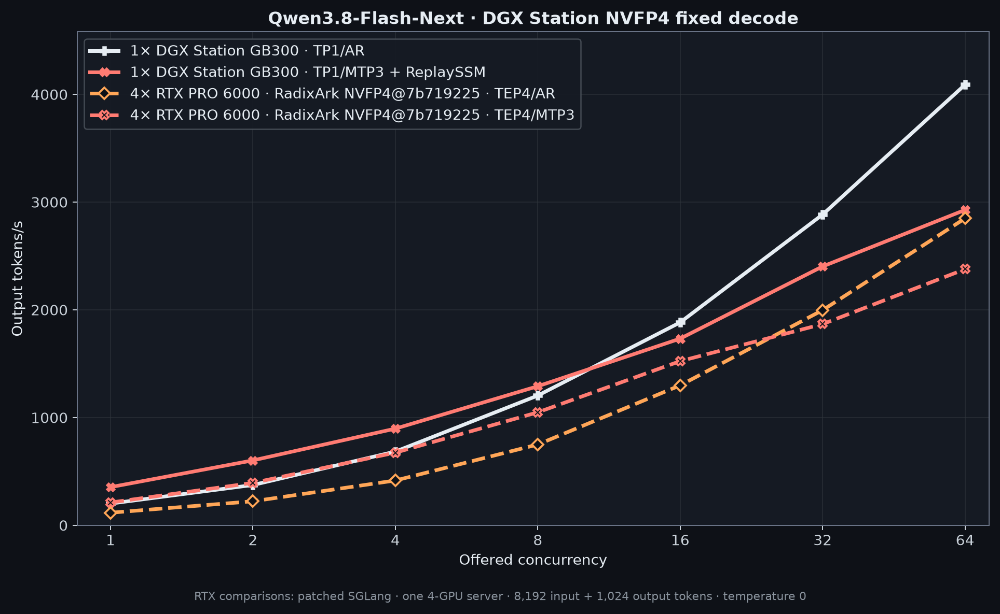
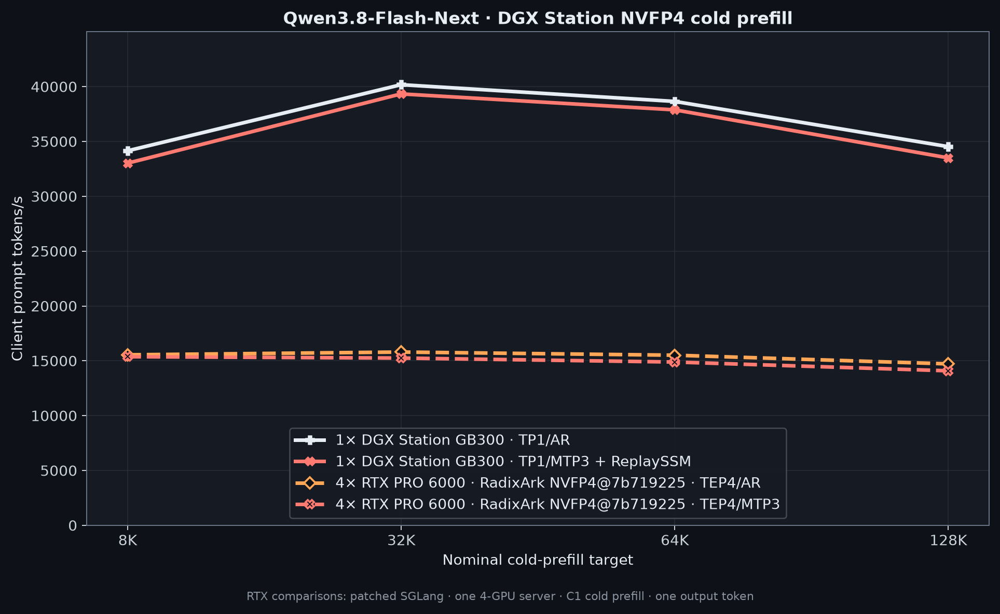

# Qwen3.8-Flash-Next

Qwen3.8-Flash-Next NVFP4 on one DGX Station GB300. This is the Flash-Next MoE
model, not Qwen3.8-27B.

## DGX Station results

The DGX headline uses
[`local-inference-lab/Qwen3.8-Flash-Next-NVFP4-4p89`](https://huggingface.co/local-inference-lab/Qwen3.8-Flash-Next-NVFP4-4p89)
on SGLang. Each row is one serving engine on one Station. ReplaySSM is enabled
for the MTP3 row.

| DGX configuration | C1 decode | C16 decode | C64 decode | 64K cold prefill |
| --- | ---: | ---: | ---: | ---: |
| 1× DGX Station · TP1/AR | 202.1 tok/s | **1,883.9 tok/s** | **4,090.4 tok/s** | **38,653 tok/s** |
| 1× DGX Station · TP1/MTP3 + ReplaySSM | **354.6 tok/s** | 1,733.2 tok/s | 2,927.8 tok/s | 37,884 tok/s |

## RTX PRO 6000 comparison

The dashed orange and red lines use
`RadixArk/Qwen3.8-Flash-Next-NVFP4@7b719225242aacd3dbd3f9407468c2ee9a9d2594`
on patched SGLang: one TEP4 server across four RTX PRO 6000 Blackwell GPUs.
Orange is AR; dashed red is MTP3. Fixed decode is 8,192 input + 1,024 output
tokens at temperature 0, shown from C1 through C64. Cold prefill is C1 at 8K,
32K, 64K, and 128K with one output token. These are comparison points, not DGX
Station headlines.

Exact checkpoint revisions, launch settings, workload, and per-cell values are
in the [recipe](recipes/) and [`data/`](data/).

Return to the [repository overview](../).
