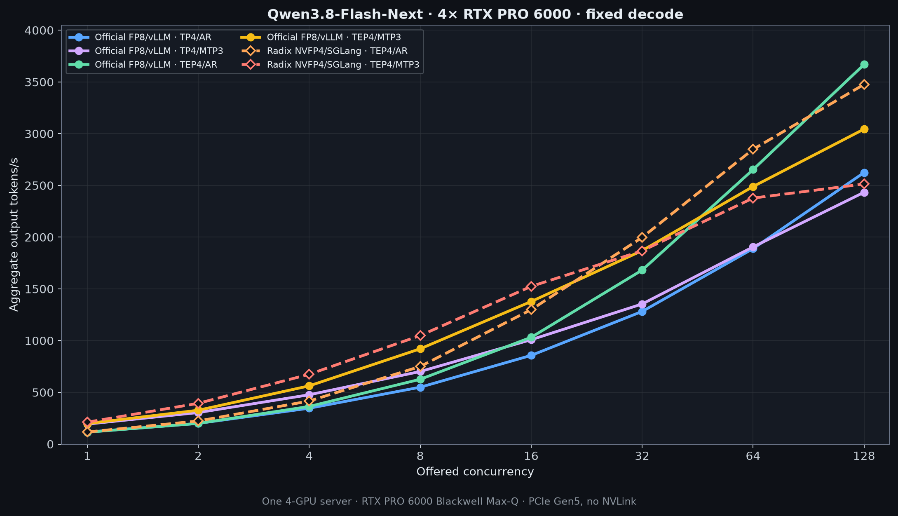
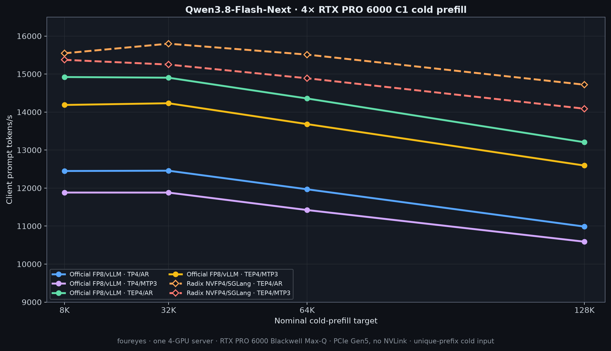
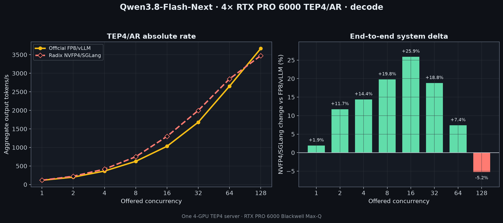
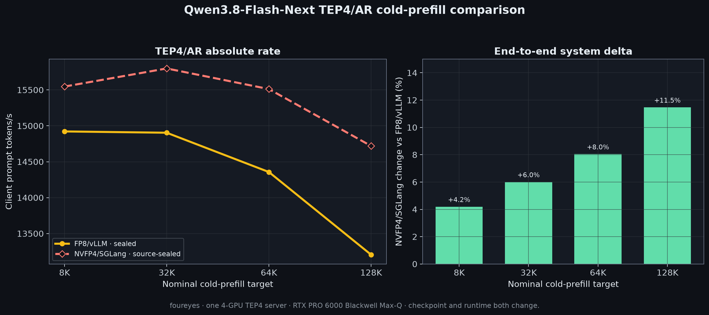
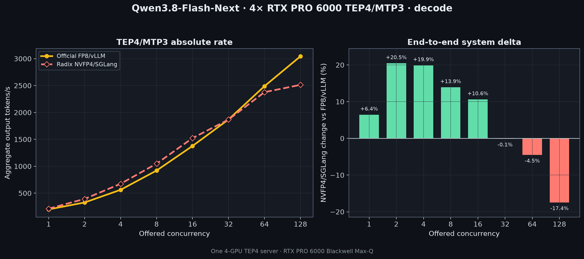
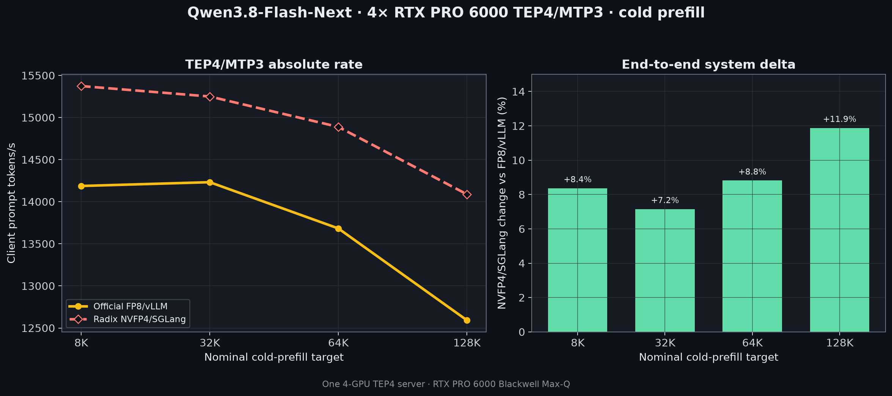

# Qwen3.8-Flash-Next evidence and reproduction notes

This page contains the system-specific inventory, runtime pins, topology,
benchmark contract, integrity information, and local DGX bring-up notes kept
out of the headline result page.

## Current DGX Station benchmark

| Item | Value |
| --- | --- |
| Checkpoint | `local-inference-lab/Qwen3.8-Flash-Next-NVFP4-4p89@ee0cea634a371acd1caeaed8e95b90e4344c16b4` |
| Quantization | ModelOpt mixed precision; NVFP4 4.89-bit checkpoint |
| Runtime image | `qwen38-4p89-sglang:runtime-v1` |
| Parallelism | One engine on one Station (TP1), or across two Stations (TP2 or TEP2) |
| Decode | Ordinary autoregressive decode or MTP3 |
| Memory / limits | fraction 0.80, 262,144-token context, 128 running requests |
| Workload | 8,192 input + 1,024 output tokens; `C` warmups and `5 × C` measured requests |
| Decode matrix | C1, C2, C4, C8, C16, C32, C64 |
| Cold prefill | C1; 8K, 32K, 64K, and 128K targets; one output token; 30 seconds per target |

The runtime aliases the checkpoint architecture to SGLang's Qwen4Exp model
implementation and uses `modelopt_mixed`. Its PLE loader handles the
checkpoint's sharded NVFP4 embedding weights and scales. MTP3 uses three
speculative steps and inherits the target checkpoint's mixed quantization.
Thirty-six narrow MXFP8 `in_proj_ba` layers per TP2 rank have local output
width 48, below the available MXFP8 kernels' minimum width. Those weights are
dequantized once at model load and use the BF16 linear path; wider MXFP8 layers
remain quantized.

Every plotted DGX row comes directly from a completed client JSON. Offered
concurrency, effective concurrency, queue fraction, and the capacity flag are
kept as observed; queueing does not make a measured cell disappear. Missing
cells remain absent.

Raw result roots are under
`/home/catid/frontier-bench/results/qwen38-4p89-sglang/`. The importer reads
`run-manifest.json`, `benchmark/raw/fixed/c*.json`, and
`benchmark/raw/prefill/cold.json`. Use `--require-complete` for the final
C1–C64 publication pass; it also requires the launcher's completed cleanup and
postflight marker.

TP1/AR run `qwen38-4p89-tp1-mtp0-gemini1-v1` used one engine on `gemini1`.
TP1/MTP3 run `qwen38-4p89-tp1-mtp3-gemini2-v2` used one engine on `gemini2`.
Both completed all measurements, cleanup, and postflight checks. Each is
plotted once; no second-machine curve is inferred or summed. The TP1/MTP3
runtime limited resident requests to 47 because of Mamba-state capacity. Its
C64 cell is the measured offered-load result: 2,590.4 tok/s at 45.1 effective
concurrency and 0.911 queue fraction.

### Initial two-Station optimization baselines

The first TP2 and TEP2 layouts are retained here as measured optimization
baselines, but excluded from the headline tables and charts. They are slower
than TP1, so they are not representative two-Station results. The current
layer placement shards communication-heavy parts of Qwen3.8-Flash-Next's
hybrid architecture across the two hosts. The next experiment kept those
parts local while distributing the routed experts.

#### Two-Station decode throughput

Output tok/s:

| C | TP2/AR | TP2/MTP3 | TEP2/AR | TEP2/MTP3 |
| ---: | ---: | ---: | ---: | ---: |
| 1 | 142.4 | 243.5 | 142.3 | 246.4 |
| 2 | 265.8 | 443.7 | 265.9 | 438.7 |
| 4 | 486.9 | 678.7 | 489.7 | 696.3 |
| 8 | 897.0 | 954.1 | 906.9 | 971.5 |
| 16 | 1,473.0 | 1,258.9 | 1,502.3 | 1,289.2 |
| 32 | 2,099.7 | 1,793.2 | 2,164.0 | 1,876.7 |
| 64 | 3,055.9 | 2,342.4 | 3,164.1 | 2,360.1 |

#### Two-Station cold-prefill throughput

C1 client prompt tok/s:

| Target | TP2/AR | TP2/MTP3 | TEP2/AR | TEP2/MTP3 |
| ---: | ---: | ---: | ---: | ---: |
| 8K | 20,455 | 19,756 | 21,043 | 20,104 |
| 32K | 24,717 | 24,858 | 25,610 | 24,610 |
| 64K | 24,437 | 24,363 | 25,210 | 24,170 |
| 128K | 22,681 | 22,375 | 23,417 | 22,345 |

The retained roots are `qwen38-4p89-tp2-mtp0-v11`,
`qwen38-4p89-tp2-mtp3-v1`, `qwen38-4p89-tep2-mtp0-v1`, and
`qwen38-4p89-tep2-mtp3-v1`. All four completed the C1–C64 decode matrix and
the four cold-prefill cells with zero request errors.

TEP2/AR run `qwen38-4p89-tep2-mtp0-v1` completed its measurements and exact
container cleanup. Its first local postflight gate overlapped an `nvidia-smi`
child from a pre-existing `watch -n1 nvidia-smi`; fresh canonical idle gates
then passed on both hosts without changing measurements or relaunching the
model. The retry note and both gate outputs remain in the result root.

### Attention-TP1 plus routed-EP2 experiments

The next AR and MTP3 layouts used TP2/DP2 with DP attention: attention and the
hybrid core ran at TP1 on each Station, while routed experts were distributed
with EP2. The MoE all-to-all backend was `none`. Client request distribution
and throughput cover both DP ranks and are global rates for the two-Station
engine. These experiments are retained here, not in the headline tables or
charts.

Output tok/s for 8,192 input plus 1,024 output tokens:

| C | Attention TP1 + routed EP2/AR | Attention TP1 + routed EP2/MTP3 |
| ---: | ---: | ---: |
| 1 | 133.0 | 226.9 |
| 2 | 273.1 | 459.1 |
| 4 | 508.0 | 727.7 |
| 8 | 905.1 | 1,068.2 |
| 16 | 1,589.0 | 1,557.2 |
| 32 | 2,588.7 | 2,181.9 |
| 64 | 3,899.8 | 2,866.0 |

C1 cold-prefill client prompt tok/s:

| Target | Attention TP1 + routed EP2/AR | Attention TP1 + routed EP2/MTP3 |
| ---: | ---: | ---: |
| 8K | 19,161 | 18,477 |
| 32K | 20,951 | 20,398 |
| 64K | 20,587 | 20,212 |
| 128K | 19,251 | 18,753 |

The result roots are `qwen38-4p89-tep2-attntp1-mtp0-v1` and
`qwen38-4p89-tep2-attntp1-mtp3-v1`. Both completed all seven decode cells with
their exact request counts and zero errors, plus all four prefill cells.
Exact-name cleanup and both canonical postflight gates passed for each run.
The AR launcher's final status step was repaired after measurement because its
script had been edited in place to prepare the next dry run; the original
status and repair note are retained and no measurement JSON changed.

The effective-concurrency field for these profiles contains DP0 scheduler
metrics only because the client selected one scheduler's metrics series. It
does not represent global request residency. The client request counts and
throughput above cover both DP ranks.

A follow-up attempt, `qwen38-4p89-tep2-attntp1-fia2a-mtp0-v1`, changed the
MoE path to FlashInfer all-to-all with the routed TRT-LLM runner and NVFP4
dispatch. It stopped during startup before timing: FlashInfer's MNNVL memory
path could not exchange POSIX file descriptors between `gemini1` and
`gemini2`, and reported that multi-node MNNVL requires
`CU_MEM_HANDLE_TYPE_FABRIC`. No zero-throughput row is recorded. Exact-name
cleanup and both postflight gates passed. The retained node-0 server log is
SHA-256 `d5ab3a43bd4aa4483c46a62e9893ca2cda11aa885610558ef3f574fd2834d823`.

The two dashed chart comparisons are the workstation's RadixArk NVFP4/SGLang
TEP4/AR and TEP4/MTP3 profiles at every point; no pointwise envelope is used.
Each is one server across all four RTX PRO 6000 GPUs, shown at C1–C64 decode
and all four cold-prefill contexts. MTP3 requested `NEXTN`, resolved to
`EAGLE`, and used three steps, top-k 1, and four draft tokens.

## RTX PRO 6000 comparison details

The comparison system is one server with four NVIDIA RTX PRO 6000 Blackwell
Max-Q GPUs. Its official lane is
[`Qwen/Qwen3.8-Flash-Next-FP8`](https://huggingface.co/Qwen/Qwen3.8-Flash-Next-FP8)
on vLLM; its NVFP4 lane is the third-party
[`RadixArk/Qwen3.8-Flash-Next-NVFP4`](https://huggingface.co/RadixArk/Qwen3.8-Flash-Next-NVFP4)
quantization on SGLang. This is supporting comparison data, not the DGX
Station headline.

| Lane | C1 decode | C64 decode | C128 decode | 64K cold prefill | Profiles |
| --- | ---: | ---: | ---: | ---: | --- |
| Official FP8/vLLM | 198.9 (TEP4/MTP3) | 2,653.4 (TEP4/AR) | **3,668.9** (TEP4/AR) | 14,357 (TEP4/AR) | TP4 and TEP4 |
| Third-party NVFP4/SGLang | **211.7** (TEP4/MTP3) | **2,849.4** (TEP4/AR) | 3,476.5 (TEP4/AR) | **15,512** (TEP4/AR) | TEP4; TP4 unsupported |

Decode values are aggregate output tok/s; prefill values are client prompt
tok/s.

### Workstation decode throughput

8,192 input tokens, 1,024 forced output tokens. Best result in each row is
bold.

| C | FP8/vLLM TP4/AR | FP8/vLLM TP4/MTP3 | FP8/vLLM TEP4/AR | FP8/vLLM TEP4/MTP3 | NVFP4/SGLang TEP4/AR | NVFP4/SGLang TEP4/MTP3 |
| ---: | ---: | ---: | ---: | ---: | ---: | ---: |
| 1 | 116.0 | 193.1 | 114.7 | 198.9 | 116.9 | **211.7** |
| 2 | 199.8 | 304.8 | 199.8 | 327.1 | 223.3 | **394.0** |
| 4 | 346.7 | 476.7 | 363.8 | 562.8 | 416.2 | **674.8** |
| 8 | 549.7 | 701.4 | 626.3 | 920.9 | 750.2 | **1,049.0** |
| 16 | 857.2 | 1,008.8 | 1,031.9 | 1,377.9 | 1,299.4 | **1,524.2** |
| 32 | 1,281.9 | 1,354.1 | 1,681.5 | 1,869.9 | **1,997.6** | 1,868.1 |
| 64 | 1,889.1 | 1,905.7 | 2,653.4 | 2,489.4 | **2,849.4** | 2,377.8 |
| 128 | 2,624.5 | 2,433.7 | **3,668.9** | 3,044.4 | 3,476.5 | 2,513.7† |

† NVFP4/MTP3 C128 averaged 95.7 resident requests and includes the first-use
Triton compile described below.



### Workstation cold prefill

C1 client prompt tok/s. Best result in each row is bold.

| Target | FP8/vLLM TP4/AR | FP8/vLLM TP4/MTP3 | FP8/vLLM TEP4/AR | FP8/vLLM TEP4/MTP3 | NVFP4/SGLang TEP4/AR | NVFP4/SGLang TEP4/MTP3 |
| ---: | ---: | ---: | ---: | ---: | ---: | ---: |
| 8K | 12,449 | 11,882 | 14,922 | 14,187 | **15,547** | 15,374 |
| 32K | 12,457 | 11,881 | 14,904 | 14,232 | **15,799** | 15,250 |
| 64K | 11,968 | 11,422 | 14,357 | 13,683 | **15,512** | 14,889 |
| 128K | 10,987 | 10,589 | 13,206 | 12,593 | **14,720** | 14,089 |



### Workstation TEP4 comparisons

These compare complete checkpoint-and-runtime lanes, not quantization alone.









## External source system

The 2026-08-27 handoff came from one serving instance and endpoint using all
four accelerators on host `foureyes`.

| Field | Source value |
| --- | --- |
| System | ASUS Pro WS WRX90E-SAGE SE workstation |
| Accelerators | 4× NVIDIA RTX PRO 6000 Blackwell Max-Q Workstation Edition |
| Compute capability | 12.0 (`sm_120`) |
| Memory | 97,887 MiB per accelerator; 391,548 MiB aggregate reported |
| Power limit | 300 W per accelerator, unchanged by the recipe |
| Allowed power range | 250–325 W per accelerator |
| Interconnect | PCIe Gen5 x16, peer access for every pair, no NVLink |
| Topology | `NODE` between every accelerator pair; one NUMA node |
| CPU | AMD Ryzen Threadripper PRO 9985WX, 64 cores / 128 threads |
| CPU sockets / NUMA | 1 / 1 |
| RAM | 1 TiB installed; Linux reported 1,081,088,303,104 bytes |
| OS / kernel | Ubuntu 24.04.4 LTS / 6.8.0-137-generic |
| Driver / reported CUDA | 610.43.02 / 13.3 |
| ECC | Disabled during inventory |
| Initial CPU governor observation | `powersave`; not retained in sealed provenance |

All throughput values are per-host rates from that one server. They are not a
sum of four independent replicas.

### Retained fabric diagnostics from the handoff

| Metric | Value |
| --- | ---: |
| Pairwise off-diagonal bandwidth average | 54.047 GB/s |
| Pairwise bandwidth range | 53.202–54.501 GB/s |
| Four-accelerator ring bandwidth per accelerator | 51.998 GB/s |
| Four-accelerator ring aggregate | 205.210 GB/s |
| Four-accelerator all-to-all per accelerator | 30.021 / 32.192 / 31.769 / 29.801 GB/s |
| Four-accelerator all-to-all aggregate | 123.783 GB/s |
| Pairwise latency average | 1.045 µs |
| Full-load latency average | 1.070 µs |
| NCCL 1 MiB all-reduce latency | 80.795 µs |
| NCCL 1 MiB all-reduce bus bandwidth | 19.467 GB/s |
| NVIDIA P2P override | Not enabled |
| Resizable BAR flag | 0 |

The source handoff named `data/fabric-diagnostic.json`, but that raw file was
not present in this checkout at import time. The table preserves the source's
metric labels and rounded values; its aggregate fields were not recomputed
from the rounded per-accelerator values here.

## Portable topology definitions

- TP4: tensor parallel size 4, expert parallelism disabled.
- TEP4: TP4 plus expert parallel size 4 on the same four accelerators. Dense
  and attention work stays tensor-parallel; routed experts are distributed.
- AR: ordinary autoregressive decode.
- MTP3: three speculative MTP steps/tokens.

TEP4 uses four total accelerators, not eight.

## Benchmark contract

| Field | Value |
| --- | --- |
| Harness | `llm-inference-bench` 0.4.29 |
| Harness commit | `0b4185b5b435e948b199c9077a00b084864aa963` |
| Endpoint | `/v1/chat/completions` |
| Chat template | Checkpoint default |
| Temperature | 0 |
| Decode prompt / output | Exactly 8,192 input / 1,024 output tokens |
| Decode EOS | Ignored |
| Decode C values | 1, 2, 4, 8, 16, 32, 64, 128 |
| Warmup / measurement | `C` warmups / `5 × C` measured requests |
| Decode prefix state | Same-prefix warm after one unmeasured scout and warmups |
| Cold-prefill C / output | C1 / one output token |
| Cold-prefill targets | 8K, 32K, 64K, 128K |
| Actual prompt lengths | 8,194; 32,770; 65,538; 131,074 |
| Cold-prefill control | Unique leading prefix per sample |

Startup, model loading, and planned cache priming are outside measured
intervals. The one exception is the explicitly qualified NVFP4 TEP4/MTP3 C128
row, where a previously unseen Triton kernel compiled during measurement.
Fixed-decode TTFT is warm-prefix TTFT; cold-ingest latency is in the prefill
table.

## Primary official FP8 lane

| Item | Pin |
| --- | --- |
| Checkpoint | `Qwen/Qwen3.8-Flash-Next-FP8` |
| Revision | `bcd9f01ddc9cff2316eb84281bebcd5b058bddce` |
| Runtime | vLLM `0.1.dev20073+g8e685d198` |
| Container | `vllm/vllm-openai@sha256:0aea30240f3e3d9ffae8526643950e170eb5fa07fc427016a9dd90892afa2aa3` |
| Multiarch manifest | `sha256:fc120ece0a388cc0aa1caad4a9f1cd92113484ab7ec2fd0efadd62585be05bf8` |
| PyTorch / Transformers | 2.13.0+cu130 / 5.15.1 |
| FlashInfer / Triton | 0.6.17 / 3.7.1 |
| NCCL | 2.29.7 through PyTorch; vLLM PyNCCL 2.30.7 |
| Quantization / compute | FP8 weights, dynamic activation, 128×128 blocks / BF16 |

Common launch settings were tensor parallel 4, memory utilization 0.91,
maximum model length 262,144, maximum sequences 256, prefix caching enabled,
language-model-only enabled, and KV cache dtype `auto`. TEP4 enabled expert
parallelism. MTP3 added
`{"method":"mtp","num_speculative_tokens":3}`.

The handoff reports all four profiles sealed with 68/68 manifest entries
verified. Model, shard, index, and profile seal hashes are retained in
[`../data/handoff-provenance.json`](../data/handoff-provenance.json).

## Source-sealed NVFP4 lanes

| Item | Pin |
| --- | --- |
| Checkpoint | `RadixArk/Qwen3.8-Flash-Next-NVFP4` |
| Revision | `7b719225242aacd3dbd3f9407468c2ee9a9d2594` |
| Runtime | SGLang `0.0.0.dev1+gd91c3682b` |
| Base image | `sha256:59f06adce6f91401adf443bd168d45fdb2044d77671fd591c7c57a29d851cbae` |
| Derived image | `sha256:5c293f10ba3be3630a2568b243570dc0fe83e98fe21ebfbadbf3320f01c80f88` |
| SM120 patch | `dac5523d1e5d2f4297fec40ef02fc76fb0f662d1` |
| Patch source SHA-256 | `95a3f14e39961410337527c5803a2ce5aae8f1ff6099f25fce1f91e6cf6b99f4` |
| PyTorch / Transformers | 2.13.0+cu130 / 5.12.1 |
| FlashInfer / Triton / NCCL | 0.6.17 / 3.7.1 / 2.29.7 |

The two measured profiles were TEP4/AR and TEP4/MTP3. Both used
`modelopt_fp4`, FlashInfer CUTLASS FP4 GEMM, TRT-LLM full-attention decode,
FlashInfer full-attention prefill, Triton linear attention, BF16 KV cache, FP32
recurrent state, the `extra_buffer` Mamba cache with tracking interval 64,
memory fraction 0.91, at most 256 running requests, a 262,144-token context,
and PLE offload disabled. The AR profile disabled speculation. MTP3 requested
`NEXTN`, resolved to `EAGLE`, and used three steps, top-k 1, and four draft
tokens.

The run contract declared the draft quantization unquantized/null, while the
startup log reported online NVFP4 conversion of MTP expert weights. That
precision discrepancy remains unresolved and is preserved as a provenance
caveat rather than silently relabeled.

### Source-reported seals and cache qualification

| Profile | Expected source root | Source-reported seal | Qualification |
| --- | --- | --- | --- |
| TEP4/AR | `nvfp4/results-20260827-r2/tep4/ar` | `a95881ba198b9a22f3317e13d42cf36a343362852b5ced316c74eedef139c13a` | Sealed primary evidence |
| TEP4/MTP3 | `nvfp4/results-20260827-r2/tep4/mtp3` | `de9459cfb8ae365c9dd40d0e404d6240228280634fd3bd285a72ff29258353fe` | Sealed primary evidence; C128 cache exception |

The TEP4/AR acquisition completed before a zero-byte FlashInfer diagnostic-log
path caused its original final cache check to fail. The source's narrow verifier
repair reported that all 1,097 substantive cache files (37,069,243 bytes) were
unchanged. Its 154-file `SHA256SUMS` and `SEAL-REPAIR.md` are expected under the
profile root above. No measurement was reported rerun or rewritten.

For TEP4/MTP3, C1 through C64 are source-reported warmed-cache rows. During the
C128 measurement, one previously unseen Triton `alloc_extend_kernel` variant
compiled, adding eight files and 214,284 bytes at approximately 07:56:28 UTC.
The row still completed 640/640 requests with zero errors, but it is not a
strict warmed-cache result. It was also capacity-limited: offered C128 averaged
95.7 resident requests and a 0.917 queue fraction. Cold prefill ran afterward.
The source retains the exception in `CACHE-SEAL-EXCEPTION.md`; individual row
hashes are recorded in
[`../data/handoff-provenance.json`](../data/handoff-provenance.json).

### Unsupported TP4-only NVFP4 startup

TP4/AR and TP4/MTP3 were attempted independently and both failed before health
or timing. The routed-expert `w2_weight_scale` shape `(512, 2560, 10)` required
padding while the gated activation already implemented padding, and SGLang's
ModelOpt path rejected that combination. These are unsupported startup results,
not zero-throughput rows.

The source expected the failure evidence under
`nvfp4/results-20260827-r2/tp4/{ar,mtp3}/failure/`. The reported AR and MTP3
server-log hashes are respectively
`8d9a099681779846a40dc875b03532c3c80180adc139719f29c4f237cc30e8aa`
and `ab1f247b9d0ed959d401c45ec56d616a2e4412b11fc0259c19b550af8eed1fb8`;
their normalized traceback bodies matched at
`8b195578b2940af5f6a841b4cb07b7616c750e478eb44d93ff517ce74fb13eb5`.

SGLang did not expose a per-request cached-token counter for these NVFP4
prefill rows. The source's zero-shaped field meant unavailable, not a measured
zero cache-hit count.

## Integrity and import policy

The handoff expected four official raw roots under `data/raw/`, two sealed
NVFP4 profile roots under `nvfp4/results-20260827-r2/tep4/`, and two TP4
failure roots. None was present locally when this section was updated.
Consequently:

1. `throughput.csv` and `prefill.csv` reproduce the supplied tabular values as
   `external_user_handoff` rows.
2. Source-sealed official rows remain primary, but are explicitly labeled
   `SEALED_PRIMARY_EXTERNAL`.
3. Source-sealed NVFP4 TEP4 rows are also labeled
   `SEALED_PRIMARY_EXTERNAL`, with the MTP3 C128 exception bound to that row
   in `handoff-provenance.json` and the workstation detail charts.
4. Unsupported TP4 attempts have no numeric performance rows.
5. Expected paths and SHA-256 values are recorded in
   `handoff-provenance.json`; they do not assert a local hash check.
6. If raw trees arrive later, verify every profile seal and individual NVFP4
   file before changing evidence status.

The supplied natural-output diagnostic is not headline throughput: all 3,860
outputs hit the 1,024-token cap with nonempty reasoning and empty final-answer
content. Its nominal C128 client was also capped at 100 HTTP connections.

## Historical RadixArk DGX bring-up

The earlier local staging lane used the third-party RadixArk NVFP4 checkpoint.
These records explain the retained `qualification.csv` and `attempts.csv`; they
are not results for the current 4p89 checkpoint.

| Item | Local pin |
| --- | --- |
| Runtime image index | `sha256:12d3392bdc8be8d35e9a95f191df6aef99c5114bdbefd41bfdc7e760e6d25ec1` |
| ARM64 child | `sha256:14ed582518584c5c830206b5318a2c2769e68229c3422e48a28b952b3a888bd4` |
| Image config | `sha256:64c58f100438fa5f036bdfbeb3edd3136fb12c5d22d8ae52786c4a701263c55d` |
| Current derived image | `sha256:6eab5f1837284fe2317de55b00b8f35e83d9b44abc2ea915861661067c39dc91` |
| SGLang base | `d91c3682b0b429e4c70df63cd57f819588ce29b0` |
| Support overlay | `Qiaolin-Yu/sglang-qwen-next#38`, commits `3ea3a37a1,12070370f` |
| PR #36014 patch | `415eb564937c57fb80bfae300df8e127ecbb05ed` |
| Current benchmark client | `0b4185b5b435e948b199c9077a00b084864aa963` |

The historical TP1/MTP0 smoke v17 completed `PASS_SMOKE_UNRANKED`; both
replicas produced the same 64-token stream (`b381629a…efd20`). The current
pinned qualification is v18. Historical MTP3 v1 was rejected by an over-broad
online-quantization verifier and v2 by a false-positive Markdown-divider
heuristic. The corrected v3 qualification reached the intended MTP path and
reported 78 drafts, 37 accepted drafts, 26 verify calls, acceptance rate
0.474359, and mean accepted length 2.461538. It was independently deterministic
across replicas (`2a243cc3…4b30`) but failed exact MTP0 parity at output index 6
(token 198 versus 271); 57 of 64 output positions differed. The
unpatched MTP3 path is therefore `FAILED_CORRECTNESS` and contributes no timed
row.

The current derived image includes the beta-parity change from
[SGLang PR #36014](https://github.com/sgl-project/sglang/pull/36014), aligning
non-KDA `TARGET_VERIFY` beta rounding with packed GDN decode. With that pinned
runtime, TP1/MTP0 v18, TP1/MTP3 v2, TP2/MTP0 v7, TP2/MTP3 v1, and TEP2/MTP0
v2 completed their profile-specific smoke checks. These checks cover replica
or distributed request behavior as applicable, MTP counters, RoCE/GDRDMA for
cross-Station runs, effective expert execution for TEP2, graceful cleanup, and
postflight safety. `qualification.csv` lists only completed current smoke
profiles; it does not create placeholder rows for an uncompleted mode.

The current C1–C64 TP1 rows are in `../data/dgx-overlays.csv`. A completed
cross-node TP2 or TEP2 result is a distinct topology and includes transport
evidence; it is never merged with the independent per-Station TP1 rates.

From the section root, final timed roots are imported without invoking the
benchmark harness:

```bash
python3 data/import-dgx-results.py --require-all \
  /path/to/nvfp4-tp1-mtp0-result \
  /path/to/nvfp4-tp1-mtp3-result \
  /path/to/nvfp4-tp2-mtp0-result \
  /path/to/nvfp4-tp2-mtp3-result \
  /path/to/nvfp4-tep2-mtp0-result \
  /path/to/nvfp4-tep2-mtp3-result \
  --require-complete
```

With `--require-complete`, the importer accepts only roots whose launcher wrote
`COMPLETE_MEASURED_RAW` after cleanup and postflight and whose client wrote
`COMPLETE` after all C1–C64 and cold-prefill cells. Queueing or lower effective
concurrency remains a measured property of a completed cell. TP1 represents one
engine on one Station; TP2 and TEP2 each represent one distributed engine
across both Stations. The current TP2 and TEP2 rows remain in machine-readable
data and the optimization-baseline tables above, but are not plotted.

Final timed status supersedes the corresponding smoke status in performance
tables only after the completed timed root passes this import. Smoke status by
itself never creates a throughput value.

Before every memory-tight local launch, follow `/home/catid/AGENTS.md` and the
repository safety checklist: verify ordinary idle HBM, remove named containers
on both hosts after distributed attempts, and never reset a GPU or reload the
driver. Retain startup, backend, precision, benchmark, quality, MTP-counter,
transport, cleanup, and postflight evidence for each accepted row.
